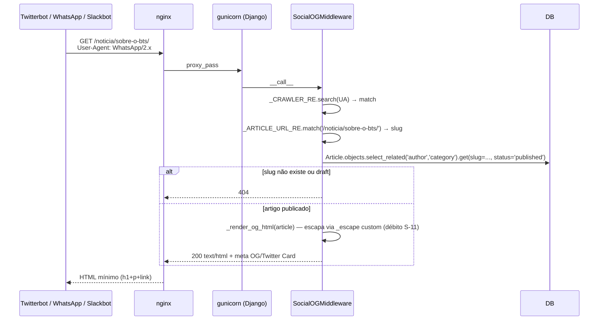

# Design — Módulo `articles` (retroativo)

> **Tipo**: Spec retroativo · **Versão**: v1 · **Data**: 2026-06-09 · **Status**: ✅ Em produção
> **Realiza**: [RF-001 — Publicação editorial](../../requirements/RF/RF-001-articles.md)
> **Epic**: [EP-02 — Publicação editorial](../../backlog/epics/EP-02-publicacao-editorial.md)
> **Specialist**: `backend-architect` (retroativo). Concentração no boundary backend; SEO/OG e sitemap são responsabilidades adjacentes que **vivem dentro do app** por acoplamento histórico (ver §7 OPS-1).

---

## 0. Responsabilidade

`apps.articles` é o **hub editorial** do Interpop: define o `Article` (UUID, `slug`, `status`, `body`, `cover_image`, `view_count`, `is_featured`) e `Category` (5 categorias fixas pós-pivô: Música/Moda/Cinema/Literatura/Cultura Digital — `migrations/0003`). Materializa o ciclo de vida editorial (`draft → published`) com `published_at` carimbado **no boundary HTTP** (não no model), bucket anti-abuse de `view_count` por (slug, IP, 5min), invariante de "featured único" via `transaction.atomic` no `save()`, e três responsabilidades adjacentes carregadas pelo app: (a) middleware OG para crawlers sociais em `/noticia/<slug>`, (b) `sitemap.xml` + `robots.txt` apontando para o **frontend**, (c) conversor de path `<uslug:>` registrado global em `ready()`. É **Ca=4 / Ce=3 / I=0.43** no grafo de apps (ARCHITECTURE §dependências) — toda escrita editorial passa aqui; `comments`, `audit`, `newsletter` e `search` leem do modelo `Article`.

---

## 1. Stack (dependências entre apps)

| Dependência       | O que `articles` importa                                                                                                                                 | Direção / Uso                                                                           |
| ----------------- | -------------------------------------------------------------------------------------------------------------------------------------------------------- | --------------------------------------------------------------------------------------- |
| `apps.users`      | `IsPublisherOrReadOnly`, `IsOwnerOrAdmin`, `UserPublicSerializer`, `AUTH_USER_MODEL`                                                                     | `views.py:10`, `serializers.py:2`, `models.py:44` — permissions de view + object-level  |
| `apps.audit`      | `get_client_ip` (extração X-Forwarded-For única no projeto, C13)                                                                                         | `views.py:9` — chave do bucket de `view_count`                                          |
| `apps.newsletter` | `tasks.send_article_notification` (Celery task)                                                                                                          | `signals.py:57` **lazy** (anti-import-circular); `admin.py:3` **eager** (resend action) |
| **Quem lê**       | `comments` (FK→Article), `search` (read-projection via trigger PL/pgSQL — ADR-018), `audit` (`AdminMetricsView`), `newsletter` (carrega Article em task) | Sentido inverso — `articles` é hub editorial                                            |

Há `signals.py` (2 receivers — pre_save/post_save), `admin.py` (action `resend_notification`), `og_middleware.py` (não-DRF — intercepta nginx-origin), `sitemaps.py` (não usa `django.contrib.sitemaps` — explicação em `sitemaps.py:1-9`), `robots_view.py`, `converters.py` (`<uslug:>` único registro do projeto — `apps.py:17`). **Não há** `services.py`, `tasks.py`, nem `permissions.py` próprios — todas regras de permissão vêm de `apps.users` (débito D-07 documentado: lógica do `ArticleViewCountView` poderia migrar para `services.py`).

---

## 2. Data model

### 2.1 `Category` (`models.py:7-22`)

| Campo  | Tipo                           | Notas                                                                                     |
| ------ | ------------------------------ | ----------------------------------------------------------------------------------------- |
| `name` | `CharField(100)` unique        | 5 valores canônicos pós-pivô editorial (`migrations/0003_seed_pop_culture_categories.py`) |
| `slug` | `SlugField(100)` unique, blank | Auto-gerado via `slugify(name, allow_unicode=True)` no `save()` (`models.py:16-19`)       |

**Meta**: `db_table='categories'`, `ordering=['name']`. Sem FK a `User` (categoria é vocabulário global, não user-owned). **Onde nasce categoria nova**: data migration (`migrations/0003` é o padrão) **OU** Django admin (`admin.py:8-11` com `prepopulated_fields`). API expõe apenas `GET /api/v1/categories/` — **não há POST/PATCH público**. Decisão deliberada: vocabulário editorial é estável (ADR-002 — tags livres deferidas).

### 2.2 `Article` (`models.py:25-95`)

| Campo           | Tipo                                                              | Notas                                                                                                                                                                                      |
| --------------- | ----------------------------------------------------------------- | ------------------------------------------------------------------------------------------------------------------------------------------------------------------------------------------ |
| `id`            | `UUIDField` PK `default=uuid4`                                    | Convenção UUID do projeto (bate com `User.id` e `Comment.id`)                                                                                                                              |
| `title`         | `CharField(500)`                                                  | Limite alto p/ títulos editoriais ("A nova hegemonia coreana no Spotify e por que o BTS importa para o Itamaraty")                                                                         |
| `slug`          | `SlugField(520)` unique, **blank**, db_index                      | Gerado via `_unique_slug()` (`models.py:71-76`) — sufixa `-1`, `-2` até achar único. **`allow_unicode=True`** → requer conversor `<uslug:>` no path (`converters.py:16`)                   |
| `excerpt`       | `TextField(max_length=1000)`                                      | Usado no card de listing + `og:description` (`og_middleware.py:54`, truncado em 300)                                                                                                       |
| `body`          | `TextField()` **sem `max_length`**                                | ADR-014: texto puro hoje, JSON estruturado deferido. **Sem sanitização HTML no boundary** — débito S-01 (CONCERNS)                                                                         |
| `cover_image`   | `ImageField(upload_to='covers/%Y/%m/')` null/blank                | Salva em `media/covers/2026/06/...`. URL é **relativa** — débito D-10 (newsletter envia link quebrado em email)                                                                            |
| `cover_caption` | `CharField(300)` blank/default=''                                 | "Padrão G1/Folha — `Foto: Agência`". Model permite blank por retrocompat; **serializer força obrigatório no boundary** (`serializers.py:40-46`)                                            |
| `author`        | FK `AUTH_USER_MODEL` **`PROTECT`**                                | Apagar conta de autor com artigos publicados **levanta `ProtectedError`** — escolha consciente (autoria é parte do registro histórico). Contrasta com `Comment.author=CASCADE`.            |
| `category`      | FK `Category` **`SET_NULL`**, null, blank                         | Apagar categoria deixa artigo órfão (rótulo). Mostra que `Article` sobrevive sem categoria.                                                                                                |
| `status`        | `CharField(12) choices=Draft/Published` default=`draft`, db_index | **Apenas 2 estados** — não há `submitted`, `archived`. `archived` mencionado no template do RF-001 está fora-de-escopo hoje.                                                               |
| `is_featured`   | `BooleanField default=False`, db_index                            | Hero único na home (NYT/Substack pattern). Setar como `True` desmarca todos os outros (`save()` override `models.py:78-92`) — operação atômica                                             |
| `view_count`    | `PositiveIntegerField default=0`                                  | Incrementado **apenas** via `ArticleViewCountView` (`views.py:91-124`) com bucket; ranqueável (`ordering_fields=['view_count']`, `views.py:36`) — débito S-06: vaza entre workers gunicorn |
| `created_at`    | `auto_now_add`                                                    | Imutável                                                                                                                                                                                   |
| `updated_at`    | `auto_now`                                                        | Toca em qualquer save                                                                                                                                                                      |
| `published_at`  | `DateTimeField` null/blank                                        | Carimbado **só no view** (`views.py:64, 87`) — **não há trigger de model**. Débito documentado: publicar via Django admin **não preenche** `published_at` (observação #883, 2026-05-29).   |

**Meta** (`models.py:63-69`): `db_table='articles'`, `ordering=['-published_at','-created_at']`, índices `(status, -published_at)` (cobre o listing público) + `(author, status)` (cobre "drafts do editor X").

**Override de `save()`** (`models.py:78-92`):

1. Auto-slug se vazio (`_unique_slug()`).
2. **`transaction.atomic` envolvendo `super().save()` + UPDATE em massa** para desmarcar outros `is_featured=True`. Sem o atomic, race entre dois `save()` simultâneos poderia deixar 2 featured (CONCERNS §articles: "mitigado por `transaction.atomic` mas vale auditar").

### 2.3 Migrações relevantes

| Migration                          | O que faz                                                                                                                                                                                                     |
| ---------------------------------- | ------------------------------------------------------------------------------------------------------------------------------------------------------------------------------------------------------------- |
| `0001_initial`, `0002_initial`     | Schema base de Category + Article                                                                                                                                                                             |
| `0003_seed_pop_culture_categories` | Data migration **idempotente**: cria as 5 categorias do pivô; remove 6 legadas (Política, Tecnologia, Cultura, Negócios, Internacional, Economia) **apenas se vazias**. Documentado em docstring linhas 1-19. |
| `0004_article_cover_caption`       | Adiciona `cover_caption` (CharField 300, blank, default='')                                                                                                                                                   |

---

## 3. Public contract

### 3.1 Endpoints DRF (`urls.py:4-9`, prefixo `/api/v1/` — ADR-010)

| Método        | URL                                   | View                   | Permissions                                                   | Notas                                                                                                                                             |
| ------------- | ------------------------------------- | ---------------------- | ------------------------------------------------------------- | ------------------------------------------------------------------------------------------------------------------------------------------------- |
| `GET`         | `/api/v1/categories/`                 | `CategoryListView`     | `AllowAny`                                                    | 5 itens fixos                                                                                                                                     |
| `GET`         | `/api/v1/articles/`                   | `ArticleListView`      | `IsPublisherOrReadOnly`                                       | Anon vê só `published`; editorial (`user.can_publish`) vê drafts também (`views.py:51-54`)                                                        |
| `POST`        | `/api/v1/articles/`                   | `ArticleListView`      | `IsPublisherOrReadOnly` (publisher = admin+dev+editor)        | `cover_image` + `cover_caption` obrigatórios na criação                                                                                           |
| `GET`         | `/api/v1/articles/<uslug:slug>/`      | `ArticleDetailView`    | `IsPublisherOrReadOnly`                                       | Lookup por slug unicode-aware                                                                                                                     |
| `PATCH`/`PUT` | `/api/v1/articles/<uslug:slug>/`      | `ArticleDetailView`    | `IsPublisherOrReadOnly` **+ `IsOwnerOrAdmin`** (object-level) | Defesa em profundidade: só o **autor** ou admin/dev edita. Sem o 2º, editor X editava artigo de editor Y via API (frontend era a única barreira). |
| `DELETE`      | `/api/v1/articles/<uslug:slug>/`      | `ArticleDetailView`    | mesmo que PATCH                                               | **Delete físico** (não há soft-delete em Article) — contraste com `Comment`                                                                       |
| `POST`        | `/api/v1/articles/<uslug:slug>/view/` | `ArticleViewCountView` | `AllowAny`                                                    | Bump anti-abuse; sempre 204 (mesmo quando bucket bloqueia)                                                                                        |

Filtros (`views.py:35-36`): `?category__slug=cinema&status=published&is_featured=true`; busca `?search=foo` em `title, excerpt, body, author__first_name, author__last_name` via `icontains` (SQLite + Postgres — sem dep extra, **não é FTS** — search real vive em `apps/search` com `SearchIndex`). Ordering: `?ordering=-view_count` ou `published_at`. Annotation `comment_count=Count('comments', filter=Q(comments__is_deleted=False))` zera N+1 no listing (lido em `serializers.py:16`).

### 3.2 Serializers (`serializers.py`)

- **`CategorySerializer`** (5-9): `id`, `name`, `slug`.
- **`ArticleListSerializer`** (12-24): leitura plana — `author` nested via `UserPublicSerializer`, `category` nested, `comment_count` lido da annotation (zero query extra). **Não inclui `body`** (payload da listagem fica leve).
- **`ArticleDetailSerializer`** (27-30): herda + `body`, `cover_caption`, `updated_at`. **`cover_caption` só no detail** ("não inflate o payload da listagem").
- **`ArticleWriteSerializer`** (33-68): aceita `category_id` (PK ref), `cover_caption` **obrigatória** (`required=True, allow_blank=False` + mensagens em pt-BR), `cover_image` obrigatório **na criação** (`validate` linha 60: `is_create = self.instance is None`); `author` injetado em `create()` a partir de `request.user` (linha 67).

### 3.3 Signals (`signals.py:28-65`)

Dois receivers + 1 sentinel attribute (`_PREV_STATUS_ATTR`):

- **`pre_save`** (`_capture_previous_status`, linha 28): snapshot do status persistido em `instance._prev_status`. Novos records → `None`. **Anti-double-fire**: detecta `draft → published` distinguindo de "salvou published de novo".
- **`post_save`** (`_notify_subscribers_on_publish`, linha 42): se `became_published == (now_published and (created or prev != published))`, faz **lazy import** de `apps.newsletter.tasks.send_article_notification` (anti-import-circular, linha 57) e `.delay(article_id=str(instance.pk))`. **Falha de enqueue é swallow-and-log** (linha 62-64) — "Enqueue failures must never block the publish flow".

ADR-009: dispatcher Celery substituiu chamada síncrona; em dev (`CELERY_TASK_ALWAYS_EAGER=True`) roda no thread atual — `tests/test_views.py:378-401` patcha `_dispatch_article_notification_sync` para garantir exatamente 1 chamada por transição.

### 3.4 Admin (`admin.py:14-52`)

`ArticleAdmin` com `list_display`, `list_filter`, `search_fields`, `prepopulated_fields={'slug':('title',)}`, `readonly_fields=('view_count', 'created_at', 'updated_at')`. Action manual `resend_notification` (linha 30-52): enfileira Celery `.delay()` (C12 — antes era síncrono e travava admin por 30s em 1k subscribers). Ignora artigos `status != published`.

> **Divergência conhecida** (observação #883): publicar via admin **não chama** `views.perform_create`/`perform_update` — então `published_at` fica `NULL` mesmo com `status=published`. Setar manualmente ou usar override de `ArticleAdmin.save_model`. Débito ativo, sem PR.

### 3.5 Middlewares / SEO / Operacional

| Arquivo                   | Responsabilidade                                                                                                                                                                                                                                                                                                                                                                                                                                   | Wire-up                                                                   |
| ------------------------- | -------------------------------------------------------------------------------------------------------------------------------------------------------------------------------------------------------------------------------------------------------------------------------------------------------------------------------------------------------------------------------------------------------------------------------------------------- | ------------------------------------------------------------------------- |
| `og_middleware.py:99-122` | `SocialOGMiddleware`: regex `_CRAWLER_RE` em UA (facebookexternalhit, Twitterbot, WhatsApp, LinkedInBot, Slackbot, Discordbot, TelegramBot, Pinterest, redditbot, Applebot — `og_middleware.py:28-32`); intercepta `GET /noticia/<slug>` e devolve HTML com OG/Twitter Card meta. SPA puro do React **não renderiza meta a tempo**; produção tem origem única (nginx → backend) então middleware **funciona em prod, não em dev** (Vite em :5173). | `MIDDLEWARE` em `config/settings/base.py` (verificar ordem)               |
| `sitemaps.py:33-68`       | `sitemap_xml(request)` manual via `SimplerXMLGenerator`. **Não usa `django.contrib.sitemaps`** porque ele auto-prefixa `request.scheme://request.host` — sitemap deve apontar para o **frontend** (`SITE_URL`), não para o backend. Inclui 4 rotas estáticas + N artigos publicados.                                                                                                                                                               | URL `/sitemap.xml` (config global)                                        |
| `robots_view.py:8-18`     | `robots.txt` dinâmico: `Allow: /`, `Disallow: /api/`, `/django-admin/` + linha `Sitemap: <SITE_URL>/sitemap.xml`                                                                                                                                                                                                                                                                                                                                   | URL `/robots.txt` (config global)                                         |
| `converters.py:16-31`     | `UnicodeSlugConverter` registrado como `'uslug'`. Regex `[-\w]+` — `\w` é unicode-aware em Python. Aceita `à`, `ç`, `é`, `ã` (vs built-in `<slug:>` que rejeita).                                                                                                                                                                                                                                                                                  | `apps.py:17` (`ready()`) — registro único anti-`RemovedInDjango60Warning` |
| `apps.py:9-18`            | Wire de signals + converters no `ready()`                                                                                                                                                                                                                                                                                                                                                                                                          |                                                                           |

### 3.6 Management commands

**Nenhum.** Não há `management/commands/` no módulo. Seed de categorias vive em data migration (`0003`); não há `seed_test_articles.py`.

---

## 4. Fluxos críticos

### 4.1 Publicação completa (draft → published)

```mermaid
sequenceDiagram
  participant FE as Frontend (CreatePost)
  participant API as ArticleDetailView (PATCH)
  participant PERM as IsPublisherOrReadOnly + IsOwnerOrAdmin
  participant DB as Postgres
  participant SIG as signals (pre/post_save)
  participant CEL as Celery (newsletter)
  participant SRCH as search trigger (PL/pgSQL)

  FE->>API: PATCH /api/v1/articles/{slug}/ {status: 'published'}
  API->>PERM: check (view + object)
  PERM-->>API: ok (editor é dono OR admin)
  API->>API: perform_update — se status==published e obj.status != published: published_at = now()
  API->>DB: pre_save signal → snapshot prev_status
  DB->>DB: UPDATE articles SET status='published', published_at=...
  DB->>SIG: post_save signal disparado
  SIG->>SIG: became_published == True
  SIG->>CEL: send_article_notification.delay(article_id)
  Note over SIG,CEL: lazy import (anti-circular); falha de enqueue = log + swallow
  DB->>SRCH: trigger PL/pgSQL atualiza SearchIndex (ADR-018, fora-de-app)
  API-->>FE: 200 + ArticleDetailSerializer(article)
```

### 4.2 Crawler social em `/noticia/<slug>`



**Importante**: em dev (Vite em :5173 + Django em :8000), o crawler nunca bate no backend — o frontend serve. Em produção a origem é única (nginx → gunicorn) e o middleware sempre intercepta. Testar manualmente:

```bash
curl -A "WhatsApp/2.0" http://localhost:8000/noticia/<slug>/
```

### 4.3 Bump de `view_count` com bucket anti-abuse

```mermaid
sequenceDiagram
  participant FE as Article page
  participant API as ArticleViewCountView
  participant CA as cache (LocMem hoje; Redis no A20)
  participant DB

  FE->>API: POST /api/v1/articles/{slug}/view/
  API->>API: bucket_key = f'view_count:{slug}:{get_client_ip(request) or "0.0.0.0"}'
  API->>CA: cache.get(bucket_key)
  alt já existe → bucket bloqueia
    API-->>FE: 204 (silencioso — FE não sabe se contou)
  else bucket livre
    API->>CA: cache.add(bucket_key, True, timeout=300) — atômico, evita race
    alt add() retorna False (race entre 2 reqs)
      API-->>FE: 204
    else add() retorna True
      API->>DB: UPDATE articles SET view_count=view_count+1 WHERE slug=... AND status='published'
      API-->>FE: 204
    end
  end
```

**Limites conhecidos**: (a) **S-06**: LocMemCache é per-worker → com 3 workers gunicorn, mesmo IP atinge 3 buckets distintos = ~36×/hora por artigo. Aceitável até A20 (Redis); (b) `get_client_ip()` com fallback `'0.0.0.0'` colapsa todos os clientes sem IP detectável num só bucket (anti-pattern §6 CONCERNS).

---

## 5. Invariantes

| #   | Invariante                                                                             | Onde se sustenta                                                             | Coberto por                                                                                                                     |
| --- | -------------------------------------------------------------------------------------- | ---------------------------------------------------------------------------- | ------------------------------------------------------------------------------------------------------------------------------- |
| I1  | `status='published' ⇒ published_at NOT NULL` **(via API DRF)**                         | `views.py:64, 87` — `perform_create`/`perform_update` carimba                | `test_article_publish_triggers_send_article_notification_once` (`test_views.py:378`)                                            |
| I2  | **Apenas 1 artigo `is_featured=True` por vez**                                         | `Article.save()` `transaction.atomic` (`models.py:87-92`)                    | `test_marking_article_featured_unsets_previous` (`test_views.py:225`), `test_only_one_featured_after_multiple_marks` (`:238`)   |
| I3  | `slug` é único — auto-sufixa `-1`, `-2`, … se colisão                                  | `_unique_slug()` (`models.py:71-76`)                                         | DB constraint `unique=True` (`models.py:32`)                                                                                    |
| I4  | `view_count` nunca decrementa                                                          | `views.py:122` — `update(view_count=F('view_count')+1)`. Não há endpoint `-` | `test_view_count_incremented_once_per_5min_window` (`test_views.py:324`)                                                        |
| I5  | Crawler social em `/noticia/<slug>` publicado **sempre vê** OG meta (não 200 vazio)    | `og_middleware.py:114-120`                                                   | **Sem teste automatizado** — gap (GAP-1 §7)                                                                                     |
| I6  | Anon **não vê** `draft`; editorial (`can_publish`) vê todos                            | `views.py:51-54`                                                             | `test_list_articles_anon_returns_only_published` (`:81`), `_editor_sees_drafts` (`:92`), `_reader_does_not_see_drafts` (`:104`) |
| I7  | **Só o autor OU admin/dev** edita/apaga via API (editor X não toca artigo de editor Y) | `IsOwnerOrAdmin` object-level em `ArticleDetailView` (`views.py:73`)         | `test_editor_cannot_update_other_editors_article` (`:262`), `_cannot_delete_` (`:292`)                                          |
| I8  | View_count **só sobe** em artigo `status='published'`                                  | `views.py:121` — `.filter(slug=..., status='published')`                     | `test_view_count_unpublished_article_not_incremented` (`:366`)                                                                  |
| I9  | Apagar autor com artigos publicados levanta `ProtectedError` (autoria preservada)      | FK `on_delete=PROTECT` (`models.py:46`)                                      | **Sem teste direto** — gap (GAP-2)                                                                                              |
| I10 | Apagar categoria deixa artigo órfão (rótulo, não conteúdo)                             | FK `on_delete=SET_NULL` (`models.py:51`)                                     | **Sem teste direto** — gap (GAP-3)                                                                                              |
| I11 | `search_index` reflete `Article` publicado — mantido por **trigger SQL** (não signal)  | ADR-018; `apps/search/migrations/0001_initial.py` (trigger PL/pgSQL)         | Testes em `apps/search/tests/` com `connection.vendor == 'postgresql'` guard                                                    |

**Não-invariante**: artigo com `author` banido **permanece visível**. Banir não desfaz publicação (decisão de produto consistente com CLAUDE.md §4 — ban é prospectivo, não retroativo). Verificado pela ausência de filtro `author__is_banned=False` nas queries de `ArticleListView`.

---

## 6. Conhecimento operacional

### 6.1 Rodar testes

```bash
cd backend
uv run pytest apps/articles/ -v                  # 21+ testes em test_views.py
uv run pytest apps/articles/tests/test_views.py::test_marking_article_featured_unsets_previous
```

### 6.2 Simular crawler social (debug do OG middleware)

```bash
# DEV: Vite + Django separados — crawler bate no Vite (não no middleware)
# Para testar middleware em dev, force a requisição no backend:
curl -A "WhatsApp/2.0" http://127.0.0.1:8000/noticia/<slug>/
curl -A "facebookexternalhit/1.1" http://127.0.0.1:8000/noticia/<slug>/

# Não-crawler: passa direto (não há middleware OG na resposta — vai pro fluxo normal)
curl -A "Mozilla/5.0" http://127.0.0.1:8000/noticia/<slug>/
```

### 6.3 Inspecionar / limpar bucket de `view_count`

```python
uv run python manage.py shell
>>> from django.core.cache import cache
>>> # LocMem não suporta delete_pattern — em dev força clear total
>>> cache.clear()
>>> # Em prod (Redis no A20): cache.delete_pattern('view_count:*')
>>> # Inspecionar se bucket existe:
>>> cache.get('view_count:sobre-o-bts:127.0.0.1')  # True ou None
```

### 6.4 Criar Category nova

**Não pela API** (não há POST público). Opções:

1. **Data migration** (canônico): copiar padrão de `migrations/0003_seed_pop_culture_categories.py` (idempotente via `get_or_create`).
2. **Django admin** (`/django-admin/articles/category/add/`) — `prepopulated_fields` gera o slug. Útil para spike/experimento.
3. **Shell**: `Category.objects.create(name='Esportes')` — slug auto-gerado pelo override do `save()`.

### 6.5 Recarimbar `published_at` quando admin publicou direto

Bug conhecido (observação #883 — admin não chama o code-path da view). Mitigação manual:

```python
>>> from django.utils import timezone
>>> from apps.articles.models import Article
>>> Article.objects.filter(status='published', published_at__isnull=True).update(published_at=timezone.now())
```

---

## 7. Status atual e débitos (cross-ref [CONCERNS.md](../codebase/CONCERNS.md))

| #     | Item                                                                                                                                                                                                                                                                                                           | Sev | Origem                                                                      |
| ----- | -------------------------------------------------------------------------------------------------------------------------------------------------------------------------------------------------------------------------------------------------------------------------------------------------------------- | --- | --------------------------------------------------------------------------- |
| S-01  | `body` aceita HTML cru no boundary serializer. React escapa hoje (zero `dangerouslySetInnerHTML` no `src/`), mas é **defesa única** — viola defense-in-depth.                                                                                                                                                  | 🔴  | CONCERNS §S-01; `models.py:34`                                              |
| S-06  | `view_count` bucket vaza entre workers gunicorn (LocMemCache per-process). Em prod com 3 workers → mesmo IP infla 3× o limite.                                                                                                                                                                                 | 🟠  | CONCERNS §S-06; `views.py:100-103` (comment no próprio código)              |
| S-11  | `_escape` DIY em `og_middleware.py:38-46` é funcionalmente equivalente a `html.escape(quote=True)` da stdlib, mas escapa do gate de SAST (bandit/semgrep não reconhecem custom).                                                                                                                               | 🟢  | CONCERNS §S-11                                                              |
| D-07  | Lógica de bump em `ArticleViewCountView` vive na view, não em `services.py`. Inconsistente com `apps.users` que tem `services.py` puro.                                                                                                                                                                        | 🟡  | CONCERNS §D-07; `views.py:91-124`                                           |
| D-10  | `og:image` em `og_middleware.py:59` constrói URL absoluta corretamente (`SITE_URL + relative`). **Mas** templates de email do `newsletter` usam `article.cover_image.url` cru (relativo) → imagem quebra em Gmail/Outlook.                                                                                     | 🟠  | CONCERNS §D-10; observação #885                                             |
| OPS-1 | **Divergência admin × view**: publicar pelo Django admin **não preenche `published_at`** porque carimbo está em `perform_create/update`, não no `save()` do model. Artigos publicados via admin ficam com `published_at=NULL`, contradizem I1, somem da ordenação default (`-published_at, -created_at`).      | 🟠  | observação #883; `views.py:64,87` × `admin.py`                              |
| OPS-2 | **Acoplamento de responsabilidades**: `articles` carrega SEO (sitemap), conteúdo institucional (robots.txt), middleware de crawler (OG) e conversor global (`<uslug:>`). Coesão fraca por critério SRP. Refactor candidato: extrair `apps/seo/` (sitemap + robots + og_middleware).                            | 🟡  | `sitemaps.py`, `robots_view.py`, `og_middleware.py`, `converters.py`        |
| OPS-3 | `SITE_URL` com fallback `http://localhost:5173` hardcoded em 3 lugares (`og_middleware.py:51`, `sitemaps.py:22`, `robots_view.py:9`). Esquecer var em prod → meta tags + sitemap publicam URL de dev. Sem hard-fail.                                                                                           | 🟠  | observação #884; deve virar `raise ImproperlyConfigured` em `production.py` |
| OPS-4 | `og_middleware._CRAWLER_RE` é case-insensitive (`re.IGNORECASE` linha 31). **OK** — `WhatsApp/2.0` casa com `WhatsApp` no padrão. Verificado: não é débito.                                                                                                                                                    | ⚪  | `og_middleware.py:28-32` (refutado)                                         |
| OPS-5 | Race condition residual no `is_featured`: `transaction.atomic` cobre o UPDATE em massa, mas **dois `save()` concorrentes em artigos diferentes** com `is_featured=True` podem deixar 2 featured se ambos completarem o `super().save()` antes do `update()` do outro. Janela curta, baixo-prob, alta confusão. | 🟢  | `models.py:87-92`; cita CONCERNS §articles "vale auditar"                   |
| OPS-6 | Apagar artigo (`DELETE` físico) **dispara CASCADE em `Comment`** (configurado em `apps.comments`). LGPD-OK (dado pessoal do leitor sai junto). Worth documentar formalmente.                                                                                                                                   | ⚪  | comportamento correto, não-documentado                                      |
| GAP-1 | Sem teste para I5 (crawler social vê OG meta). Regressão no middleware passa silenciosa.                                                                                                                                                                                                                       | 🟡  | `tests/test_views.py` ausência                                              |
| GAP-2 | Sem teste para I9 (`PROTECT` em author com artigos).                                                                                                                                                                                                                                                           | 🟢  | ausência                                                                    |
| GAP-3 | Sem teste para I10 (`SET_NULL` em category).                                                                                                                                                                                                                                                                   | 🟢  | ausência                                                                    |
| GAP-4 | Sem teste para anti-pattern: artigo de autor banido continua visível (decisão de produto não-formalizada em invariante negativa).                                                                                                                                                                              | 🟢  | ausência                                                                    |

**Não é débito** (refutações):

- `signals.py` faz `from apps.newsletter.tasks import ...` **dentro** do receiver (linha 57). Parece anti-pattern (#6 em CONCERNS) mas aqui é **deliberado**: anti-import-circular (`newsletter` → `articles` lazy via Article; `articles` → `newsletter.tasks` síncrono explodiria no boot). Comment na linha 53-55 justifica.
- `og_middleware._escape` funciona — não é vulnerável. Débito S-11 é de **gate de auditoria**, não de segurança ativa.

---

## 8. Cross-references

- **Requisito**: [RF-001](../../requirements/RF/RF-001-articles.md) (stub — preencher retroativamente)
- **Epic**: [EP-02](../../backlog/epics/EP-02-publicacao-editorial.md)
- **Codebase mapping**:
  - [ARCHITECTURE.md §apps Django, §grafo de dependências](../codebase/ARCHITECTURE.md)
  - [CONVENTIONS.md — permissions, slug, UUID](../codebase/CONVENTIONS.md)
  - [CONCERNS.md — S-01, S-06, S-11, D-07, D-10, OPS-1..3](../codebase/CONCERNS.md)
  - [STRUCTURE.md — `backend/apps/articles/`](../codebase/STRUCTURE.md)
- **Specs vizinhos**:
  - [comments/DESIGN.md](../comments/DESIGN.md) — consome `Article` via FK
  - [busca-editorial/DESIGN.md](../busca-editorial/DESIGN.md) — read-projection sobre Article (CQRS-lite, ADR-016/018)
- **ADRs do projeto** (em `docs/planning/Improvement-system.md` — gitignored, ver O-01 em CONCERNS):
  - ADR-002 — tags livres deferidas (categoria fixa)
  - ADR-009 — newsletter via Celery (signal usa `.delay()` ao invés de chamada síncrona)
  - ADR-010 — `/api/v1/` prefix
  - ADR-012 — `transaction.atomic` em saves com side-effect múltiplo
  - ADR-014 — `body` texto puro hoje (JSON estruturado deferido)
  - ADR-018 — `SearchIndex` mantido por trigger PL/pgSQL (não signal)
- **Tests**: [`backend/apps/articles/tests/test_views.py`](../../../backend/apps/articles/tests/test_views.py) — 21+ testes, todos batem DB
- **Improvement-system**: C2 (signal de email único — `test_views.py:378`), C4 (view_count rate-limit — `:324`), C12 (admin resend `.delay()`), C13 (`get_client_ip` único), A20 (Redis), S-XX (sanitização HTML)

---

## 9. Open questions (para futuro DESIGN evolutivo)

1. **Sanitização HTML no boundary** (S-01): `nh3` ou `bleach.clean()` no `ArticleWriteSerializer.validate_body`? Decisão depende do roadmap do ADR-014 (body texto puro → JSON estruturado). Se `body` virar JSON com blocos tipados, sanitização migra para o renderizador.
2. **`published_at` em `model.save()`** vs view (OPS-1)? Mover lógica do view para o `Article.save()` resolve o divergence com admin — mas acopla model a regra de boundary. Alternativa: override `ArticleAdmin.save_model` (mais cirúrgico, sem impactar testes existentes).
3. **`status` expandido** (`submitted`, `archived`)? RF-001 template lista; código tem só `draft`/`published`. Decisão de produto: precisamos de "review antes de publicar"? Se sim, ADR formal.
4. **`view_count` atômico via Redis `INCR`** (A20)? Resolve S-06 (vaza entre workers) **e** torna o bucket realmente unique. Trade-off: depende de Redis em prod (já planejado).
5. **Refactor SEO** (OPS-2): extrair `apps/seo/` (sitemap + robots + og_middleware)? Custo: tocar `MIDDLEWARE` em `base.py` + URL config global + dependências de model. Benefício: SRP + reuso do middleware em outros tipos de página (Sobre, Newsletter).
6. **Soft-delete em Article**? Hoje `DELETE` é físico — cascateia em Comment (OPS-6). LGPD ok (dado de leitor sai junto), mas perde audit trail editorial ("quem apagou que artigo, quando, por quê"). Padrão de mídia (G1, Folha) é **never delete**: artigos publicados ficam acessíveis com flag `unpublished_at` ou similar.
7. **Ordenação do listing**: hoje `?ordering=` aceita `published_at`, `view_count`, `created_at` (`views.py:36`). Não há `?ordering=-comment_count` apesar da annotation existir. Adicionar?
8. **Resposta do `POST view/`** (today: sempre 204): FE poderia receber `view_count` atualizado em algum header? Hoje, refresh do detail é a forma de re-obter. Trade-off: 204 é correto semanticamente; adicionar dado é gambiarra.
9. **Featured único realmente atômico** (OPS-5): vale `select_for_update` na query que verifica concorrentes? Custo: lock de tabela em cada save de artigo. Provavelmente não — janela é curta e o erro (2 featured por minutos) é UX-tolerável.

---

_Spec retroativo criado em 2026-06-09 (Sprint housekeeping). Alinha com [CONCERNS.md](../codebase/CONCERNS.md) (auditoria brownfield) e [comments/DESIGN.md](../comments/DESIGN.md) (mesmo estilo retroativo). Anti-sycophancy: nem todo débito listado vira tarefa de Sprint; alguns (S-11, OPS-4) são fricções pequenas e justificadas. Próximo passo: preencher RF-001 (negócio) e priorizar OPS-1 + D-10 (impacto direto em produção)._

_Skills aplicadas: `tlc-spec-driven`, `backend-architect`, `django-pro`, `architecture-decision-records`, `api-design-principles`._
