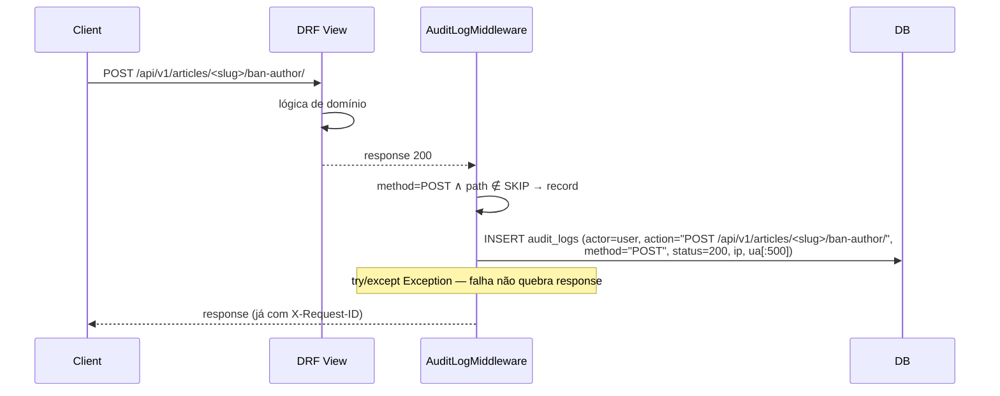
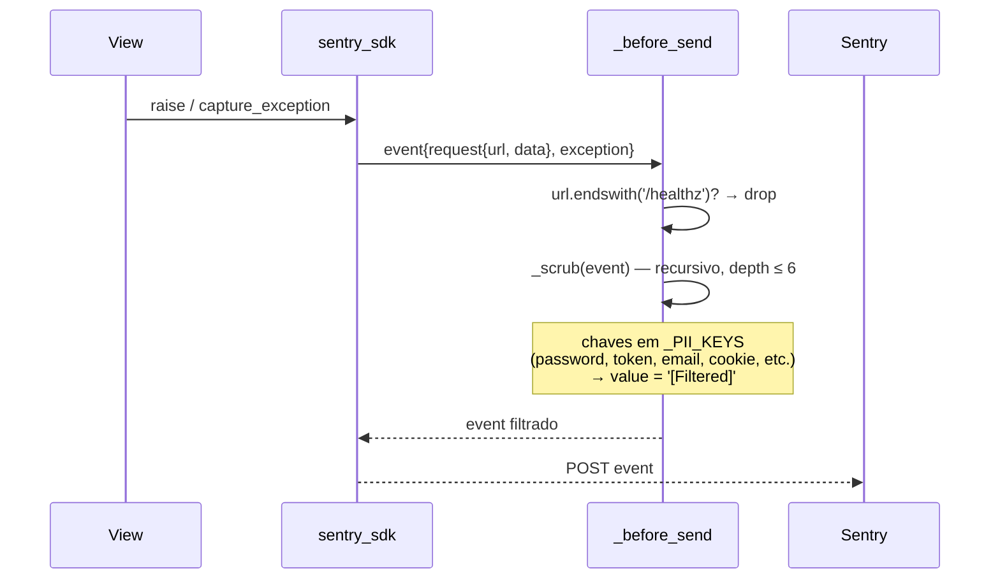

# Design — Módulo `audit` (retroativo)

> **Tipo**: Spec retroativo · **Versão**: v1 · **Data**: 2026-06-09 · **Status**: 🟠 Em produção com débito estrutural conhecido (refactor candidato Sprint 9+)
> **Realiza**: [RF-006 — Auditoria, observabilidade e telemetria operacional](../../requirements/RF/RF-006-audit.md)
> **Epic**: [EP-01 — Fundação da plataforma](../../backlog/epics/EP-01-fundacao-plataforma.md)
> **Specialist**: `backend-architect` (retroativo) + handoff para `cyber-security-architect` (S-10 LGPD)

---

## 0. Responsabilidade

`apps.audit` é o ponto único onde **observability + audit trail + admin BFF + healthcheck** estão grudados. Hoje ele faz **quatro** coisas distintas em um app só: (1) modela e grava `AuditLog` de toda escrita HTTP via middleware, (2) padroniza logging estruturado (RequestID + contextvars + JSON formatter), (3) inicializa Sentry com PII scrubbing, (4) serve um endpoint admin `metrics/` que agrega contagens de 4 outros apps. Mais um endpoint público `/healthz/` e um middleware de Permissions-Policy/CSP completam o quadro. É o módulo de **maior débito estrutural do backend** ([CONCERNS §D-02](../codebase/CONCERNS.md)) — este spec **não defende o desenho atual**, apenas o documenta honestamente para tornar viável o split planejado para Sprint 9+ (ver §8).

---

## 1. Stack (dependências entre apps)

| Dependência                                     | O que importa                            | Uso no `audit`                                                                                    |
| ----------------------------------------------- | ---------------------------------------- | ------------------------------------------------------------------------------------------------- |
| `apps.users`                                    | `IsAdminUser` (`apps.users.permissions`) | Gate de `AdminMetricsView` (`views.py:30,133`)                                                    |
| `apps.articles`                                 | `Article`, `Category`                    | Contagens + per_article ranking em `AdminMetricsView` (`views.py:27,148-170,201-213`)             |
| `apps.comments`                                 | `Comment`, `CommentLike`                 | Contagens + time_series + `_period_stats` (`views.py:28,107-129,182-187`)                         |
| `apps.newsletter`                               | `NewsletterSubscriber`                   | Contagem de subscribers ativos (`views.py:29,122-124,188-190`)                                    |
| `django.core.cache`                             | `cache.set/get`                          | Healthcheck de cache (`health_view.py:43-44`)                                                     |
| `django.db.connection`                          | cursor `SELECT 1`                        | Healthcheck de DB (`health_view.py:31-33`)                                                        |
| `sentry_sdk` + `sentry_sdk.integrations.django` | DjangoIntegration                        | Init Sentry em produção (`sentry.py:67-87`)                                                       |
| `contextvars` (stdlib)                          | `ContextVar`                             | Propaga `request_id` + `user_id` para logging (`logging.py:22-27`)                                |
| `decouple.config`                               | env vars                                 | `CSP_ENFORCE`, `CSP_REPORT_URI`, `SENTRY_DSN`, `SENTRY_TRACES_SAMPLE_RATE`, `GIT_SHA`, `HOSTNAME` |

**Ce alto, confirmado**: `AdminMetricsView` importa de **5 apps distintos** (users + articles + comments + newsletter + (User via get_user_model)). É o maior fan-in de imports de qualquer view do projeto. Cross-ref: observação 2301 (architecture coupling) + CONCERNS §D-02 + §3.6 abaixo.

Não há `signals.py`, `tasks.py`, `services.py` — toda lógica vive em **middleware + view + util**. AuditLog é gravado **sem signal próprio** (escolha consciente: middleware HTTP captura por método/path, signals capturariam por model — pareceriam mais limpo mas perderiam path/status/UA).

---

## 2. Data model

### 2.1 `AuditLog` (`backend/apps/audit/models.py:5-34`)

| Campo             | Tipo                                              | Notas                                                                                                                                                                                                     |
| ----------------- | ------------------------------------------------- | --------------------------------------------------------------------------------------------------------------------------------------------------------------------------------------------------------- |
| `id`              | `BigAutoField` (default app, `apps.py:3`)         | Sequencial — único model do projeto não-UUID. **Inconsistência** com convenção UUID de User/Article/Comment (decisão implícita; sem ADR formal — ver §10).                                                |
| `actor`           | FK `AUTH_USER_MODEL` `SET_NULL`                   | `related_name='audit_logs'`. Nullable: requests anônimos (GET público, login fail) ainda gravam linha sem actor.                                                                                          |
| `action`          | `CharField(max_length=120, db_index=True)`        | Hoje preenchido como `'{method} {path}'` (`middleware.py:77`) — **não é taxonomia semântica**. "login" / "ban" / "publish" são strings derivadas de path, não enums (gap vs. ideal de domínio — ver §10). |
| `target_repr`     | `CharField(max_length=300, blank=True)`           | **Sempre vazio na prática** — nada popula esse campo hoje. Campo morto vivendo no schema (débito D-AUD-04).                                                                                               |
| `request_path`    | `CharField(max_length=500)`                       | Path cru.                                                                                                                                                                                                 |
| `request_method`  | `CharField(max_length=10)`                        | POST/PUT/PATCH/DELETE (filtro em `middleware.py:20,65`).                                                                                                                                                  |
| `response_status` | `PositiveSmallIntegerField`                       | Útil pra detectar bursts de 4xx/5xx — index dedicado (linha 30).                                                                                                                                          |
| `ip_address`      | `GenericIPAddressField`, `null=True`              | **IPv4 ou IPv6 completo** — sem truncamento, sem anonimização. **LGPD blocker** (S-10 em CONCERNS).                                                                                                       |
| `user_agent`      | `TextField(blank=True)`                           | Truncado em 500 chars no insert (`middleware.py:82`) — bots Apple/WhatsApp podem perder UA.                                                                                                               |
| `metadata`        | `JSONField(default=dict)`                         | **Nunca preenchido na prática** — escrita do middleware não passa `metadata=` (`middleware.py:75-83`). Campo morto, igual `target_repr`.                                                                  |
| `created_at`      | `DateTimeField(auto_now_add=True, db_index=True)` | Imutável.                                                                                                                                                                                                 |

**Meta** (`models.py:24-31`):

- `db_table='audit_logs'`, `ordering=['-created_at']`
- Índices: `(actor, -created_at)` + `(action, -created_at)` + `(response_status, -created_at)`. Cobre as 3 queries naturais: "o que esse user fez", "todas as ocorrências de ação X", "todos os 5xx recentes". **Sem índice em `(ip_address, -created_at)`** — investigação de abuso de IP roda full-scan (aceitável até MM linhas).

**Imutabilidade**:

- Admin Django bloqueia `add` e `change` (`admin.py:12-16`).
- Middleware só faz `objects.create(...)` — nunca `update()` nem `delete()`.
- **Garantia é convencional**, não enforced no DB. Atacante com DB write apaga rastro ([CONCERNS Defense-in-depth — `AuditLog integridade`](../codebase/CONCERNS.md)).

### 2.2 Migrações relevantes

- `0001_initial.py`, `0002_initial.py` — schema base. Não há histórico de evolução: `target_repr` e `metadata` nasceram mortos no schema inicial (gap não resolvido em retro).

---

## 3. Componentes (quatro responsabilidades, três responsáveis lógicos diferentes)

Cada subseção abaixo é um **app candidato** num split futuro (§8). O agrupamento atual existe por inércia: cresceu junto desde que `audit` foi o primeiro app a precisar interceptar a request inteira.

### 3.1 `AuditLog` model + `AuditLogMiddleware` (responsabilidade: trilha de auditoria)

`AuditLogMiddleware` (`middleware.py:57-85`):

- Roda **depois** de RequestID (linha 71 da MIDDLEWARE em `base.py:67-71`) — usa `request.user` já populado.
- Filtra por método (`_WRITE_METHODS` `{POST, PUT, PATCH, DELETE}` — `middleware.py:20`) e skip de path (`_SKIP_PATHS` `{/api/v1/auth/refresh/, /admin/}` — `middleware.py:21`).
- Insert é **post-response** (`__call__` linha 61-70): cliente já recebeu HTTP antes do INSERT ocorrer. Custo de log não conta no p99 do request.
- `try/except Exception` cobre o insert (`middleware.py:73-85`) — **AuditLog quebrar nunca pode quebrar request**. Comentário no doctring acima reforça o invariante.

**Não há signals registrados.** Captura é puramente HTTP-method-driven. Trade-off:

- ✅ Captura também via DRF action paths sem precisar instrumentar cada model
- ❌ Não captura mudanças via `python manage.py shell`, via management command, via signal pré-save de outro app, via fixture-load
- ❌ `/admin/` é skipado (`_SKIP_PATHS`) — admin Django bypassa o audit custom; `django.contrib.admin.models.LogEntry` cobre, mas em outro formato (CONCERNS D-09)

### 3.2 `RequestIDMiddleware` + `RequestContextFilter` (responsabilidade: observability / correlation)

`RequestIDMiddleware` (`middleware.py:24-54`):

- Gera `uuid.uuid4().hex[:16]` por request — **16 hex chars (= 64 bits de entropia)**. Honra `X-Request-ID` header de entrada se cliente já gerou (limite 64 chars na linha 39).
- Stamp `request.id` + contextvars (`request_id_var`, `user_id_var`) — propaga para qualquer `logging.getLogger(...).info(...)` no request lifecycle (via filter).
- Reset com `ContextVar.reset(token)` em `finally` (`middleware.py:51-52`) — corretamente isolado entre requests, sem leak entre coroutines/threads.
- Stamp response header `X-Request-ID` (linha 53) — cliente pode logar em paralelo e referenciar em ticket de suporte (trade-off documentado em CONCERNS O-07).

`RequestContextFilter` (`logging.py:30-41`):

- `logging.Filter` (não Formatter) — Django LOGGING aplica filters antes do formatter consumir `%(request_id)s` e `%(user_id)s`.
- Defaults `'-'` em vez de `None`/empty string — facilita grep e diferencia "anônimo" de "valor não populado".
- Configurado em `base.py:307-321` (formatters `json` em prod, `console` em dev — ambos consomem `%(request_id)s %(user_id)s`).

**Gotcha de ordem de middleware** (CONCERNS "Áreas onde ler primeiro, mudar depois"): `RequestIDMiddleware` precisa rodar **depois** de `AuthenticationMiddleware` (lê `request.user` linha 41-45) e **antes** de `AuditLogMiddleware` (que consome contextvars indiretamente via logging). Quebrar essa cadeia mata os logs estruturados em silêncio.

### 3.3 Sentry init (`sentry.py:56-90`) (responsabilidade: telemetria de erro externo)

- `init_sentry(environment='unknown')` é chamada **uma vez** em `production.py` (gate condicional via `SENTRY_DSN`).
- Sem DSN → no-op (`sentry.py:62-64`); sem `sentry_sdk` instalado → warn e no-op (`sentry.py:67-71`). Dev local não força telemetria.
- `before_send = _scrub` (`sentry.py:46-53`) faz duas coisas:
  - Dropa events de `/healthz/` ou `/healthz` (drop early, antes do scrub) — **mas só por path EXATO** (`endswith('/healthz/')`). Query string `/healthz/?probe=1` passa direto e gera event de health check no Sentry (observação 872 — débito D-AUD-01 confirmado, §8).
  - Scrub recursivo (`_scrub` linha 31-43): substitui valores cujas **chaves** estão em `_PII_KEYS` por `'[Filtered]'`. Lista (linha 22-28) cobre `password*`, `*_token`, `csrf_token`, `authorization`, `cookie`, `email`, `cpf`, `phone`, `sendgrid_api_key`, `secret_key`, `jwt_signing_key`. **Cobertura por chave, não por valor** — se a senha vier como part de payload sem chave `password` (improvável mas possível em payloads custom), passa. Profundidade limitada em 6 (proteção contra estruturas cíclicas — linha 34).
- `send_default_pii=False` (linha 82) é defesa em profundidade. Sentry SDK por default não enviaria IP/cookie; reforçar é cheap.
- `traces_sample_rate=0.1`, `profiles_sample_rate=0.05` — env-overridable (linhas 77-79). Calibrado para tier KVM 1 — não queimar quota nem ofuscar trends.
- `release=GIT_SHA[:12]` + `environment` + `server_name=HOSTNAME` — permite filtrar por deploy em incident response.

### 3.4 `SecurityHeadersMiddleware` (`security_headers_middleware.py:69-92`) (responsabilidade: hardening de browser policy)

- Injeta **dois** headers que Django nativo não cobre:
  - `Permissions-Policy` (constante em linha 28-34): desabilita camera, microphone, geolocation, payment, USB, sensores, autoplay, encrypted-media, picture-in-picture; mantém `fullscreen=(self)`.
  - `Content-Security-Policy` ou `Content-Security-Policy-Report-Only` (linha 86-91, decisão via `CSP_ENFORCE` setting).
- `_build_csp(report_uri)` (linha 37-66) constrói uma policy baseline:
  - `script-src 'self' 'unsafe-inline'` — **compromisso consciente**: Django admin usa inline. Comentário no código (linhas 40-44) reconhece e propõe caminho de saída (django-csp-nonces ou interface admin custom). Esse `'unsafe-inline'` **desabilita 80% da proteção do CSP** contra stored-XSS — combinado com S-01 (sem sanitização HTML em comments/articles) é defesa em profundidade ilusória.
  - `frame-ancestors 'none'` é redundante com `X-Frame-Options DENY` (`base.py:272`) — intencional (X-Frame deprecated em favor de CSP).
  - `img-src 'self' data: https:` — permite qualquer HTTPS (necessário para avatares + embeds OG).
- `setdefault` (linhas 82, 91) — não sobrescreve se view já setou. Útil para futuros endpoints que querem CSP custom (ex.: PDF preview com mais permissivo).
- Lê settings **a cada request** (linhas 84-85, `getattr(settings, ...)`), permitindo `override_settings` em testes.

**Gap operacional grave**: `CSP_REPORT_URI` default `''` (vazio, `base.py:293`) **sem warn** — em prod, violations descem para o vazio (CONCERNS §S-03 + observação 877). Permission-Policy também silently aceita override. Cerimônia sem proteção — débito S-03 priorizado em §8.

### 3.5 `AdminMetricsView` (`views.py:132-237`) (responsabilidade: BFF de dashboard admin)

- **Endpoint**: `GET /api/v1/admin/metrics/` (`urls.py:6` + `config/urls.py:37`).
- **Permissão**: `IsAuthenticated + IsAdminUser` (`views.py:133`).
- **Query param**: `?period=day|week|month|year` (default `week`) — controla `_period_stats`, `previous_period_stats` (para delta) e granularidade do time series (`_generate_buckets` linha 42-85, `_trunc_for` linha 88-93).
- **Agrega**:
  - `totals` lifetime: users, subscribers, articles publicados, view_count total, comments visíveis, likes (linhas 221-228 — 6 COUNTs)
  - `period_stats` + `previous_period_stats` (linhas 231-232, cada um faz 6 queries — total 12 nessa seção)
  - `per_article` ranking top 20 (PER_ARTICLE_LIMIT=20, linha 39): article + comment_count + like_count + engagement_rate computado em Python (linha 172-174 — comment explica que ORM divisions são brittle)
  - `time_series` em 5 séries (comments, likes, subscribers, users, articles — linhas 180-197): cada uma faz 1 grouped-count truncado por bucket
  - `category_breakdown` (linhas 201-213): retorna **toda** categoria mesmo com 0 — comment justifica ("editorial palette completa")
- **Query budget**: ~25 queries por hit. **Sem cache, sem rate-limit dedicado** — apoia em DRF default `1000/h` + permissão `IsAdminUser`. Em escala (3 admins recarregando o dashboard) já abre flank: **sem `assertNumQueries` em test** (observação 874 — débito D-AUD-02 confirmado, §8).
- **Sem `select_related`/`prefetch_related`** porque tudo passa por `.values()` ou `.aggregate()` — não há objeto Django sendo materializado. Mas `Count` com `filter=Q(...)` + `distinct=True` (linhas 152-166) força planner Postgres a fazer hash distinct — query plan precisa ser monitorado.

**Por que isso é BFF disfarçado**: a view sabe **exatamente** o que o frontend admin precisa renderizar (donut de categoria, linha de tempo, ranking de artigo, delta vs período anterior). Não é uma API genérica. É um Backend-for-Frontend embutido em `apps.audit` por falta de lugar melhor. Ou se aceita como CQRS materialized read (ADR formal) ou se separa em `apps.admin_bff` (§8).

### 3.6 `healthz` (`health_view.py:49-65`) (responsabilidade: liveness/readiness probe)

- **Endpoint**: `GET /healthz/` + alias `GET /healthz` (sem slash) — montado em `config/urls.py:21-22`.
- **Sem auth, sem throttle, sem audit log** (`/healthz` não está em `_WRITE_METHODS` então AuditLog não toca; auth não montada na URL).
- Faz 2 checks: `_check_db` (`SELECT 1` via cursor — `health_view.py:28-36`) + `_check_cache` (`cache.set('healthz', 'ok', 5)` + get — linha 39-46).
- Retorna `200 status:ok` se ambos passam, `503 status:degraded` caso contrário.
- Payload inclui `version` = `GIT_SHA[:12]` ou `'unknown'` (linha 58) — útil para confirmar qual deploy está vivo.
- **Gate de performance**: < 50ms p99 por convenção (docstring linha 13-15). 4 testes formais em `tests/test_health.py` (43 LOC, 4 testes) cobrem 200/alias-sem-slash/no-auth/version-env.

Consumidores documentados (docstring linha 7-12): UptimeRobot (1×/min), nginx upstream check, smoke test do `deploy.sh` (rollback automático se 503 após restart do gunicorn).

### 3.7 `get_client_ip` (`utils.py:12-30`) (responsabilidade: telemetria compartilhada)

- Lê `HTTP_X_FORWARDED_FOR` primeiro elemento → fallback `REMOTE_ADDR` → `None`.
- Justificativa de morar em `audit/utils.py` (docstring linha 1-8): IP é dado de telemetria, e `audit` é o app que naturalmente vê toda request via middleware.
- **Não respeita `CF-Connecting-IP`** (Cloudflare-specific header) explicitamente — confia que nginx already agrega Cloudflare em XFF. **Frágil**: se Cloudflare for desativado ou bypassed, XFF pode vir do próprio client (spoofable). Não há `NUM_PROXIES` env var no projeto — pattern típico Django ausente.
- Fallback de chamadores em `'0.0.0.0'` (ex.: `apps/articles/views.py:112`) significa que clientes sem IP detectável **compartilham um bucket de rate-limit** — anti-pattern documentado em CONCERNS §"Padrões a NÃO replicar" item 4.

---

## 4. Public contract

| Método | URL                              | View               | Permissões                      | Throttle                                          | Audit?                          |
| ------ | -------------------------------- | ------------------ | ------------------------------- | ------------------------------------------------- | ------------------------------- |
| `GET`  | `/healthz/` (+ `/healthz` alias) | `healthz` (FBV)    | `AllowAny`                      | nenhum                                            | não (skip via `_WRITE_METHODS`) |
| `GET`  | `/api/v1/admin/metrics/`         | `AdminMetricsView` | `IsAuthenticated + IsAdminUser` | DRF default `user=1000/h` (não dedicado — débito) | não (GET)                       |

**Sem endpoint para LER `AuditLog`** — investigação só via Django admin (`/admin/audit/auditlog/`, `admin.py:5-16`) ou shell. Decisão consciente: AuditLog é insumo de incident response, não produto. Mas implica que qualquer dashboard de "minhas atividades" para o próprio usuário é **inexistente** — gap se LGPD-DSAR exigir mostrar histórico.

**Headers de response adicionados pelo módulo** (em **toda** resposta Django, não só do app):

- `X-Request-ID: <16-hex>` (RequestIDMiddleware, sempre)
- `Permissions-Policy: <baseline>` (SecurityHeadersMiddleware, sempre)
- `Content-Security-Policy-Report-Only: <baseline>` OU `Content-Security-Policy: <baseline>` (SecurityHeadersMiddleware, conforme `CSP_ENFORCE`)

---

## 5. Fluxos críticos

### 5.1 Request rastreável end-to-end

```mermaid
sequenceDiagram
  participant Client
  participant RID as RequestIDMiddleware
  participant Auth as AuthenticationMiddleware
  participant View
  participant LOG as logging<br/>(RequestContextFilter)
  participant AUD as AuditLogMiddleware
  participant DB

  Client->>RID: HTTP request (com ou sem X-Request-ID)
  RID->>RID: rid = header or uuid4().hex[:16]
  RID->>RID: request_id_var.set(rid); user_id_var.set(uid)
  RID->>Auth: (já rodou antes — request.user populado)
  RID->>View: get_response(request)
  View->>LOG: logger.info("...")
  LOG->>LOG: filter injeta request_id + user_id
  View-->>RID: response
  RID->>RID: ctx.reset(); response['X-Request-ID']=rid
  RID->>AUD: response
  AUD->>AUD: if method ∈ WRITE_METHODS and path ∉ SKIP
  AUD->>DB: INSERT audit_logs (...)
  AUD-->>Client: response com X-Request-ID
```

### 5.2 AuditLog de ação POST (publicar artigo, banir, comentar)



**O que NÃO é capturado nesse fluxo**:

- Path skip (`/api/v1/auth/refresh/` ou `/admin/`).
- `action` é texto cru do path, não enum semântico (`'POST /api/v1/articles/foo/ban-author/'` ≠ `action='ban'`).
- `target_repr` e `metadata` ficam vazios — não há quem popule.

### 5.3 Health check

```mermaid
sequenceDiagram
  participant UR as UptimeRobot
  participant URL as urls.py
  participant H as healthz()
  participant DB
  participant Cache

  UR->>URL: GET /healthz/
  URL->>H: dispatch (no middleware filter)
  H->>DB: cursor.execute('SELECT 1')
  DB-->>H: ok / error
  H->>Cache: set('healthz', 'ok', 5); get('healthz')
  Cache-->>H: ok / mismatch / error
  H-->>UR: 200 {status, version, db, cache}<br/>OR 503 {status: degraded, ...}
```

### 5.4 Sentry capture com PII scrubbing



---

## 6. Invariantes

| #   | Invariante                                                                               | Onde se sustenta                                                                                            | Coberto por                                                                                  |
| --- | ---------------------------------------------------------------------------------------- | ----------------------------------------------------------------------------------------------------------- | -------------------------------------------------------------------------------------------- |
| I1  | `AuditLog` é INSERT-only (nunca UPDATE, nunca DELETE)                                    | `admin.py:12-16` bloqueia change/add; middleware só faz `objects.create`                                    | **Convencional** — nenhum trigger DB enforce. Gap defense-in-depth.                          |
| I2  | `request_id` propaga até logs profundos no request lifecycle                             | `contextvars.ContextVar` + `RequestContextFilter` em todo handler de `LOGGING['handlers']` (`base.py:307+`) | `tests/test_middleware.py` (84 LOC) cobre stamp + reset                                      |
| I3  | AuditLog quebrar **nunca** quebra request                                                | `try/except Exception` em `middleware.py:73-85` + `logger.exception` log out-of-band                        | Implícito (cobertura existe em test_middleware)                                              |
| I4  | `/healthz/` responde em < 50ms p99                                                       | 2 checks síncronos, sem auth, sem audit, sem signals                                                        | `tests/test_health.py:14-43` (4 testes) — mas **sem assertion de latência** (gap GAP-AUD-01) |
| I5  | Sentry nunca envia password/token/email/cookie                                           | `_before_send` faz scrub por chave (`sentry.py:31-43`) + `send_default_pii=False` (linha 82)                | `tests/test_sentry.py` (108 LOC) cobre scrub recursivo                                       |
| I6  | RequestIDMiddleware honra `X-Request-ID` recebido do cliente (correlation cross-service) | `middleware.py:39` `request.headers.get('X-Request-ID') or uuid4().hex[:16]`                                | `tests/test_middleware.py`                                                                   |
| I7  | Sentry dropa events de healthcheck para não poluir noise                                 | `before_send` linha 49-51                                                                                   | **PARCIAL** — query string bypassa (observação 872, §8 D-AUD-01)                             |
| I8  | `AdminMetricsView` cap em 20 artigos                                                     | `PER_ARTICLE_LIMIT=20` linha 39 + slice linha 169                                                           | `tests/test_admin_metrics.py` (426 LOC)                                                      |
| I9  | `get_client_ip` retorna primeiro elemento de XFF (não toda a cadeia)                     | `utils.py:29` `forwarded.split(',')[0].strip()`                                                             | Cobertura indireta via `test_middleware.py`                                                  |

---

## 7. Conhecimento operacional

### 7.1 Rodar testes do módulo

```bash
cd backend
uv run pytest apps/audit/ -v
# 5 arquivos de teste, 806 LOC total:
# test_health.py            43 LOC  · 4 testes
# test_middleware.py        84 LOC
# test_security_headers.py 145 LOC
# test_sentry.py           108 LOC
# test_admin_metrics.py    426 LOC (maior — reflete complexidade da view)
```

### 7.2 Inspecionar AuditLog no shell

```bash
uv run python manage.py shell
```

```python
from apps.audit.models import AuditLog
from django.contrib.auth import get_user_model

# Últimas 50 ações de um usuário:
User = get_user_model()
u = User.objects.get(email='gabriel@interpop.com.br')
u.audit_logs.all()[:50]

# Bursts de erro recente:
AuditLog.objects.filter(response_status__gte=500).values('action').annotate(n=Count('id')).order_by('-n')[:10]

# Atividade por IP suspeito (full scan — sem índice):
AuditLog.objects.filter(ip_address='1.2.3.4').count()

# Verificar quem deletou no último 1h:
from datetime import timedelta; from django.utils import timezone
AuditLog.objects.filter(
    request_method='DELETE',
    created_at__gte=timezone.now() - timedelta(hours=1),
).values('actor__email', 'request_path')
```

### 7.3 Debugar request específico em prod

```bash
# Cliente reporta erro com X-Request-ID = abc123def456...
ssh interpop@kvm
sudo journalctl -u gunicorn --since "1 hour ago" | grep 'request_id=abc123def456'
# Agrega TODAS as linhas daquele request, mesmo cruzando módulos.
```

### 7.4 Verificar healthz local

```bash
uv run python manage.py runserver
curl -i http://127.0.0.1:8000/healthz/
# Deve retornar 200 com {"status":"ok","version":"unknown","db":"ok","cache":"ok"}
```

### 7.5 Tunar Sentry sample rate em prod

```bash
# .env de produção:
SENTRY_TRACES_SAMPLE_RATE=0.05  # mais conservador
SENTRY_PROFILES_SAMPLE_RATE=0.02
# Reiniciar gunicorn — init_sentry() lê env no boot.
```

### 7.6 Rotacionar SENTRY_DSN se vazar

1. Gerar novo DSN no Sentry UI (revogar antigo).
2. `nano /etc/interpop/.env` → atualizar `SENTRY_DSN`.
3. `sudo systemctl restart gunicorn-interpop`.
4. Verificar `/healthz/` + linha "Sentry: initialized" nos logs.

### 7.7 Django admin do AuditLog

`/admin/audit/auditlog/` — `list_display` = (created_at, actor, action, response_status, ip_address); `search_fields` permite busca por email/action/path/IP (`admin.py:9`). `readonly_fields` cobre **todos** os campos (`admin.py:10`) — UI reforça imutabilidade.

---

## 8. Status e débitos (HONESTO — este módulo tem mais débito que os outros)

Cross-ref: [CONCERNS §D-02 (top débito estrutural do backend)](../codebase/CONCERNS.md), §S-03 (CSP cerimônia), §S-10 (LGPD retenção), §D-08 (defensive guard divergente), §O-07 (X-Request-ID exposed).

### 🔴 Críticos (refactor planejado)

#### D-AUD-00 — Módulo com 4 responsabilidades distintas em um único app

**Confirmado**: `ls apps/audit/` mostra middleware (RequestID + AuditLog), `sentry.py` (Sentry init), `security_headers_middleware.py` (Permissions-Policy + CSP), `logging.py` (structlog filter), `health_view.py`, `views.py` (AdminMetricsView). SRP ferido. Refactor candidato para Sprint 9+:

- `apps.observability` — RequestID + RequestContextFilter + Sentry init + healthz (responsabilidades de telemetria/operação)
- `apps.audit` (puro) — só AuditLog model + AuditLogMiddleware + admin
- `apps.admin_bff` (ou rename de `apps.audit_views`) — AdminMetricsView
- `apps.security_headers` — SecurityHeadersMiddleware (ou `django-csp` package, escolha de ADR)

Antes de refatorar: **ADR formal** explicando split e ordem de extração. Risco de quebrar ordem de middleware (CONCERNS §"ler primeiro mudar depois" — `RequestIDMiddleware` precisa rodar depois de Auth e antes de AuditLog).

#### D-AUD-02 — `AdminMetricsView` importa de 5 apps + sem `assertNumQueries` + sem throttle dedicado

**Confirmado por observação 874**. Endpoint:

- Faz ~25 queries por hit (totais + period × 2 + per_article + time_series × 5 + category breakdown). PR futuro que adicione `select_related` errado ou um Count adicional vira N+1 silencioso.
- Sem cache (linha 132-237 não tem `@method_decorator(cache_page(...))`). 3 admins recarregando = 75 queries.
- Sem `ScopedRateThrottle 'admin_metrics': 30/min` — pattern já vivo em `apps/users/views.py:32` e `apps/search/throttles.py`.

**Mitigações**: (a) `assertNumQueries(<=25)` em `test_admin_metrics.py` (regression guard); (b) cache de 60s com key por `period` + `user.id` (cheap, dashboard tolera staleness); (c) ScopedRateThrottle dedicado.

#### S-10 (CONCERNS) — `AuditLog` retenção indefinida, IP cru, **LGPD blocker**

**Confirmado**: `grep -rn "AuditLog.*delete|cleanup" backend/apps/audit/` retorna 0. Insert grava IP + UA + actor + path indefinidamente. Vazamento da tabela após 1+ ano = mapa de quem leu/comentou/curtiu o quê. LGPD art. 16 exige tempo necessário ao tratamento.

**Mitigação obrigatória antes de go-live público**:

- Cron task semanal: `AuditLog.objects.filter(created_at__lt=now-90d).update(ip_address=None, user_agent='[expired]')`.
- Full purge após 2 anos.
- ADR de retenção + atualização de doc DPO.

Cross-ref: [CONCERNS §O-06 — gaps LGPD operacionais](../codebase/CONCERNS.md).

### 🟠 Importantes (planejar)

#### D-AUD-01 — Sentry `_before_send` filtro de healthz vulnerável a query string

**Confirmado por observação 872**. `sentry.py:50` faz `endswith('/healthz/')` ou `endswith('/healthz')`. Probe com `?probe=1` (UptimeRobot configurável faz isso) **bypassa** o drop e gera event Sentry. Quota queimada por noise.

**Fix**: trocar para `urlparse(url).path in {'/healthz/', '/healthz'}` ou `re.match(r'^.*?/healthz/?$', url.split('?')[0])`. 2 linhas.

#### S-03 (CONCERNS) — CSP `Report-Only` indefinido + `CSP_REPORT_URI` aceita vazio sem warn

**Confirmado por observação 877 + `base.py:292-293`**. `CSP_ENFORCE` default `False`; `CSP_REPORT_URI` default `''`. Violations descem para o vazio. Cerimônia sem proteção.

**Mitigação**:

1. Endpoint interno `POST /api/v1/security/csp-report/` que loga via structlog + dispara `sentry_sdk.capture_message(level='warning')`.
2. Hard-fail em `production.py`: se `CSP_REPORT_URI == ''` e Sentry DSN configurado → assumir Sentry CSP endpoint (`https://o<orgId>.ingest.sentry.io/api/<projectId>/security/?sentry_key=<key>`). Caso contrário, `raise ImproperlyConfigured`.
3. Timeline para flip `CSP_ENFORCE=True` — 1 semana de baseline limpo no Report-Only.
4. Plano para remover `script-src 'unsafe-inline'` (linha 54): caminho realista é admin Django custom OU `django-csp` com nonce middleware (não trivial — admin templates fazem `<script>` inline).

#### D-AUD-03 — `RequestIDMiddleware` e `AuditLogMiddleware` divergem em defensive guard

**Confirmado por CONCERNS §D-08 + observação 875**. `middleware.py:41-45` (`RequestIDMiddleware`) faz `hasattr(request, 'user') and request.user.is_authenticated`. `middleware.py:74` (`AuditLogMiddleware`) faz só `request.user.is_authenticated`. Sem o `hasattr` guard, ordem de middleware quebrada explode em `AttributeError` que o `try/except Exception` engole — audit fica silenciosamente cego.

**Fix**: extrair helper `_user_or_none(request)` em `apps.audit.utils` e usar em ambos. 5 linhas.

#### D-AUD-04 — `target_repr` e `metadata` nasceram mortos no schema

**Confirmado**: `grep -rn "target_repr\|metadata" backend/apps/audit/` mostra que **nada** escreve esses campos. Schema carrega 300 chars + JSON field default `{}` por linha para nada.

**Decisão pendente**:

- **(a)** Implementar de fato (action como enum, target via `ContentType` polimórfico, metadata estruturado por action) — esforço alto, valor real para LGPD-DSAR ("o que admin X mudou em mim?").
- **(b)** Remover via migration — schema honesto.

Não decidir é débito invisível. Vinculado ao D-AUD-00 (refactor estrutural).

### 🟡 Menores (oportunístico)

#### D-AUD-05 — `request_id` 16 hex chars = 64 bits, colisão teórica em alta volume

**Verificado**: `middleware.py:39` `uuid.uuid4().hex[:16]`. Birthday bound colisão em 2^32 ≈ 4.3 bilhões de requests (não-prático no horizonte Interpop). Mas filtro de log `grep request_id=<rid>` com 16 chars pega colisões espúrias em ferramentas que truncam ainda mais.

**Decisão**: deixar como está OU usar UUID completo (32 chars). Custo trivial — debate é UX de log (linhas mais longas vs. unicidade plena).

#### D-AUD-06 — `_check_cache` em LocMemCache é per-process (3 workers gunicorn = 3 backends distintos)

`health_view.py:43-44` faz `cache.set/get` no backend default. Em dev = LocMem (sempre passa). Em prod com 3 workers gunicorn + LocMem (ainda não migrou para Redis — A20/S-06 em CONCERNS), cada healthz hit testa só o cache do worker que recebeu — não revela cache compartilhado broken (porque não existe ainda). Healthz **passa enganando** sobre cache compartilhado.

**Mitigação acoplada a A20**: quando Redis virar default em prod, `_check_cache` automaticamente vira liveness real de Redis. Até lá, healthz só atesta "LocMem do meu worker funciona" — tautológico.

#### D-AUD-07 — `_SKIP_PATHS` rígido sem documentação de "por que skip"

**Confirmado por CONCERNS §D-09**. `middleware.py:21` skipa `/api/v1/auth/refresh/` (alto volume, semanticamente não state-changing — defensável) e `/admin/` (mudanças via Django admin **não** aparecem em AuditLog — LGPD-relevante).

**Decisão pendente**: manter skip e usar `django.contrib.admin.models.LogEntry` para investigação de admin (formato divergente — tooling de export precisa unir os dois); OU remover skip e aceitar overhead. Documentar em ADR.

#### D-AUD-08 — `get_client_ip` não respeita `NUM_PROXIES`

`utils.py:27-29` pega primeiro elemento de XFF sem skip de N proxies confiáveis. Em ambiente onde **dois** reverse proxies estão no caminho (Cloudflare → nginx → gunicorn), XFF chega `cliente, cloudflare-edge, nginx`. Pegar `[0]` ainda dá o IP correto **porque Cloudflare reescreve**, mas pattern é frágil. Se Cloudflare for desativado e nginx for o único proxy, atacante pode injetar header XFF custom no client → bypass de rate-limit.

**Mitigação**: setting `NUM_PROXIES` + helper que faz `forwarded.split(',')[-NUM_PROXIES-1].strip()`. Pattern Django-rest-framework já tem em `IPAddressThrottle`.

### Gaps de cobertura (cross-ref §6 invariantes)

| #          | Gap                                                                                                                     | Severidade |
| ---------- | ----------------------------------------------------------------------------------------------------------------------- | ---------- |
| GAP-AUD-01 | Sem assertion de latência em `test_health.py` — invariante I4 (< 50ms) não é verificada                                 | 🟢         |
| GAP-AUD-02 | Sem `assertNumQueries` em `test_admin_metrics.py` — regressão de N+1 passa                                              | 🟠         |
| GAP-AUD-03 | Sem teste de race condition no `RequestContextFilter` (contextvars são corretos por design, mas teste de smoke valeria) | 🟢         |
| GAP-AUD-04 | Sem teste do path de erro em `AuditLog write failed` — caminho `try/except` linha 84-85 não é exercitado                | 🟢         |

---

## 9. Cross-references

- **Requisito**: [RF-006 — Auditoria, observabilidade e telemetria operacional](../../requirements/RF/RF-006-audit.md) (stub — preencher retroativo)
- **Epic**: [EP-01 — Fundação da plataforma](../../backlog/epics/EP-01-fundacao-plataforma.md)
- **Codebase mapping**:
  - [ARCHITECTURE.md — middleware order + signal flow](../codebase/ARCHITECTURE.md)
  - [STRUCTURE.md — `backend/apps/audit/`](../codebase/STRUCTURE.md)
  - [CONCERNS.md §D-02, §S-03, §S-10, §D-08, §D-09, §O-07](../codebase/CONCERNS.md)
  - [INTEGRATIONS.md — Sentry, UptimeRobot, Cloudflare](../codebase/INTEGRATIONS.md)
- **ADRs relacionadas** (em `docs/planning/Improvement-system.md`, gitignored — pedir ao Gabriel):
  - A27 — Logging estruturado (estabelece JSON formatter + RequestContext)
  - A28 — Sentry init gating
  - A29 — Healthz contract (gate de deploy + UptimeRobot)
  - A20 — Redis caching (libera D-AUD-06)
  - S3/S9 §11.6 — Security headers (CSP + Permissions-Policy)
- **Settings tocadas**:
  - `backend/config/settings/base.py:55-79` (MIDDLEWARE order, **crítica**)
  - `backend/config/settings/base.py:269-293` (security headers + CSP)
  - `backend/config/settings/base.py:295-360` (LOGGING dict, lê de `apps.audit.logging`)
  - `backend/config/settings/production.py` (chamada `init_sentry(environment='production')`)
- **Endpoints externos do módulo**:
  - `backend/config/urls.py:21-22` (`/healthz/` + alias)
  - `backend/config/urls.py:37` (`/api/v1/admin/metrics/` via include)
- **Runbooks**: cobre Sentry quota, DB exhaustion, gunicorn restart — **não cobre** rotação de `SENTRY_DSN` nem restore de `AuditLog` corrompido (gap operacional).

---

## 10. Open questions (escalar antes de refatorar)

1. **Quando o split do app acontece (D-AUD-00)?** Sprint 9+ é o slot natural após search consolidar. Order de extração: (a) `apps.security_headers` (independente, menor risco), (b) `apps.observability` (Sentry + RequestID + healthz — testar middleware order), (c) `apps.admin_bff` (mover AdminMetricsView + urls), (d) `apps.audit` fica enxuto (model + AuditLogMiddleware + admin).
2. **`AdminMetricsView` vira BFF formal (ADR) ou separa em app próprio?** Hoje é BFF disfarçado. ADR aceita o pattern (vantagem: contrato explícito com `src/pages/Admin/`) OU split com API genérica + frontend agrega (vantagem: SRP, desvantagem: chatter de rede).
3. **Quando `CSP_ENFORCE=True`?** Depende de criar endpoint de report (`/api/v1/security/csp-report/`) + 1 semana de baseline limpo. Bloqueio operacional para defesa real contra S-01 (XSS) + S-03 (cerimônia atual).
4. **`AuditLog` TTL formal — 90 dias? 1 ano? Indefinido?** S-10 é LGPD blocker pré-go-live. ADR explícito de retenção por tabela (audit_logs, comments soft-deleted, newsletter unsubscribed) precisa ser produzido **antes** do cron.
5. **`target_repr` e `metadata` — preencher ou deletar?** D-AUD-04. Preencher exige refactor de captura (de "string do path" para "ação semântica + ContentType polimórfico"). Deletar é honesto. Decisão depende de quão sério tomamos LGPD-DSAR.
6. **`action` cru vs. enum semântico?** Hoje `'POST /api/v1/articles/foo/ban-author/'`. Para investigação humana funciona; para query agregada ("quantos bans nessa semana?") é frágil (path muda quebra agregação). Vinculado à pergunta 5.
7. **`AuditLog.id` é `BigAutoField` enquanto resto do projeto é UUID — manter inconsistência?** Sequence é apropriado para tabela append-only (sem risco de enumeration porque endpoint não expõe `id`). Mas inconsistência convencional pode confundir contribuidores. Decisão de estilo + ADR.
8. **`X-Request-ID` no response é trade-off consciente** (CONCERNS O-07). Manter ou trocar por HMAC do request_id para zero-leak? Hoje aceitável (UUID aleatório, 64 bits).
9. **`/admin/` skip do AuditLogMiddleware** (D-AUD-07): aceita gap LGPD ou remove skip? Override usar `LogEntry` nativo precisa de tooling de export consolidado.

---

_Spec retroativo criado em 2026-06-09 (Sprint housekeeping). Anti-sycophancy: este módulo está **inchado** e o spec não tenta defender o desenho — apenas documenta o que existe para tornar o refactor visível e seguro. Cross-ref obrigatório com [CONCERNS.md](../codebase/CONCERNS.md). Próximo passo: handoff para `cyber-security-architect` validar S-10 (LGPD) e S-03 (CSP); handoff para `software-architect` desenhar ADR de split (D-AUD-00) antes de Sprint 9+._

_Skills aplicadas: `backend-architect`, `tlc-spec-driven`, `architecture-decision-records`, `observability-engineer`, `gdpr-data-handling`._
