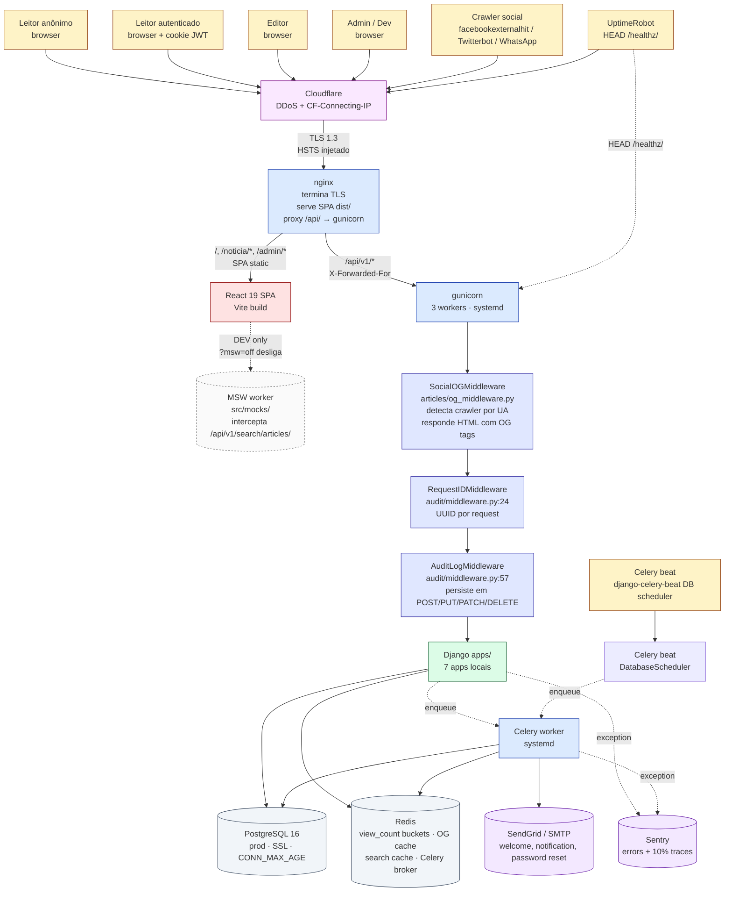
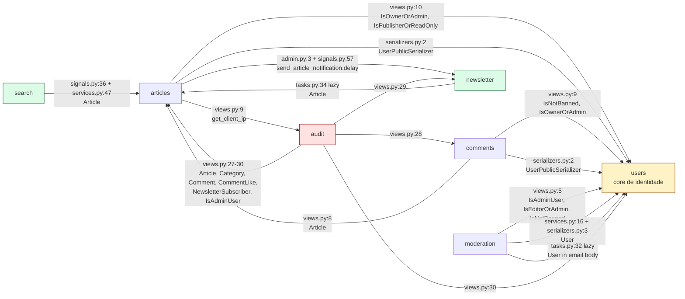
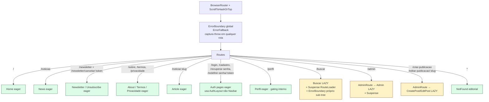
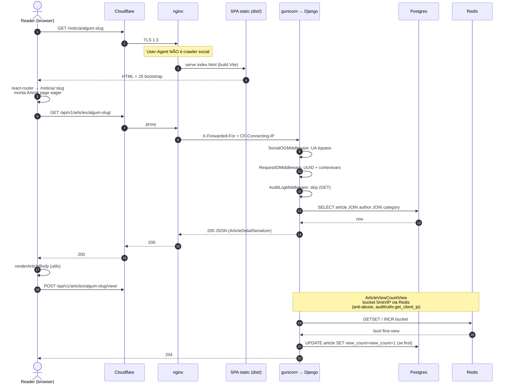
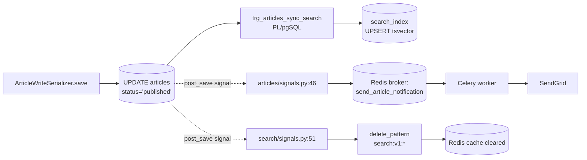
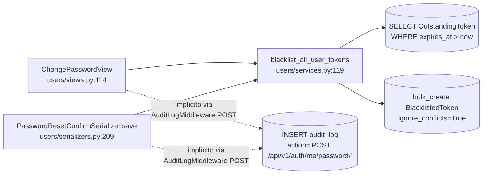

# Interpop — Architecture (brownfield)

> **Objetivo deste documento (SDD codebase spec).** Descrever a arquitetura
> _real_ do sistema hoje — componentes, boundaries, fluxos, regras de
> acoplamento. É complemento de profundidade ao
> [`docs/architecture/overview.md`](../../architecture/overview.md) (mapa de
> leitura). Aqui mora o que precisa de evidência (`grep`, `cat`, `urls.py`,
> `signals.py`): quem importa quem, o que dispara o quê, como o dado
> propaga entre apps.
>
> **Quando atualizar**: a cada mudança que mexa em boundary entre apps
> (import novo cross-app), em URL pública, em signal/task, em layer
> layout do frontend, ou em política de cache/persistence cross-componente.
> **Não atualizar** para mudança interna de view/serializer/template.
>
> **Verificado em**: 2026-06-09. Fonte de cada afirmação cita
> `arquivo.py:linha`.

---

## §1. Visão de cima — sistema como um todo



**Onde MSW vive**: somente em `import.meta.env.DEV` (`src/main.tsx:33`).
Em produção, `enableMocks()` retorna cedo e `msw` é tree-shaken pelo Vite.
Pode ser desligado em dev via `?msw=off` (`src/main.tsx:38`).

**Onde Sentry coleta**: init em `apps/audit/sentry.py` (auto-init em prod
com `SENTRY_DSN` setado); inclui PII scrubbing; releases marcadas por
`GIT_SHA` env. Cobertura: views Django, tasks Celery.

**Health check**: `GET /healthz/` (`config/urls.py:21`, view em
`apps/audit/health_view.py`) — root path, sem versioning, retorna db+cache
em <50ms. UptimeRobot bate por minuto; smoke test do deploy também usa.

---

## §2. Apps Django — 7 boundaries lógicas

### §2.1 Tabela-resumo

| App          | Responsabilidade (1 frase)                                                                                                   | Modelos principais                                     | Endpoints públicos                                                                                                                                                 |
| ------------ | ---------------------------------------------------------------------------------------------------------------------------- | ------------------------------------------------------ | ------------------------------------------------------------------------------------------------------------------------------------------------------------------ |
| `users`      | Identidade, auth, roles, permissions canônicas, password reset, token blacklist.                                             | `User` (`models.py:12`), `PasswordResetToken` (`:110`) | `/api/v1/auth/login/`, `/logout/`, `/register/`, `/refresh/`, `/me/`, `/me/password/`, `/password-reset/`, `/password-reset/confirm/`, `/users/`, `/users/<uuid>/` |
| `articles`   | Conteúdo editorial: artigos, categorias, view_count bucket, sitemap/robots, OG middleware.                                   | `Article` (`models.py:25`), `Category` (`:7`)          | `/api/v1/categories/`, `/articles/`, `/articles/<uslug:slug>/`, `/articles/<slug>/view/`                                                                           |
| `comments`   | Comentários encadeados (`parent_id`), likes, soft-delete.                                                                    | `Comment` (`models.py:6`), `CommentLike` (`:51`)       | `/api/v1/articles/<slug>/comments/`, `/comments/<uuid>/`, `/comments/<uuid>/like/`                                                                                 |
| `moderation` | Banimento direto (admin) + `BanRequest` (editor solicita, admin decide).                                                     | `BanRequest` (`models.py:6`), `Ban` (`:65`)            | `/api/v1/moderation/bans/`, `/bans/<uuid>/`, `/ban-requests/`, `/ban-requests/<uuid>/decide/`                                                                      |
| `newsletter` | Inscrição + welcome + per-article notification (Celery), unsubscribe via token.                                              | `NewsletterSubscriber` (`models.py:5`)                 | `/api/v1/newsletter/subscribe/`, `/newsletter/unsubscribe/`                                                                                                        |
| `audit`      | Request-id, AuditLog, security headers, `/healthz/`, `AdminMetricsView` (read-model agregado), Sentry init, `get_client_ip`. | `AuditLog` (`models.py:5`)                             | `/api/v1/admin/metrics/`, `/healthz/`, `/sitemap.xml`-mount-helper                                                                                                 |
| `search`     | Read-projection full-text (CQRS leve, ADR-016) sobre Article. Trigger Postgres mantém `SearchIndex`.                         | `SearchIndex` (`models.py:28`), `SearchLog` (`:71`)    | `/api/v1/search/articles/`                                                                                                                                         |

### §2.2 Matriz de dependência inter-app (evidência: `grep -rn "from apps\." backend/apps/`)



**Leitura desta matriz** (verificação direta no diff de imports):

| App          | Importa de (production)                                                                                                        | É importado por (production)                       | Métricas (Ca / Ce / I)                                                                    |
| ------------ | ------------------------------------------------------------------------------------------------------------------------------ | -------------------------------------------------- | ----------------------------------------------------------------------------------------- |
| `users`      | — (zero deps outbound em código não-test; `tests/test_auth_flow.py:64` importa `moderation.services.ban_user` apenas em teste) | `articles`, `comments`, `moderation`, `audit`      | **Ca=4 / Ce=0 / I=0** — núcleo estável (correto: User é Aggregate Root global)            |
| `articles`   | `users` (permissions, serializer), `audit` (`get_client_ip`), `newsletter` (task)                                              | `comments`, `audit`, `newsletter`, `search`        | **Ca=4 / Ce=3 / I=0.43** — hub editorial                                                  |
| `comments`   | `users`, `articles`                                                                                                            | `audit`                                            | **Ca=1 / Ce=2 / I=0.67**                                                                  |
| `moderation` | `users` (3 caminhos)                                                                                                           | (zero em produção)                                 | **Ca=0 / Ce=1 / I=1.0** — folha instável (acoplamento direto a User OK; é o domínio dela) |
| `newsletter` | `articles` (lazy em task)                                                                                                      | `articles` (lazy em admin/signals), `audit` (read) | **Ca=2 / Ce=1 / I=0.33**                                                                  |
| `audit`      | `articles`, `comments`, `newsletter`, `users`                                                                                  | `articles` (`get_client_ip`)                       | **Ca=1 / Ce=4 / I=0.8** — ⚠ ver §6                                                        |
| `search`     | `articles` (read-only do modelo)                                                                                               | (zero)                                             | **Ca=0 / Ce=1 / I=1.0** — folha instável correta (CQRS read side, ADR-015/016)            |

**Convenção `dispatch_uid` em signals**: `apps/search/signals.py:48,68` usa
`dispatch_uid='search.invalidate_on_*'` para evitar dupla-conexão em reload.
`apps/articles/signals.py` não usa — `_PREV_STATUS_ATTR` é o anti-double-fire.
`apps/moderation/signals.py` filtra por `created and PENDING`.

### §2.3 Signals — quem dispara, quem escuta

| Sinal         | Sender                  | Receiver                                          | O que dispara                                                                                                         | Arquivo:linha              |
| ------------- | ----------------------- | ------------------------------------------------- | --------------------------------------------------------------------------------------------------------------------- | -------------------------- |
| `pre_save`    | `articles.Article`      | `articles.signals._capture_previous_status`       | Salva status anterior em `instance._prev_status` para o post_save detectar draft→published.                           | `articles/signals.py:30`   |
| `post_save`   | `articles.Article`      | `articles.signals._notify_subscribers_on_publish` | Enfileira `newsletter.tasks.send_article_notification.delay(article_id)`. Cross-app via lazy import (linha 56).       | `articles/signals.py:46`   |
| `post_save`   | `articles.Article`      | `search.signals._invalidate_on_article_save`      | `cache.delete_pattern('search:v1:*')`. Logs em `interpop.search.signals`.                                             | `search/signals.py:51`     |
| `post_delete` | `articles.Article`      | `search.signals._invalidate_on_article_delete`    | Mesma invalidação.                                                                                                    | `search/signals.py:69`     |
| `post_save`   | `moderation.BanRequest` | `moderation.signals.notify_admins_on_new_request` | Enfileira `moderation.tasks.notify_admins_on_new_ban_request.delay(ban_request_id)` se `created and status==PENDING`. | `moderation/signals.py:24` |

**O que NÃO existe (verificado)**: `users/signals.py` e `comments/signals.py`
e `audit/signals.py` estão vazios. Mutações de `User` (mudança de senha,
ban, password reset confirm) não disparam signal — usam **chamada
explícita** ao service `blacklist_all_user_tokens()` (ver §5).

### §2.4 Celery tasks (encontradas em `apps/<app>/tasks.py`)

| Task                                               | App          | Decorator      | Disparada por                                                                                      | Arquivo:linha            |
| -------------------------------------------------- | ------------ | -------------- | -------------------------------------------------------------------------------------------------- | ------------------------ |
| `notify_admins_on_new_ban_request(ban_request_id)` | `moderation` | `@shared_task` | `moderation/signals.py` em `post_save` BanRequest PENDING                                          | `moderation/tasks.py:27` |
| `send_article_notification(article_id)`            | `newsletter` | `@shared_task` | `articles/signals.py:57` em transição draft→published; também ação manual em `articles/admin.py:3` | `newsletter/tasks.py:27` |
| `send_welcome_email(subscriber_id)`                | `newsletter` | `@shared_task` | `newsletter/views.py` SubscribeView                                                                | `newsletter/tasks.py:57` |
| `send_password_reset_email(user_email, token)`     | `users`      | `@shared_task` | `users/views.py` PasswordResetRequestView                                                          | `users/tasks.py:31`      |

**Celery beat (cron)**: `CELERY_BEAT_SCHEDULER = 'django_celery_beat.schedulers:DatabaseScheduler'`
(`config/settings/base.py:365`). Schedules **persistidos no DB**, editáveis
em `/django-admin/`. **Hoje não há schedule periódico cadastrado** (verificável
via `PeriodicTask.objects.all()`). Comentários em `base.py:38` mencionam
"Article auto-purge" como uso futuro; sem código que crie esse schedule
automaticamente.

`CELERY_TASK_ALWAYS_EAGER` é ativo em
`config/settings/development.py` — em dev, tasks rodam síncronas no thread
do request (mantém behavior de teste idêntico).

---

## §3. Frontend (React 19 SPA)

### §3.1 Estrutura de rotas (`src/router/AppRouter.tsx`)



**Lazy vs eager** (`src/router/AppRouter.tsx:24-40`):

- `Admin`, `CreatePost`, `EditPost`, `Buscar` são `React.lazy()`.
- Rationale citado no código: `/admin` carrega Recharts (~50KB gz) +
  MetricsDashboard que leitor nunca vê; `/buscar` carrega
  `mark.js` (~15KB gz) + TanStack Query usage chunk.
- Demais rotas são `import` eager — produto editorial otimiza para
  primeiro paint da Home.

**`AdminRoute`**: wrapper em `src/router/AdminRoute.tsx` que lê
`isAdmin` do `AuthContext` e redireciona para `/` se falso. Aplicado em
`/admin`, `/criar-publicacao`, `/editar-publicacao/:slug`. **NÃO** aplicado
em `/perfil` — gating é interno (qualquer autenticado, incluindo `user`).

### §3.2 Layout: dois mundos paralelos

| Rota                                                                                                                                        | Layout                                                                                                          | Onde fica decidido                                                                                                  |
| ------------------------------------------------------------------------------------------------------------------------------------------- | --------------------------------------------------------------------------------------------------------------- | ------------------------------------------------------------------------------------------------------------------- |
| `/`, `/noticias`, `/noticia/:slug`, `/newsletter`, `/sobre`, `/termos`, `/privacidade`, `/perfil`, `/buscar`, `/admin`, `/criar-publicacao` | `PageLayout` (`src/components/layout/PageLayout.tsx:20`) que injeta `Navbar` + `Footer` + skip-link `#main`     | Página chama `<PageLayout>` em si — **não há nesting via Route layout**. Cada page importa `PageLayout` localmente. |
| `/login`, `/cadastro`, `/recuperar-senha`, `/redefinir-senha/:token`                                                                        | `AuthLayout` (`src/components/layout/AuthLayout.tsx`) — brand panel à esquerda + form à direita, **sem Navbar** | Páginas Auth importam `AuthLayout` diretamente (ex.: `src/pages/Auth/Login.tsx:3`)                                  |

**Implicação**: trocar de logado/deslogado dentro do form de login
**não** re-monta Navbar — porque ela nem existe nesse subtree. Bom para
performance percebida, ruim para a hipótese (futura) de "manter
Navbar mas escurecer ao logar".

### §3.3 Estado global

| Estado                                             | Onde                                                                                                                                                                          | Consumers diretos                                                                                                 |
| -------------------------------------------------- | ----------------------------------------------------------------------------------------------------------------------------------------------------------------------------- | ----------------------------------------------------------------------------------------------------------------- |
| Sessão / role / `isAdmin` / `isDev` / `canPublish` | `AuthContext` (`src/contexts/AuthContext.tsx`) — `useState` + restore via `authService.me()` no mount; listener para `auth:logout` CustomEvent emitido pelo interceptor axios | `AdminRoute`, `Navbar`, `NavbarUserMenu`, `Perfil`, `CreatePost`, todas as páginas que precisam saber role        |
| Cache de queries / pagination cursor / staleness   | `QueryClientProvider` em `src/main.tsx:46` com defaults `staleTime=SEARCH_STALE_TIME`, `gcTime=SEARCH_GC_TIME`, `refetchOnWindowFocus=false`, `retry=1`                       | `src/pages/Buscar/hooks/useSearch.ts` (`useInfiniteQuery`); outros services hoje usam axios direto sem `useQuery` |

**Detalhe importante**: `QueryClient` defaults vêm das constantes
`SEARCH_STALE_TIME` / `SEARCH_GC_TIME` importadas de
`pages/Buscar/services/searchService.ts` (`src/main.tsx:7-10`). Esta é
uma **inversão de dependência inesperada** — settings globais derivados
de um chunk lazy de feature. Funciona porque o import é estático (não
lazy), mas significa que a feature de busca é a fonte canônica de
políticas de cache do app inteiro.

### §3.4 Service layer (`src/services/*.ts`)

`api.ts` exporta o `axios.create({withCredentials, xsrfCookieName, xsrfHeaderName})`
compartilhado, com **um único interceptor de refresh** em response:

- Em 401 não-retry e não-refresh-request → POST `/api/v1/auth/refresh/` deduplicado por `let refreshing`.
- Sucesso do refresh → retry do original.
- Falha do refresh → `window.dispatchEvent(new CustomEvent('auth:logout'))` consumido por `AuthContext`.

Cada `<domínio>Service.ts` é wrapper temático **fino**: monta URL, monta
payload tipado, devolve `Promise<AxiosResponse<T>>`. Sem lógica de
domínio. Pasta tem `articleService`, `authService`, `commentService`,
`metricsService`, `moderationService`, `newsletterService`. **Busca tem
service próprio em `pages/Buscar/services/searchService.ts`** —
co-localizado com a feature (não em `src/services/`).

### §3.5 Erros e loading

| Camada                | Como propaga                                                                                 | Onde                                 |
| --------------------- | -------------------------------------------------------------------------------------------- | ------------------------------------ |
| Render throw global   | `<ErrorBoundary FallbackComponent={ErrorFallback}>` envolvendo `<Routes>`                    | `src/router/AppRouter.tsx:65`        |
| Render throw sub-tree | `<ErrorBoundary>` interno em `/buscar` (ADR-030-FE: resilient sub-tree, NÃO envolve o input) | `src/pages/Buscar/Buscar.tsx:44`     |
| Loading de chunk lazy | `<Suspense fallback={<RouteLoader/>}>` por rota lazy                                         | `AppRouter.tsx:84, 92, 100, 109`     |
| Loading de auth       | `isLoading` exposto pelo `AuthContext` (true até `authService.me()` terminar)                | consumido por `AdminRoute`, `Navbar` |
| Loading de query      | `useInfiniteQuery` em `useSearch` retorna `isLoading`/`isFetching`/`isFetchingNextPage`      | `Buscar.tsx` deriva UI states deles  |

---

## §4. Cross-layer flows (3 cenários)

### §4.1 Leitor anônimo lê artigo



**Caso "crawler social"** (mesma URL, UA = `WhatsApp` / `facebookexternalhit`):
no passo 2 a request bate em `SocialOGMiddleware` (`articles/og_middleware.py`)
ANTES da chain Django normal. O middleware lê o slug, faz `Article.objects.get(slug=…)`,
e devolve HTML mínimo com `og:title`, `og:image`, `og:description`. SPA
nunca é carregada para o crawler.

### §4.2 Editor publica artigo

```mermaid
sequenceDiagram
  autonumber
  actor E as Editor (browser)
  participant SPA as SPA
  participant API as Django (gunicorn)
  participant DB as Postgres
  participant Sig as articles/signals.py
  participant Search as search/signals.py
  participant CelB as Celery broker (Redis)
  participant CelW as Celery worker
  participant Cache as Redis cache
  participant SMTP as SendGrid

  E->>SPA: submit form em /criar-publicacao
  SPA->>API: POST /api/v1/articles/ {status: 'published', …}
  Note over API: AuditLogMiddleware ENVOLVE este request (POST)
  API->>API: ArticleListView.create → IsPublisherOrReadOnly OK
  API->>API: ArticleWriteSerializer.save()
  Note over Sig: pre_save Article: snapshot status anterior
  API->>DB: INSERT articles ... status='published'
  Note over Sig: post_save Article com prev_status=None + now='published'
  Sig->>Sig: became_published = True
  Sig->>CelB: send_article_notification.delay(article_id)
  Note over Search: post_save Article: invalida search:v1:*
  Search->>Cache: delete_pattern('search:v1:*')
  Note over DB: TRIGGER trg_articles_sync_search<br/>(migration 0003+0005 ENABLE ALWAYS)<br/>UPSERT em search_index<br/>com tsvector ponderado A/B/C
  DB->>DB: search_index sincronizado<br/>(prod Postgres apenas; dev SQLite no-op)
  API->>API: AuditLogMiddleware.persist → INSERT audit_log
  API-->>SPA: 201 Created
  CelW->>CelB: dequeue
  CelW->>DB: SELECT subscribers WHERE confirmed=True
  CelW->>SMTP: send email batch
  SMTP-->>CelW: 250 OK
```

**Pontos críticos verificáveis**:

- `pre_save` (`articles/signals.py:30`) captura `_PREV_STATUS_ATTR` para
  distinguir transição vs. edição.
- `became_published = now_published and (created or prev_status != PUBLISHED)`
  (`articles/signals.py:51`).
- Enqueue via lazy import (`articles/signals.py:62`: `from apps.newsletter.tasks import send_article_notification`) — quebra ciclo de import em startup.
- Em dev (`CELERY_TASK_ALWAYS_EAGER=True`), `delay()` roda sync no mesmo
  request thread → mesma cobertura de teste.
- Trigger SQL é a **fonte de verdade da consistência** (ADR-018);
  signal só faz cache invalidation. Em SQLite (dev), trigger é no-op
  (ADR-020) e busca cai em `__icontains` fallback (`search/services.py:5`).

### §4.3 Leitor busca artigo `?q=kpop`

```mermaid
sequenceDiagram
  autonumber
  actor U as User (logged or anon)
  participant Input as <input> /buscar
  participant Hook as useSearch
  participant TQ as TanStack Query
  participant Axios as axios + interceptor
  participant API as DRF SearchArticlesView
  participant Throttle as anon/user/global throttles
  participant Svc as SearchService
  participant Cache as Redis search cache
  participant PG as Postgres

  U->>Input: digita "kpop"
  Input->>Hook: setState q
  Hook->>Hook: useDebouncedValue(250ms)
  Hook->>Hook: useDeferredValue
  Hook->>Hook: enabled = q.length >= 2
  Hook->>TQ: useInfiniteQuery(['search', q, filters])
  TQ->>TQ: checa staleTime=60s
  alt cache fresh
    TQ-->>Hook: cached page
  else miss
    TQ->>Axios: GET /api/v1/search/articles/?q=kpop
    Note over Axios: cookie httpOnly anexa<br/>CSRF cookie/header anexa
    Axios->>API: GET /api/v1/search/articles/
    API->>Throttle: SearchAnonThrottle + SearchUserThrottle + SearchGlobalThrottle
    API->>API: SearchQuerySerializer.validate
    API->>Cache: GET search:v1:<tier>:<sha256>
    alt cache hit
      Cache-->>API: serialized page
    else cache miss
      API->>Svc: search(spec)
      Svc->>Svc: normalize_search_text (Inv #2)
      Svc->>Svc: token cap (Inv #8) + empty-tsquery early-exit (Inv #7)
      Svc->>PG: SET LOCAL statement_timeout (Inv #12)
      Svc->>PG: CTE candidates LIMIT 500 + scored<br/>(ts_rank_cd + recency 60d)<br/>+ cursor tuple compare
      PG-->>Svc: rows
      Svc->>PG: in_bulk Articles (anti N+1)
      Svc->>PG: ts_lexize portuguese_stem → query_terms_expanded
      Svc-->>API: SearchResultPage
      API->>Cache: SET key value EX=60
    end
    API-->>Axios: 200 + Cache-Control public/private + Vary
    Axios-->>TQ: page
    TQ-->>Hook: page
  end
  Hook-->>Input: results
  Note over Input: highlight client-side via<br/>mark.js + query_terms_expanded<br/>(ADR-022)
```



**Onde MSW se encaixa**: em dev (`?msw=off` ausente), o request a
`/api/v1/search/articles/` é interceptado pelo Service Worker antes de
sair pra rede; resposta vem dos handlers em `src/mocks/handlers/`. Em
prod, MSW não está no bundle.

---

## §5. Persistence — data flows críticos

### §5.1 `Article.status = 'published'` propaga



**Importante**: trigger é **ENABLE ALWAYS** (migration 0005) — corre
inclusive em replicação/migration. Trigger e signal são **concorrentes**:
trigger atualiza projeção, signal Python invalida cache.

### §5.2 `User.password` change propaga

Sem signal Django. Caminho **explícito** via service call:



Audit aqui é **implícito** — não há linha de código em `users/` que
escreve em `AuditLog`. A captura vem da middleware genérica que registra
todo POST/PUT/PATCH/DELETE em rota não-skipped
(`audit/middleware.py:65-85`). Significa: **action = `POST /api/v1/auth/me/password/`**
no log (não "password_changed"). Para diferenciação semântica futura,
audit precisaria ser explícito.

### §5.3 `Comment` soft-delete propaga

```mermaid
flowchart LR
  Del[CommentDestroyView<br/>perform_destroy] --> M[(UPDATE comments<br/>is_deleted=True<br/>deleted_at=now<br/>deleted_by=user)]
  M -.->|AuditLogMiddleware DELETE| AL[(audit_log row)]
  Read[CommentListCreateView<br/>get_queryset] --> Filter[.filter(is_deleted=False)]
```

**Verificado em** `comments/views.py:15, 40, 65-68, 75`. Não há cache de
comentários; soft-deleted **nunca** é exposto porque todas as queries
filtram por `is_deleted=False`. Não há signal — invariante mantida por
ORM-level filter exclusivo.

---

## §6. Boundaries — regras de "quem pode importar quem"

### §6.1 Estado atual (regra descritiva, verificada por grep)

| App          | Pode importar (today)                                                                          | NÃO pode importar (today)                             | Justificativa                                                                                                                                                                              |
| ------------ | ---------------------------------------------------------------------------------------------- | ----------------------------------------------------- | ------------------------------------------------------------------------------------------------------------------------------------------------------------------------------------------ |
| `users`      | Nada local (Aggregate Root). Pode importar Django stdlib, DRF, SimpleJWT.                      | Qualquer `apps.*`.                                    | Core de identidade. Acoplamento outbound zerado preserva estabilidade (Ca=4, Ce=0, I=0).                                                                                                   |
| `articles`   | `users.{permissions, serializers}`; `audit.utils.get_client_ip`; `newsletter.tasks` (lazy).    | `comments`, `moderation`, `search`.                   | Hub editorial — pode depender de utilitário (`audit`) e enfileirar tarefa (`newsletter`), não pode conhecer feedback dos leitores.                                                         |
| `comments`   | `users.{permissions, serializers}`; `articles.models.Article`.                                 | `moderation`, `newsletter`, `search`, `audit`.        | Folha de engagement.                                                                                                                                                                       |
| `moderation` | `users.{models, permissions, serializers}` (3 caminhos).                                       | Outros 4 apps.                                        | Domínio próprio sobre identidade.                                                                                                                                                          |
| `newsletter` | `articles.models.Article` (lazy em task).                                                      | `users`, `comments`, `moderation`, `audit`, `search`. | Read-only de Article para montar email; nada mais.                                                                                                                                         |
| `audit`      | `articles`, `comments`, `newsletter`, `users` — **read-only** (modelos para metrics agregado). | Escrever em outros apps.                              | Telemetria + read-projection em `AdminMetricsView`. ⚠ Esse Ce=4 é proposital (CQRS read model), mas significa que `audit` precisa rebuildar a cada mudança de schema em qualquer um dos 4. |
| `search`     | `articles.models.Article` (read em service + signal).                                          | Escrever em `articles`; importar qualquer outro app.  | Read-projection canônica (ADR-015/016).                                                                                                                                                    |

### §6.2 Regras de uso (forward-looking — onde plugar nova feature)

1. **Nunca importar de `apps.<X>.views`**. Views são adapter web; importar
   delas amarra HTTP a domínio. Use service / model / serializer.
2. **Permissions canônicas só em `users.permissions`**. Não duplicar
   `IsAdminUser` / `IsEditorOrAdmin` / `IsNotBanned` / `IsOwnerOrAdmin` /
   `IsPublisherOrReadOnly`. Verificado: 4 apps importam de lá; nenhum
   redefine.
3. **Enqueue de tarefa cross-app via lazy import**. Padrão atual em
   `articles/signals.py:62`, `newsletter/tasks.py:34`,
   `moderation/signals.py:34`. Quebra ciclo em startup e evita
   `AppRegistryNotReady`.
4. **Cache de busca só é invalidado pelo `search`**. Outros apps
   **não** chamam `search.cache`. Mudança em Article propaga via
   signal próprio do `search`.
5. **`audit` é o único app autorizado a `INSERT INTO audit_log`**. Via
   middleware (genérico) ou view própria. Outros apps **não** devem
   importar `AuditLog`. Verificado: nenhum import cross-app de
   `AuditLog` em produção.
6. **`get_client_ip` é canônico em `audit.utils`**. Não reescrever
   em outro app. `articles/views.py:9` é o único consumer cross-app —
   precedente correto.

### §6.3 Acoplamentos surpreendentes (achados durante mapeamento)

1. **`articles.admin` importa `newsletter.tasks` no topo** (`articles/admin.py:3`,
   import eager, não lazy). É a única dependência cross-app **não-lazy**
   no caminho `articles → newsletter`. Risco baixo (não há ciclo: `newsletter`
   só importa Article lazy), mas inverte o padrão de "task import dentro
   do receiver". Justificativa: é uma admin action (`@admin.action`) que
   precisa de referência direta para registrar no admin site. Tolerável.

2. **`audit.views` importa de 4 outros apps** para servir `AdminMetricsView`
   (`audit/views.py:27-30`: `Article`, `Category`, `Comment`, `CommentLike`,
   `NewsletterSubscriber`, `IsAdminUser`). Isso transforma `audit` em
   **read model agregado** (efetivamente um BFF de admin). Métricas: Ce=4
   é o pior do projeto. Plausível dois caminhos de evolução: (a) aceitar
   como CQRS materializado (continua simples) ou (b) mover `AdminMetricsView`
   para um novo app `admin_bff` deixando `audit` puro de telemetria. ADR
   futuro se a página de métricas crescer.

3. **`users/tests/test_auth_flow.py:64` importa `apps.moderation.services.ban_user`**.
   Em produção, `users` não conhece `moderation`. Mas o teste de auth flow
   precisa banir usuário e testar bloqueio de login. Isso é evidência de
   uma **dependência semântica oculta**: `IsNotBanned` (em `users.permissions`)
   precisa que `User.is_banned` exista, e quem altera isso é `moderation.services.ban_user`.
   Significa que a invariante "ban bloqueia login" é compartilhada entre dois
   apps sem contrato explícito. Não é um bug — é um sinal de que se
   `moderation` mudar a forma de marcar ban (ex.: `BanStatus` enum em vez
   de boolean), users quebra silenciosamente. Mitigação atual: o teste cobre
   isso end-to-end.

### §6.4 Como crescer — árvore de decisão

```mermaid
flowchart TD
  Start[Nova feature]
  Start --> Q1{É capability<br/>transversal a artigos?<br/>(newsletter, busca, audit,<br/>moderação, identidade)}
  Q1 -->|Sim| Q2{Existe app cobrindo<br/>capability?}
  Q2 -->|Sim, escopo cabe lá| ExistApp[Adicionar dentro do app existente]
  Q2 -->|Sim, mas escopo<br/>extrapolaria responsabilidade| NewApp[Novo app + ADR de boundary<br/>tipo ADR-015 busca]
  Q2 -->|Não| NewApp
  Q1 -->|Não — é evolução de Article| Q3{Mexe em invariantes do Article?<br/>(slug, status, view_count)}
  Q3 -->|Sim| InsideArt[Dentro de apps.articles<br/>+ ADR se muda contrato]
  Q3 -->|Não — é metadata/comportamento| Q4{Tem ciclo de vida próprio?}
  Q4 -->|Sim, com modelo próprio| NewModel[Modelo novo em apps.articles<br/>OU app novo se ≥3 modelos]
  Q4 -->|Não| Field[Campo + serializer extension]

  classDef good fill:#dcfce7,stroke:#166534
  classDef warn fill:#fef3c7,stroke:#92400e
  class ExistApp,Field,InsideArt good
  class NewApp,NewModel warn
```

Heurísticas duras:

- **3 modelos ou mais** com lifecycle próprio → app dedicado (ex.:
  `moderation` tem 2 modelos mas linguagem ubíqua própria — borderline
  aceito).
- **Endpoint que cruza 3+ apps no resultado** → pode virar app `*_bff`
  ou ficar em `audit` enquanto for read-only.
- **Background job de domínio próprio** → app dedicado (ex.: se aparecer
  "recomendação personalizada", não enfiar em `articles`).
- Antes de criar app novo, **ADR obrigatória** explicando: bounded
  context, ubiquitous language, ownership, integration pattern.

---

## §7. Cross-references

| Pergunta                                                   | Documento                                                              |
| ---------------------------------------------------------- | ---------------------------------------------------------------------- |
| Mapa de leitura inicial (stack, deploy, roles em 1 página) | [`docs/architecture/overview.md`](../../architecture/overview.md)      |
| ADRs ativos do projeto (14 ADRs, Sprint matrix)            | `docs/planning/Improvement-system.md`                                  |
| ADRs da busca editorial (15-037, contexto CQRS leve)       | [`docs/specs/busca-editorial/adrs/`](../busca-editorial/adrs/)         |
| Spec completa da busca                                     | [`docs/specs/busca-editorial/DESIGN.md`](../busca-editorial/DESIGN.md) |
| Política de testes (10 tipos + reports timestamped)        | `docs/tests/testing-standards.md`                                      |
| Deploy + capacity + observability operacional              | `docs/planning/HOSTING-DEPLOY-PLAN.md`                                 |
| Estratégia JWT (cookie httpOnly + rotação)                 | `docs/planning/session-auth-strategy.md`                               |
| Runbooks operacionais (8 cenários)                         | `docs/runbooks/`                                                       |
| Postmortems                                                | `docs/postmortems/`                                                    |
| Comportamento esperado das IAs                             | `AGENTS.md §0` + `docs/references/PDF Gabarito.pdf`                    |

---

_Última atualização: 2026-06-09. Atualizar a cada mudança em boundary,
URL pública, signal/task, ou layout/contexto cross-componente._
