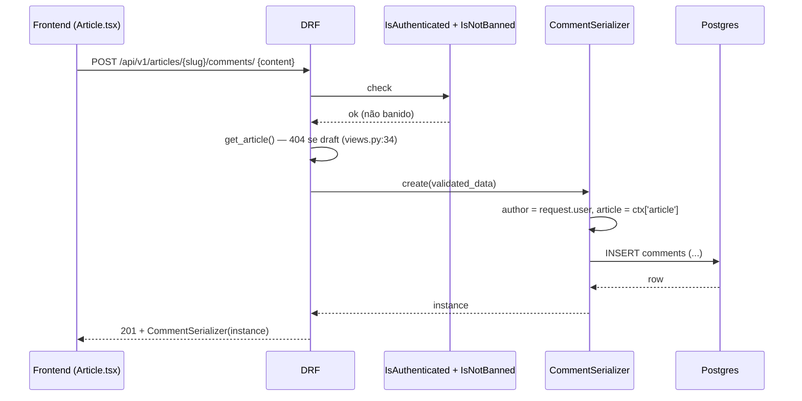
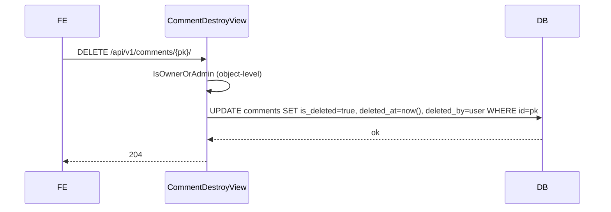

# Design — Módulo `comments` (retroativo)

> **Tipo**: Spec retroativo · **Versão**: v1 · **Data**: 2026-06-09 · **Status**: ✅ Em produção
> **Realiza**: [RF-002 — Comentários e curtidas](../../requirements/RF/RF-002-comments.md)
> **Epic**: [EP-03 — Engajamento da comunidade](../../backlog/epics/EP-03-engajamento-comunidade.md)
> **Specialist**: `backend-architect` (retroativo, sem fan-out — módulo é mono-camada backend)

---

## 0. Responsabilidade

Permitir que **leitores autenticados** comentem em artigos **publicados**, respondam a outros comentários (1 nível de aninhamento) e curtam comentários alheios — formando o espinhaço de engajamento editorial do Interpop. O autor do comentário pode apagá-lo (soft-delete preservando audit trail); admins podem apagar qualquer comentário (moderação reativa); usuários banidos têm POST/DELETE/LIKE bloqueados em **defesa em profundidade** (S8 do `Improvement-system`). Listagem pública (anônima) lê livremente; replies vêm prefetchadas dentro do comentário-pai para evitar N+1 no frontend.

---

## 1. Stack (dependências entre apps)

| Dependência       | O que importa                                                                   | Uso no `comments`                                                      |
| ----------------- | ------------------------------------------------------------------------------- | ---------------------------------------------------------------------- |
| `apps.users`      | `User` (UUID), `IsNotBanned`, `IsOwnerOrAdmin`, `UserPublicSerializer`          | FK author/deleted_by; permissões; representação pública do autor       |
| `apps.articles`   | `Article` (slug + status), conversor de path `<uslug:>` registrado em `ready()` | FK article; lookup por `slug + status='published'`                     |
| `apps.audit`      | Nenhum import direto — `AuditLog` é gravado via middleware HTTP                 | Soft-delete deixa rastro via `deleted_by` (não dispara signal próprio) |
| `apps.moderation` | Nenhum — comments **não** abrem `BanRequest` automaticamente                    | Moderação reativa: admin/editor apaga manualmente via `DELETE`         |
| `apps.newsletter` | Nenhum                                                                          | (não há notificação por novo comentário hoje)                          |

Não há `signals.py`, `tasks.py`, `services.py` nem `permissions.py` no módulo (`find` confirmou — apenas `models.py`, `views.py`, `serializers.py`, `urls.py`, `admin.py`, `apps.py`, `tests/`). Toda lógica vive em **view + serializer + permissions externos**.

---

## 2. Data model

### 2.1 `Comment` (`backend/apps/comments/models.py:6-48`)

| Campo        | Tipo                                        | Notas                                                                                                |
| ------------ | ------------------------------------------- | ---------------------------------------------------------------------------------------------------- |
| `id`         | `UUIDField` PK                              | UUID4 estável — bate com convenção UUID do `User`/`Article`                                          |
| `article`    | FK `articles.Article` `CASCADE`             | `related_name='comments'`; deletar artigo apaga comentários (LGPD: dado pessoal do leitor sai junto) |
| `author`     | FK `settings.AUTH_USER_MODEL` `CASCADE`     | Deletar conta de usuário apaga **fisicamente** todos seus comments (relevante para LGPD-erasure)     |
| `parent`     | self-FK `CASCADE`, `null=True`              | 1-nível na **prática** (não há check explícito de profundidade — ver Open Q. §9)                     |
| `content`    | `TextField(max_length=2000)`                | **Sem sanitização HTML** — ver §7 (S-01 em CONCERNS.md)                                              |
| `created_at` | `auto_now_add`                              | Imutável                                                                                             |
| `updated_at` | `auto_now`                                  | Atualiza em qualquer save — mas **não há endpoint de edição** (ver §3)                               |
| `is_deleted` | `BooleanField default=False, db_index=True` | Tombstone flag para soft-delete                                                                      |
| `deleted_at` | `DateTimeField null=True`                   | Timestamp do soft-delete                                                                             |
| `deleted_by` | FK `User SET_NULL`                          | `related_name='deleted_comments'`; preserva rastro mesmo se deletor for excluído                     |

**Meta** (`models.py:39-45`):

- `db_table='comments'`, `ordering=['-created_at']`
- Índices: `(article, parent, -created_at)` (cobre listagem por artigo) + `(author, -created_at)` (cobre "comments deste user")

### 2.2 `CommentLike` (`models.py:51-67`)

| Campo        | Tipo                   | Notas                                                                |
| ------------ | ---------------------- | -------------------------------------------------------------------- |
| `id`         | UUIDField PK           |                                                                      |
| `comment`    | FK `Comment` `CASCADE` | `related_name='likes'` — `Count('likes')` no view                    |
| `user`       | FK `User` `CASCADE`    | `related_name='comment_likes'` — usado no `Exists()` para `is_liked` |
| `created_at` | `auto_now_add`         | Não há `updated_at` (like é binário)                                 |

**Meta** (`models.py:62-64`):

- `db_table='comment_likes'`
- `unique_together=('comment','user')` → idempotência de toggle por usuário
- `indexes=[Index(fields=['comment','user'])]` → **REDUNDANTE** com a unique constraint (débito D-04, ver §7)

### 2.3 Migrações relevantes

- `0001_initial`, `0002_initial` — schema base
- `0003_commentlike_and_more` (`migrations/0003_commentlike_and_more.py`) — adiciona `parent` self-FK, índice `(article, parent, -created_at)`, modelo `CommentLike` com unique + índice. **A migration cria o índice redundante em uma única operação** (linha 51-58) — fix futuro requer nova migration `RemoveIndex` + ADR.

---

## 3. Public contract

### 3.1 Endpoints (`urls.py:9-13`, prefixo `/api/v1/` via ADR-010)

| Método   | URL                                 | View                    | Permissões                           | Throttle                                                     |
| -------- | ----------------------------------- | ----------------------- | ------------------------------------ | ------------------------------------------------------------ |
| `GET`    | `/api/v1/articles/<slug>/comments/` | `CommentListCreateView` | `AllowAny`                           | `anon`/`user` default (100/h, 1000/h)                        |
| `POST`   | `/api/v1/articles/<slug>/comments/` | `CommentListCreateView` | `IsAuthenticated` + `IsNotBanned`    | default — **sem `comments_create` específico** (débito S-07) |
| `DELETE` | `/api/v1/comments/<uuid:pk>/`       | `CommentDestroyView`    | `IsAuthenticated` + `IsOwnerOrAdmin` | default                                                      |
| `POST`   | `/api/v1/comments/<uuid:pk>/like/`  | `CommentLikeToggleView` | `IsAuthenticated` + `IsNotBanned`    | default                                                      |

> **Não existe** `PUT/PATCH` — comentários são **imutáveis após criação**. `updated_at` está no schema mas nunca muda na prática (decisão implícita; não há ADR formalizando — ver §9).

### 3.2 Serializers (`serializers.py`)

- **`CommentSerializer`** (linhas 17-58): leitura inclui `author` (via `UserPublicSerializer`), `likes_count` (annotation), `is_liked` (annotation booleana só se autenticado), `replies_count` via `len(prefetch)` (linha 42 — **fail-loud**, sem try/except), `replies` (lista aninhada `ReplySerializer`). Escrita aceita `content` + `parent_id` opcional.
- **`ReplySerializer`** (linhas 6-14): reply é nó-folha — não traz `replies`/`replies_count` (corta a árvore em 1 nível).
- **`validate_parent_id`** (linhas 44-50): rejeita `parent_id` se (a) não existe, (b) é de outro artigo, (c) está soft-deletado, (d) **já é reply** (filtro `parent=None` — bloqueia replies-de-replies a nível de API). Regressão coberta por `test_create_reply_with_parent_from_other_article_returns_400` (`tests/test_views.py:174-188`).

### 3.3 Signals / Tasks

**Nenhum.** Não há signals (criação não notifica autor do artigo, não recalcula contadores cacheados, não dispara newsletter). Não há tasks Celery — toda escrita é síncrona no request thread.

---

## 4. Fluxos críticos

### 4.1 Criar comentário top-level



### 4.2 Reply (parent_id ≠ null)

Mesmo fluxo, +`validate_parent_id` antes do `create`:

1. Carrega `Comment` com `pk=parent_id, article=ctx['article'], is_deleted=False, parent=None`.
2. Se não existe → `400 "Comentário pai inválido ou não encontrado."`.
3. Caso OK → `INSERT` com `parent_id` preenchido.

**Validação tripla simultânea** (existência + mesmo artigo + parent-de-top-level): uma única query `EXISTS` em vez de 3 ifs — economiza roundtrip mas mascara mensagem de erro (não diferencia "parent não existe" de "parent é reply"). Trade-off aceitável para o caso geral.

### 4.3 Soft-delete



`perform_destroy` (`views.py:64-68`) sobrescreve o destroy físico do DRF — **nunca há `DELETE FROM comments`**. Linha permanece para auditoria. Frontend deve mostrar "comentário removido" (verificar — §9). **Replies não são tocadas**: ficam órfãs visualmente (ver §7, débito confirmado).

### 4.4 Like / Unlike (toggle idempotente)

```python
# views.py:74-83 (CommentLikeToggleView.post)
like, created = CommentLike.objects.get_or_create(comment=comment, user=request.user)
if not created:
    like.delete()
    liked = False
else:
    liked = True
likes_count = CommentLike.objects.filter(comment=comment).count()
return Response({'liked': liked, 'likes_count': likes_count})
```

- **Idempotência** garantida pelo `unique_together('comment','user')` — corrida (dois clicks paralelos) levaria `IntegrityError` no segundo `get_or_create`, mas o pattern padrão do Django captura isso atomicamente. Caso degenerado: race entre `get_or_create` e `delete()` pode deixar count off-by-one numericamente (não há `select_for_update`); aceitável porque `likes_count` é recomputado a cada request (não cacheado).
- **Sem cache** de `likes_count` no `Comment` (campo derivado puro). Custo: `COUNT(*)` por request. Aceitável até 100+ likes por comment.
- Comment soft-deletado → 404 antes do toggle (`get_object_or_404(... is_deleted=False)`).

---

## 5. Invariantes

| #   | Invariante                                                                             | Onde se sustenta                                                            | Coberto por                                                         |
| --- | -------------------------------------------------------------------------------------- | --------------------------------------------------------------------------- | ------------------------------------------------------------------- |
| I1  | Usuário banido **não cria, não apaga, não curte**                                      | `IsNotBanned` em `views.py:31, 72`                                          | `test_create_comment_banned_user_returns_403` (`test_views.py:123`) |
| I2  | Comments soft-deletados não aparecem em listagem pública                               | `filter(is_deleted=False)` em `views.py:38`                                 | `test_list_comments_hides_soft_deleted` (`test_views.py:67`)        |
| I3  | `likes_count` retornado == `count(CommentLike WHERE comment=X)`                        | `Count('likes', distinct=True)` annotation (`views.py:45`)                  | `test_like_count_correct_with_multiple_users` (`test_views.py:287`) |
| I4  | Reply só pode apontar para comment **top-level** do **mesmo artigo**, **não deletado** | `validate_parent_id` (`serializers.py:44-50`)                               | `test_create_reply_with_parent_from_other_article_returns_400`      |
| I5  | Comments em artigos **draft** são invisíveis (GET e POST)                              | `get_article` filtra `status='published'` (`views.py:34`)                   | `test_list_comments_404_for_draft_article` (`test_views.py:81`)     |
| I6  | Soft-delete preserva `id` + `created_at` + `author` (audit trail)                      | `perform_destroy` faz `update_fields=[...]` apenas em flags                 | `test_delete_own_comment_soft_deletes` (`test_views.py:207`)        |
| I7  | Apenas owner OU admin podem apagar — editor **não** pode apagar de terceiros           | `IsOwnerOrAdmin` (object-level)                                             | `test_delete_other_users_comment_returns_403` (`test_views.py:224`) |
| I8  | Replies-de-replies bloqueadas (nesting ≤ 1)                                            | `validate_parent_id` exige `parent=None` no candidato (`serializers.py:48`) | **Sem teste direto** — invariante implícita, gap de cobertura       |

---

## 6. Conhecimento operacional

### 6.1 Rodar testes

```bash
cd backend
uv run pytest apps/comments/ -v
uv run pytest apps/comments/tests/test_views.py::test_create_reply_with_parent_from_other_article_returns_400
```

24 testes em `tests/test_views.py`. Sem `unit/` separado — todos batem DB (`pytest-django`). Cobertura medida no gate global de 40%.

### 6.2 Inspecionar no shell

```python
uv run python manage.py shell
>>> from apps.comments.models import Comment, CommentLike
>>> # Top-comments visíveis de um artigo:
>>> Comment.objects.filter(article__slug='foo', is_deleted=False, parent=None).count()
>>> # Quem apagou comments na última semana:
>>> from datetime import timedelta; from django.utils import timezone
>>> Comment.objects.filter(is_deleted=True, deleted_at__gte=timezone.now()-timedelta(days=7)).values('deleted_by__email').annotate(n=models.Count('id'))
>>> # Detectar replies órfãs (parent soft-deletado):
>>> Comment.objects.filter(parent__is_deleted=True, is_deleted=False).count()
```

### 6.3 Admin Django

`/admin/comments/comment/` — busca por email do autor + content (`admin.py:8`). `is_deleted` é filtro; `deleted_at` é read-only. **Não há admin para `CommentLike`** (volume + dado de baixo valor analítico isolado).

---

## 7. Status atual e débitos (cross-ref [CONCERNS.md](../codebase/CONCERNS.md))

| #     | Item                                                                                                                                                                                                                                                                                                                           | Sev | Origem                                    |
| ----- | ------------------------------------------------------------------------------------------------------------------------------------------------------------------------------------------------------------------------------------------------------------------------------------------------------------------------------ | --- | ----------------------------------------- |
| S-01  | `content` chega cru ao DB — sem `bleach`/`nh3`. Render React escapa hoje (zero `dangerouslySetInnerHTML` no `src/`), mas regressão de 1 PR no FE abre XSS persistente.                                                                                                                                                         | 🟠  | CONCERNS §S-01; `models.py:25`            |
| S-07  | Sem `ScopedRateThrottle` específico para `comments_create`. Default `user=1000/h` permite flood massivo em artigo viral. Pattern já vivo em `apps/users/views.py:32`.                                                                                                                                                          | 🟠  | CONCERNS §S-07                            |
| D-04  | `CommentLike` tem índice redundante (`unique_together` + `Index(['comment','user'])`). Insert overhead duplicado.                                                                                                                                                                                                              | 🟡  | CONCERNS §D-04; `models.py:62-64`         |
| OPS-1 | **Replies órfãs em parent soft-deletado**: parent some da listagem (filtro `parent=None, is_deleted=False`), replies dele **também** somem (não aparecem como top-level), mas `replies_count` do parent ainda contava antes do delete. Pior: nada documenta UX desse caso — "thread some inteira" pode ser intencional ou bug. | 🟡  | Observação 868 (May 29); `views.py:38-43` |
| OPS-2 | **Soft-delete cleanup policy ausente**: nenhum cron purga `is_deleted=True` antigo. Crescimento indefinido da tabela. LGPD pede retenção definida (CONCERNS §L-04).                                                                                                                                                            | 🟡  | CONCERNS §L-04                            |
| GAP-1 | Sem teste para invariante I8 (nesting ≤ 1).                                                                                                                                                                                                                                                                                    | 🟢  | `tests/test_views.py` (ausência)          |
| GAP-2 | `updated_at` existe mas nunca atualiza (sem endpoint de edit). Ou se remove o campo, ou se cria PATCH. **Decisão pendente**.                                                                                                                                                                                                   | 🟢  | `models.py:27`                            |
| GAP-3 | Sem signal/notificação para autor do artigo quando recebe comment. Engajamento puxado, não empurrado.                                                                                                                                                                                                                          | 🟢  | Decisão de produto pendente               |

**Não é débito**: `len(obj.replies.all())` (`serializers.py:42`) propositalmente sem try/except — comentário no código justifica fail-loud em regressão de prefetch.

---

## 8. Cross-references

- **Requisito**: [RF-002](../../requirements/RF/RF-002-comments.md) (stub — preencher retroativamente)
- **Epic**: [EP-03](../../backlog/epics/EP-03-engajamento-comunidade.md)
- **Codebase mapping**:
  - [ARCHITECTURE.md §apps Django](../codebase/ARCHITECTURE.md)
  - [CONVENTIONS.md — permissions](../codebase/CONVENTIONS.md)
  - [CONCERNS.md S-01, S-07, D-04, L-04](../codebase/CONCERNS.md)
  - [STRUCTURE.md — `backend/apps/comments/`](../codebase/STRUCTURE.md)
- **Dependências bidirecionais**:
  - `apps.users` — fornece `IsNotBanned`, `IsOwnerOrAdmin`, `UserPublicSerializer` (`backend/apps/users/permissions.py`, `serializers.py`)
  - `apps.articles` — fornece `Article`, conversor `<uslug:>` (registrado em `ArticlesConfig.ready()`)
  - `apps.audit` — captura DELETE via `AuditMiddleware` (não há signal próprio)
- **Tests**: [`backend/apps/comments/tests/test_views.py`](../../../backend/apps/comments/tests/test_views.py)
- **Improvement-system**: §11.6 S8 (IsNotBanned defense-in-depth)

---

## 9. Open questions (para futuro DESIGN evolutivo)

1. **Multi-nível ativado?** Hoje `validate_parent_id` exige `parent=None` no candidato — replies-de-replies retornam 400. UI provavelmente exibe campo de reply em qualquer comment; FE precisa esconder em replies, OU backend precisa relaxar a regra. Decisão de produto. → invariante I8.
2. **Edge case "thread morta" (OPS-1)**: quando parent é soft-deletado, replies sobrevivem em DB mas somem da API. UX deve mostrar tombstone do parent ("comentário removido") com replies abaixo, OU continuar escondendo tudo. Sem documentação atual.
3. **Edição (`PATCH`)?** Campo `updated_at` está no schema mas nunca muda. Ou se remove (clareza), ou se cria endpoint com janela de tempo (ex.: 5min após criação). Sem decisão.
4. **Notificação ao autor do artigo** quando recebe comment — feature de engajamento clássica, hoje ausente. Acopla `comments` ↔ `newsletter` ou um futuro `notifications`.
5. **Detecção básica de spam** — sem filtro de URL, sem rate-limit específico (S-07), sem honeypot. Mitigação atual = `IsNotBanned` reativo (admin precisa banir manualmente após flood). Spectrum: filtro de regex simples → akismet → ML. Decisão depende de volume real.
6. **Soft-delete cleanup policy** (OPS-2): retenção formal? 30d? 90d? Indefinida? Bate em LGPD (CONCERNS §L-04) — precisa ADR antes de cron.

---

_Spec retroativo criado em 2026-06-09 (Sprint housekeeping). Alinha com [CONCERNS.md](../codebase/CONCERNS.md) (auditoria brownfield) e referência cruzada com [busca-editorial/DESIGN.md](../busca-editorial/DESIGN.md) como exemplo Complex. Próximo passo: preencher RF-002 (negócio) e converter débitos em features de Sprint dedicada de moderação._
