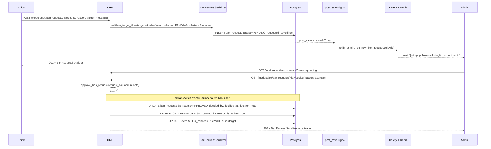

# Design — Módulo `moderation` (retroativo)

> **Tipo**: Spec retroativo · **Versão**: v1 · **Data**: 2026-06-09 · **Status**: ✅ Em produção
> **Realiza**: [RF-003 — Moderação e banimento](../../requirements/RF/RF-003-moderation.md)
> **Epic**: [EP-05 — Moderação da comunidade](../../backlog/epics/EP-05-moderacao-comunidade.md)
> **Specialist**: `backend-architect` (retroativo)

---

## 0. Responsabilidade

Aplicar **banimento de leitores** que violam regras de comunidade, via dois caminhos coordenados: (a) **Ban direto** por admin/dev em `POST /api/v1/moderation/bans/` — efeito imediato em `User.is_banned`; (b) **`BanRequest`**, criado por editor (que **não pode banir sozinho**) e decidido por admin/dev em `POST /ban-requests/<id>/decide/`. Sustenta a **hierarquia inegociável** do produto (CLAUDE.md §4): `dev > admin > editor > user`, com `dev` **imune total** e `admin` imune entre si (só `dev` baneia `admin`). Defesa em 3 camadas (queryset → serializer.validate → service) garante que escalation por bug de uma camada não derruba a invariante (Observação 827 de 29-mai, item C13/§11.6 S8 do Improvement-system).

---

## 1. Stack (dependências entre apps)

| Dependência                       | O que importa                                                                                                                                                            | Uso no `moderation`                                                                         |
| --------------------------------- | ------------------------------------------------------------------------------------------------------------------------------------------------------------------------ | ------------------------------------------------------------------------------------------- |
| `apps.users`                      | `User.role`, `is_banned`, `is_dev`, `is_admin`, `is_immune_to_ban`, `can_be_banned_by`, `can_be_unbanned_by`; permissões `IsAdminUser`, `IsEditorOrAdmin`, `IsNotBanned` | FK `user`/`banned_by`/`requested_by`/`decided_by`; regras hierárquicas; queryset ator-aware |
| `apps.articles` / `apps.comments` | Nenhum import — `is_banned=True` em `User` é checado pelos próprios consumidores via `IsNotBanned`                                                                       | Banido perde POST/DELETE/LIKE em comments + abrir BanRequest                                |
| `apps.audit`                      | `AuditLog` gravado via middleware HTTP (sem import direto)                                                                                                               | Trilha de ban/unban/decide chega via método HTTP + status code                              |
| `apps.newsletter`                 | Nenhum import direto                                                                                                                                                     | Email para admins reusa `django.core.mail.send_mail` (não a pipeline newsletter)            |
| Celery + Redis                    | `@shared_task`, broker em settings                                                                                                                                       | Envio assíncrono do email a admins quando `BanRequest` é criado                             |

Estrutura confirmada por `ls backend/apps/moderation/`: `models.py`, `serializers.py`, `services.py`, `views.py`, `urls.py`, `signals.py`, `tasks.py`, `admin.py`, `tests/`. **Sem `permissions.py` próprio** — permissions reusáveis vivem em `apps.users.permissions` (C14 do Improvement-system, single source of truth).

---

## 2. Data model

### 2.1 `BanRequest` — solicitação de banimento por editor (`models.py:6-62`)

| Campo             | Tipo                                                                  | Notas                                                |
| ----------------- | --------------------------------------------------------------------- | ---------------------------------------------------- |
| `id`              | `UUIDField` PK                                                        | UUID4, estável                                       |
| `target`          | FK `User CASCADE`, `related_name='ban_requests_received'`             | Alvo da solicitação                                  |
| `requested_by`    | FK `User SET_NULL`, `related_name='ban_requests_made'`                | Editor solicitante; nullable se conta apagada        |
| `reason`          | `TextField`                                                           | Motivação obrigatória                                |
| `trigger_message` | `TextField blank`                                                     | Cópia da mensagem ofensiva (renderizada em destaque) |
| `status`          | `CharField choices=PENDING/APPROVED/REJECTED, db_index=True`          | Estado terminal — APPROVED/REJECTED não muda mais    |
| `decided_by`      | FK `User SET_NULL, null/blank`, `related_name='ban_requests_decided'` | Admin/dev que decidiu                                |
| `decided_at`      | `DateTimeField null/blank`                                            | Timestamp da decisão                                 |
| `decision_note`   | `TextField blank`                                                     | Justificativa do admin (opcional)                    |
| `created_at`      | `auto_now_add`                                                        | Imutável                                             |

**Meta** (`models.py:56-59`): `db_table='ban_requests'`, `ordering=['-created_at']`, índice `(status, -created_at)` para listar pendentes rapidamente.

### 2.2 `Ban` — banimento ativo, **1 por usuário** (`models.py:65-110`)

| Campo             | Tipo                                                           | Notas                                                                                                       |
| ----------------- | -------------------------------------------------------------- | ----------------------------------------------------------------------------------------------------------- |
| `id`              | `UUIDField` PK                                                 | UUID4                                                                                                       |
| `user`            | **`OneToOneField` `User CASCADE`**, `related_name='ban'`       | **Constraint dura**: 1 ban por usuário no banco. Re-banir reativa registro existente via `update_or_create` |
| `banned_by`       | FK `User SET_NULL`, `related_name='bans_issued'`               | Admin/dev autor; nullable se conta apagada                                                                  |
| `reason`          | `TextField`                                                    | Justificativa formal                                                                                        |
| `trigger_message` | `TextField blank`                                              | Conteúdo gatilho (idem BanRequest)                                                                          |
| `created_at`      | `auto_now_add`                                                 | Imutável                                                                                                    |
| `expires_at`      | `DateTimeField null/blank`                                     | **Null = permanente. Field existe mas não há job que respeite** — ver §7 OPS-1                              |
| `is_active`       | `BooleanField default=True, db_index=True`                     | Tombstone do soft-unban — `False` = ban revogado                                                            |
| `unbanned_by`     | FK `User SET_NULL, null/blank`, `related_name='bans_reversed'` | Quem reverteu                                                                                               |
| `unbanned_at`     | `DateTimeField null/blank`                                     | Timestamp do unban                                                                                          |

**Meta** (`models.py:104-107`): `db_table='bans'`, `ordering=['-created_at']`, índice `(is_active, -created_at)`.

**Trade-off crítico** (`services.py:22-31`, comentário no código): `OneToOneField` perde o histórico individual de cada ciclo `ban → unban → re-ban` — `update_or_create` sobrescreve `banned_by`, `reason`, `trigger_message`. Auditoria completa de cada ciclo só vem migrando para `FK + UniqueConstraint(condition=Q(is_active=True))` (futuro ADR).

### 2.3 Migrações relevantes

- `0001_initial` — schema base `Ban` + `BanRequest`. Não há migrations subsequentes; o módulo nasceu maduro em maio/2026 e segue estável (29-mai obs 853).

---

## 3. Public contract

### 3.1 Endpoints (`urls.py:9-14`, prefixo `/api/v1/` via ADR-010)

| Método   | URL                                                 | View                       | Permissões                        | Observações                                                       |
| -------- | --------------------------------------------------- | -------------------------- | --------------------------------- | ----------------------------------------------------------------- |
| `GET`    | `/api/v1/moderation/bans/`                          | `BanListCreateView`        | `IsAdminUser` + `IsNotBanned`     | Lista só `is_active=True`; busca por email/username/name          |
| `POST`   | `/api/v1/moderation/bans/`                          | `BanListCreateView`        | `IsAdminUser` + `IsNotBanned`     | Ban direto; queryset de `user_id` é **ator-aware**                |
| `GET`    | `/api/v1/moderation/bans/<uuid:pk>/`                | `BanDestroyView`           | `IsAdminUser` + `IsNotBanned`     | Retrieve                                                          |
| `DELETE` | `/api/v1/moderation/bans/<uuid:pk>/`                | `BanDestroyView`           | `IsAdminUser` + `IsNotBanned`     | Soft-unban via `services.unban_user`                              |
| `GET`    | `/api/v1/moderation/ban-requests/`                  | `BanRequestListCreateView` | `IsEditorOrAdmin` + `IsNotBanned` | **Editor vê só as suas**; admin/dev veem todas (`views.py:65-70`) |
| `POST`   | `/api/v1/moderation/ban-requests/`                  | `BanRequestListCreateView` | `IsEditorOrAdmin` + `IsNotBanned` | `requested_by = request.user`                                     |
| `POST`   | `/api/v1/moderation/ban-requests/<uuid:pk>/decide/` | `BanRequestDecideView`     | `IsAdminUser` + `IsNotBanned`     | Body: `{action: 'approve'\|'reject', decision_note?}`             |

> **Divergência intencional vs proposta inicial**: a especificação do prompt sugeriu `PATCH /ban-requests/<id>/` para decidir. **A implementação usa `POST /decide/`** (verbo-RPC explícito) porque (a) a transição é não-idempotente — aprovar cria `Ban` real com side-effects (transação aninhada, `is_banned=True`), (b) só campos `status/decided_by/decided_at/decision_note` são derivados pelo backend a partir do `action`. PATCH genérico abriria espaço para o cliente forçar campos read-only. Mantida.

### 3.2 Service layer (`services.py`, todas `@transaction.atomic` — ADR-012, C3)

- **`ban_user(target, admin, reason, trigger_message)`** (`services.py:20-51`) — barreira final da hierarquia (camada 3). Verifica `target.can_be_banned_by(admin)`; senão `PermissionDenied`. `update_or_create` reativa registro existente. Atualiza `User.is_banned=True` em **uma única `UPDATE`** (`User.objects.filter(pk=...).update`, evita re-trigger de signals).
- **`unban_user(ban, admin)`** (`services.py:54-68`) — simétrico: verifica `ban.user.can_be_unbanned_by(admin)`. Critical: admin comum **não pode reverter ban aplicado por dev sobre admin** — senão a invariante "admin só é controlado por dev" seria anulada pelo lado inverso (comentário no código).
- **`approve_ban_request(request_obj, admin, decision_note)`** (`services.py:73-96`) — **idempotente**: se já `APPROVED`, retorna o `Ban` ativo existente sem duplicar. Reusa `ban_user()` (transação aninhada via savepoint).
- **`reject_ban_request(request_obj, admin, decision_note)`** (`services.py:99-106`) — somente atualiza status; não cria `Ban`. **Sem `@transaction.atomic`** — `save` único basta.

### 3.3 Signals (`signals.py`)

- `post_save` em `BanRequest` com `created=True AND status=PENDING` → `notify_admins_on_new_ban_request.delay(...)`. **Falha silenciosa do enqueue** (try/except + log) — Redis down não impede o editor de submeter; a request fica visível no `/admin` mesmo sem email.

### 3.4 Tasks Celery (`tasks.py`)

- `notify_admins_on_new_ban_request(ban_request_id)` — autoretry exponential backoff (`retry_backoff=True, retry_backoff_max=300, max_retries=3`). Recarrega `BanRequest` por ID (signal pode disparar antes do commit). Inclui `role=DEV` no recipient list — sem essa inclusão, ambiente com único superuser dev **deixa de notificar ninguém** (`tasks.py:44-49`, comentário no código).

### 3.5 Admin Django (`admin.py`)

- `Ban` é writable (admin pode editar diretamente — caminho de fuga para emergência).
- **`BanRequest` é totalmente read-only** (`has_add/change/delete_permission → False`, `admin.py:39-46`): qualquer decisão tem que passar pela `service layer` via API para registrar trilha e disparar o `ban_user` automaticamente. Editar status no admin **pula a service layer e quebra invariantes** (comentário no código justifica).

---

## 4. Fluxos críticos

### 4.1 Editor solicita ban → admin aprova



### 4.2 Admin bana direto

Sem `BanRequest`: `POST /moderation/bans/` → `BanSerializer` (queryset `user_id` filtrado por ator: dev vê `[user, editor, admin]`, demais veem `[user, editor]` — `serializers.py:36-38`) → `services.ban_user` → `Ban` row + `User.is_banned=True`. Trilha de auditoria via middleware HTTP (`apps.audit`).

### 4.3 Tentativa de admin banir admin / tentativa de banir dev

```mermaid
sequenceDiagram
  participant A as admin
  participant API
  participant SER as BanSerializer
  participant SVC as ban_user

  A->>API: POST /moderation/bans/ {user_id: <admin>}
  API->>SER: __init__ — queryset filtrado para ['user','editor'] (admin não-dev)
  SER-->>API: ValidationError "user_id inválido" (camada 1: queryset)
  alt camada 1 furada por bug
    SER->>SER: validate_user_id — target.can_be_banned_by(actor) == False
    SER-->>API: ValidationError "dev é imune; admin só por dev" (camada 2)
  end
  alt camada 2 furada por bug
    SER->>SVC: ban_user(target, admin, ...)
    SVC->>SVC: target.can_be_banned_by(admin) == False
    SVC-->>API: PermissionDenied (camada 3)
  end
```

Dev como alvo segue a mesma cadeia tripla — `is_immune_to_ban=True` em qualquer camada. Coberto por `tests/test_ban_hierarchy.py`.

### 4.4 BanRequest auto-target

Editor não pode abrir `BanRequest` contra si mesmo: bloqueio implícito por `target.is_immune_to_ban` quando o editor for admin/dev (impossível por construção — editor ≠ admin); para editor-vs-editor o queryset `role__in=['user','editor']` permite a row, mas **não há check explícito de `target != requested_by`**. Gap real — ver §9 Q1.

---

## 5. Invariantes

| #   | Invariante                                                                                    | Onde se sustenta                                                                      | Coberto por                                                       |
| --- | --------------------------------------------------------------------------------------------- | ------------------------------------------------------------------------------------- | ----------------------------------------------------------------- |
| I1  | **Dev é imune a ban** (qualquer ator).                                                        | `User.is_immune_to_ban`; 3 camadas (queryset, validate, service)                      | `test_ban_hierarchy.py`                                           |
| I2  | **Admin só é banido por dev** (admin não bana admin).                                         | `can_be_banned_by` (`users/models.py:83-99`); 3 camadas                               | `test_ban_hierarchy.py` + `test_serializers.py`                   |
| I3  | **Apenas admin/dev** criam `Ban` direto; editor só abre `BanRequest`.                         | `IsAdminUser` no `BanListCreateView`; `IsEditorOrAdmin` no `BanRequestListCreateView` | `test_services.py`                                                |
| I4  | **1 `Ban` ativo por usuário** (não há histórico duplo de bans simultâneos).                   | `OneToOneField` em `Ban.user`; `update_or_create` em `ban_user`                       | Garantia de schema + `test_services.py`                           |
| I5  | **Transação atômica** em ban/unban/approve (`User.is_banned` e `Ban` row coerentes).          | `@transaction.atomic` em `services.py:20, 54, 73` (ADR-012, C3)                       | Comportamento de teste (sem teste de crash explícito — gap menor) |
| I6  | **Aprovação de `BanRequest` é idempotente** — re-aprovar não duplica `Ban` nem altera status. | `services.py:81-83` (early-return se já APPROVED)                                     | `test_services.py`                                                |
| I7  | **`BanRequest` em estado terminal não regrede** (não volta a PENDING).                        | `BanRequestDecideView` exige `status == PENDING` (`views.py:90`)                      | Implícito no decide view + `test_services.py`                     |
| I8  | **Editor vê só seus `BanRequest`**; admin/dev veem todos.                                     | `BanRequestListCreateView.get_queryset` filtra `requested_by=user`                    | `test_serializers.py` (verificar — possível gap)                  |
| I9  | **`BanRequest` admin é read-only** — decisões passam obrigatoriamente pela API.               | `BanRequestAdmin.has_*_permission → False`                                            | Garantia de schema (sem teste E2E de admin)                       |
| I10 | **Unban respeita hierarquia inversa**: admin comum não desfaz ban-dev-sobre-admin.            | `unban_user` (`services.py:59-62`)                                                    | `test_ban_hierarchy.py`                                           |

---

## 6. Conhecimento operacional

### 6.1 Rodar testes

```bash
cd backend
uv run pytest apps/moderation/ -v
uv run pytest apps/moderation/tests/test_ban_hierarchy.py
```

Estrutura: `test_ban_hierarchy.py` (invariantes I1/I2/I10) · `test_serializers.py` (queryset ator-aware + validação) · `test_services.py` (idempotência + atomicidade) · `test_tasks.py` (email task).

### 6.2 Inspecionar e remediar no shell

```python
uv run python manage.py shell
# Listar bans ativos
>>> from apps.moderation.models import Ban, BanRequest
>>> Ban.objects.filter(is_active=True).select_related('user','banned_by').count()

# BanRequests pendentes
>>> BanRequest.objects.filter(status='pending').count()

# Reverter ban manualmente (cuidado: só se ator respeita hierarquia)
>>> from apps.moderation.services import unban_user
>>> from apps.users.models import User
>>> admin = User.objects.get(email='admin@interpop.com')
>>> ban = Ban.objects.get(user__email='alvo@x.com', is_active=True)
>>> unban_user(ban, admin)

# Forçar approve via service (preferido vs PATCH no admin)
>>> from apps.moderation.services import approve_ban_request
>>> req = BanRequest.objects.get(pk='...')
>>> approve_ban_request(req, admin, decision_note='aprovado manualmente')
```

### 6.3 Email para admins

Local (DEV): `EMAIL_BACKEND=console` imprime no terminal do runserver. Prod: `send_mail` real via SMTP configurado. Falha do worker celery → retry exponencial (3 tentativas, até 5min entre elas). Sem fallback se as 3 falharem — admin descobre via `/admin/moderation/banrequest/` (Q3 §9).

---

## 7. Status atual e débitos (cross-ref [CONCERNS.md](../codebase/CONCERNS.md))

| #     | Item                                                                                                                                                                                                | Sev | Origem                                               |
| ----- | --------------------------------------------------------------------------------------------------------------------------------------------------------------------------------------------------- | --- | ---------------------------------------------------- |
| OPS-1 | **`Ban.expires_at` existe no schema mas nenhum job respeita** — bans "temporários" criados via admin permanecem ativos indefinidamente. Ou se cria cron `unban_if_expired`, ou se remove campo.     | 🟠  | `models.py:92`                                       |
| OPS-2 | **Sem notificação ao usuário banido**. Banido descobre tentando logar/comentar (fluxo silencioso). LGPD pede transparência sobre processamento (ver §9 Q2).                                         | 🟠  | `views.py:35` (sem hook pós-ban)                     |
| OPS-3 | **Sem auto-revogação de sessões/JWT** ao banir. Token JWT em cookie httpOnly continua válido até expirar; banido pode navegar logado até logout. `IsNotBanned` bloqueia escrita, mas leitura segue. | 🟠  | Ausência em `services.ban_user`; ADR-006 (DevSecOps) |
| GAP-1 | **Sem check explícito `target != requested_by`** em `BanRequest`. Editor pode tecnicamente abrir auto-solicitação (rejeitada implicitamente quando ele virar role admin — caminho exótico).         | 🟡  | `serializers.py:76-87`                               |
| GAP-2 | **`BanRequest` não tem expiração**. Pendente há 6 meses fica pendente para sempre. Cron diário para auto-rejeitar com `decision_note='expirada'` está em backlog (ver §9 Q3).                       | 🟡  | `models.py:43-44`                                    |
| GAP-3 | **Sem rate-limit em `BanRequest` create**. Editor mal-intencionado pode floodar admins de email (CONCERNS S-07 análogo a comments). Aplicar `ScopedRateThrottle('moderation_request')`.             | 🟡  | `views.py:55-73`                                     |
| GAP-4 | **`Ban` perde histórico ao re-banir** (trade-off documentado em `services.py:22-31`). Migrar para FK + `UniqueConstraint(condition=Q(is_active=True))` quando houver dor real de auditoria.         | 🟡  | `services.py:22-31`                                  |
| GAP-5 | **Sem appeal flow** — banido não tem canal API para contestar. Caminho atual é email manual ao admin. Aceitável até volume real exigir UI.                                                          | 🟢  | Ausência                                             |
| GAP-6 | **Sem teste explícito de transaction rollback** em `ban_user` (cobertura de cenário "crash entre `update_or_create` e `User.update`"). I5 é estrutural mas não testada com `pytest.raises`.         | 🟢  | `tests/test_services.py`                             |

**Não é débito**: `services.py` chamando `User.objects.filter(pk=...).update(...)` em vez de `user.save()` é proposital — evita re-trigger de signals e roundtrip a mais. Comentário implícito por convenção do projeto.

---

## 8. Cross-references

- **Requisito**: [RF-003](../../requirements/RF/RF-003-moderation.md) (stub — preencher retroativamente com regras de produto)
- **Epic**: [EP-05](../../backlog/epics/EP-05-moderacao-comunidade.md)
- **Codebase mapping**:
  - [ARCHITECTURE.md §apps Django](../codebase/ARCHITECTURE.md)
  - [CONVENTIONS.md — permissions reusáveis em `apps.users.permissions`](../codebase/CONVENTIONS.md)
  - [CONCERNS.md — análogos a S-07 e L-04](../codebase/CONCERNS.md)
  - [STRUCTURE.md — `backend/apps/moderation/`](../codebase/STRUCTURE.md)
- **Dependências bidirecionais**:
  - `apps.users` — fornece `User.role`, `is_immune_to_ban`, `can_be_banned_by/unbanned_by` (`users/models.py:59-107`); permissões (`users/permissions.py:4, 46, 65`)
  - `apps.comments`, `apps.articles` — consomem `is_banned` via `IsNotBanned`
  - `apps.audit` — captura DELETE/POST de `/moderation/*` via middleware
  - `apps.newsletter` — **não acoplado** (email a admins é `send_mail` cru, não pipeline newsletter)
- **ADRs relevantes**:
  - **ADR-006** (DevSecOps embedded) — fundamenta hierarquia e defesa em profundidade
  - **ADR-010** (`/api/v1/` versionado) — prefixo das URLs
  - **ADR-012** (`@transaction.atomic` em services que tocam ≥2 rows) — C3 do Improvement-system
  - **Sem ADR específico** para regra "dev > admin > editor > user" — é regra de produto codificada em CLAUDE.md §4; promover a ADR formal está em backlog (Q4 §9)
- **Tests**: [`backend/apps/moderation/tests/`](../../../backend/apps/moderation/tests/)
- **Improvement-system**: §11.1 C3 (atomic), §11.6 S8 (IsNotBanned defense-in-depth), §11.6 C13 (3-layer auth), §11.7 C14 (permissions em `apps.users`)

---

## 9. Open questions (para futuro DESIGN evolutivo)

1. **`target != requested_by` em `BanRequest`?** Hoje o queryset `role__in=['user','editor']` permite editor abrir solicitação contra si próprio (GAP-1). Adicionar `validate_target_id` explícito. Trivial — 2 LOC + 1 teste.
2. **Notificação ao banido (OPS-2)** — email "sua conta foi suspensa por X, contestação via Y"? Acopla `moderation` ↔ `newsletter` (ou um futuro `notifications`). LGPD pede transparência. Decisão de produto + jurídico.
3. **Auto-expirar `BanRequest` PENDING (GAP-2)** e **auto-unban quando `expires_at` vence (OPS-1)** — dois crons distintos. Define-se SLA (7d para BanRequest? 30d default para Ban temp?). Sem decisão.
4. **Promover regra hierárquica a ADR formal** — hoje vive em CLAUDE.md §4 + comentários no código. ADR torna explícito o trade-off (dev imune é design, não bug; admin imune entre si é por construção de produto, não falha de segurança).
5. **Invalidação de JWT ao banir (OPS-3)** — `services.ban_user` deve revogar sessões ativas? Opções: (a) blocklist de JWT em Redis (custo: Redis no caminho de cada request autenticado), (b) reduzir TTL do JWT (custo: refresh mais frequente), (c) aceitar leitura banida até token expirar (status quo). Decisão arquitetural.
6. **Appeal flow (GAP-5)** — endpoint `POST /moderation/bans/<id>/appeal/` com `appeal_message` + status `APPEALED`. Quando volume justificar.
7. **Reset de senha ao banir** — segurança defensiva? Hoje não. Banido pode mudar dados via `PATCH /users/me/` se `IsNotBanned` não estiver em todas as views de `users` (verificar). Provavelmente exagero para o nível de ameaça atual.

---

_Spec retroativo criado em 2026-06-09 (Sprint housekeeping). Alinha com [CONCERNS.md](../codebase/CONCERNS.md), referência cruzada com [busca-editorial/DESIGN.md](../busca-editorial/DESIGN.md) (Complex) e [comments/DESIGN.md](../comments/DESIGN.md) (Médio). Próximo passo: preencher RF-003, escrever ADR formal da hierarquia (Q4), implementar GAP-1 + GAP-3 como Sprint Quick-Win._
