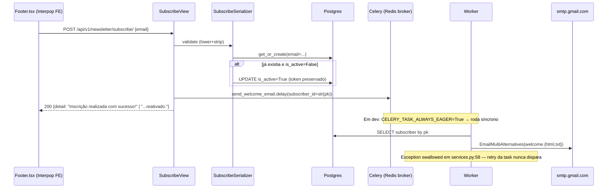
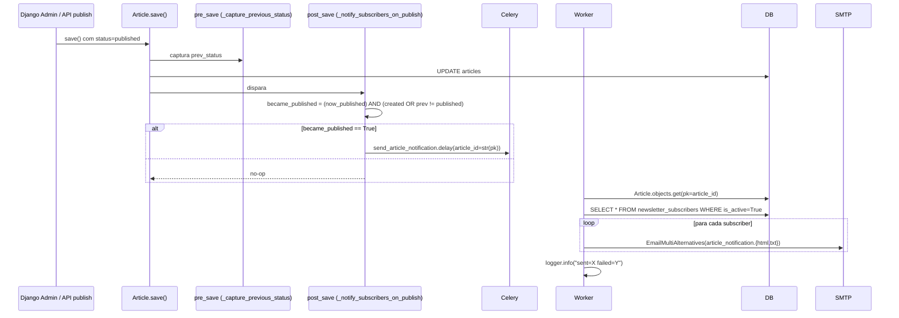
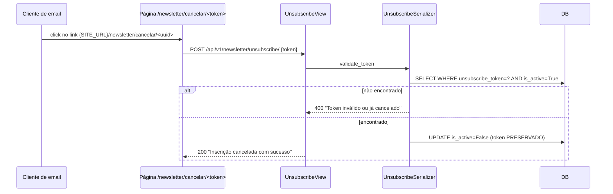

# Design — Módulo `newsletter` (retroativo)

> **Tipo**: Spec retroativo · **Versão**: v1 · **Data**: 2026-06-09 · **Status**: ✅ Em produção
> **Realiza**: [RF-004 — Newsletter e comunicação](../../requirements/RF/RF-004-newsletter.md)
> **Epic**: [EP-04 — Newsletter e comunicação](../../backlog/epics/EP-04-newsletter-comunicacao.md)
> **Specialist**: `backend-architect` (retroativo; sem fan-out — backend-only, sem decisão de UI/UX além do template HTML do email)

---

## 0. Responsabilidade

Capturar **opt-in público** de leitores anônimos (apenas e-mail; sem cadastro), entregar **welcome email** transacional logo após inscrição e **notificar a lista ativa** quando um artigo transiciona para `published` — todo o envio passa por Celery (ADR-009) para não bloquear o request HTTP. Permite **cancelamento 1-clique** via token UUID estável (preservado entre cancel/re-subscribe). É a única feature do Interpop que faz **fan-out de e-mail** baseado em estado de domínio (`Article.status`) — o resto do tráfego transacional (password reset, ban notify) é 1:1 por evento.

---

## 1. Stack (dependências entre apps)

| Dependência             | O que importa                                                    | Uso no `newsletter`                                                                                                                         |
| ----------------------- | ---------------------------------------------------------------- | ------------------------------------------------------------------------------------------------------------------------------------------- |
| `apps.articles`         | `Article` (slug, status, cover_image, excerpt, category, author) | Signal `post_save` em `articles/signals.py:42` enfileira `send_article_notification`; task recarrega o `Article` por `pk` em `tasks.py:38`. |
| `apps.users`            | Nenhuma FK — subscriber é **dissociado** do `User`               | Decisão explícita: ler newsletter não exige conta. Subscriber tem apenas `email`, não `user_id`.                                            |
| `apps.audit`            | Nenhum import direto                                             | DELETE de subscriber (raro) cai no `AuditMiddleware` HTTP via admin. Subscribe/unsubscribe **não** geram `AuditLog` próprio.                |
| `apps.moderation`       | Nenhum                                                           | Ban de `User` **não** desativa subscriber homônimo (subscriber não conhece `User`).                                                         |
| `Celery` (broker Redis) | `@shared_task` em `tasks.py`                                     | ADR-009: ambas tasks (`send_welcome_email`, `send_article_notification`) com `autoretry_for=(Exception,)` + backoff.                        |
| Django Email backend    | `EmailMultiAlternatives` (SMTP genérico)                         | **Não usa SendGrid** apesar do ADR-004 — SMTP via `EMAIL_HOST=smtp.gmail.com` (base.py:226). Migrar = trocar 3 env vars, sem código.        |

Layout do app (`backend/apps/newsletter/`): `models.py · views.py · serializers.py · services.py · tasks.py · urls.py · admin.py · apps.py · templates/newsletter/emails/{welcome,article_notification}.{html,txt} + base.html · tests/test_views.py`. **Não existe `signals.py`** — removido propositalmente (ver §7 OPS-1, bug C2).

---

## 2. Data model

### 2.1 `NewsletterSubscriber` (`backend/apps/newsletter/models.py:5-17`)

| Campo               | Tipo                                                        | Notas                                                                                                                                                 |
| ------------------- | ----------------------------------------------------------- | ----------------------------------------------------------------------------------------------------------------------------------------------------- |
| `id`                | `BigAutoField` PK                                           | Único model do projeto que **não** usa UUID (decisão histórica; sem rationale documentado — ver §9).                                                  |
| `email`             | `EmailField(unique=True, db_index=True)`                    | Normalizado para `lower().strip()` no serializer (`serializers.py:8-9`). Constraint single source of truth.                                           |
| `subscribed_at`     | `auto_now_add`                                              | Carimbo de opt-in — relevante para LGPD (prova de consentimento). **Sem registro de IP** (gap §7 L-01).                                               |
| `is_active`         | `BooleanField(default=True, db_index=True)`                 | Soft-unsubscribe — linha permanece, flag muda. Nunca há `DELETE FROM newsletter_subscribers` no fluxo público.                                        |
| `unsubscribe_token` | `UUIDField(unique=True, default=uuid.uuid4, db_index=True)` | UUID4 estável entre cancel/re-subscribe (regressão coberta em `tests/test_views.py:155-177`). 122 bits entrópicos — não-enumerável sem signing extra. |

**Meta** (`models.py:11-14`): `db_table='newsletter_subscribers'`, `ordering=['-subscribed_at']`, índice composto `(email, is_active)` para filtros de campanha.

**Não existem** `Newsletter`, `NewsletterIssue`, `Campaign`, `Subscription`, `Preference`. **Não há campos** `unsubscribed_at`, `bounce_count`, `last_email_sent_at`, `preferences`, `frequency`, `categories`, `user_id`. O domínio é deliberadamente **mínimo** — broadcasts são 1-shot por publicação, não campanhas curadas (ver §7 GAP-1/2).

### 2.2 Migrações

- `migrations/0001_initial.py` — cria `newsletter_subscribers` com todos os campos atuais. **Não houve evolução de schema** desde Sprint 0 (estabilidade absoluta — o débito é a ausência de campos, não a deriva deles).

---

## 3. Public contract

### 3.1 Endpoints (`urls.py:4-7`, prefixo `/api/v1/` via ADR-010)

| Método | URL                               | View              | Permissões | Throttle                             |
| ------ | --------------------------------- | ----------------- | ---------- | ------------------------------------ |
| `POST` | `/api/v1/newsletter/subscribe/`   | `SubscribeView`   | `AllowAny` | `AnonRateThrottle` default (100/h)   |
| `POST` | `/api/v1/newsletter/unsubscribe/` | `UnsubscribeView` | `AllowAny` | default — **sem throttle explícita** |

**Divergência intencional vs. convenção 1-click**: o unsubscribe é `POST` com `token` no **body** (`serializers.py:20-21`), não `GET /unsubscribe/<token>/`. Trade-off:

- ✅ Token não vaza em logs de proxy / Referer / histórico de browser.
- ❌ Link direto no email **não** pode dar GET — requer página intermediária no FE que faz o POST (rota FE `/newsletter/cancelar/<token>` em `services.py:33`, formato `${SITE_URL}/newsletter/cancelar/{token}`).
- ❌ Quebra RFC 8058 (`List-Unsubscribe-Post`) onde provedor (Gmail/Outlook) faz POST direto pra inbox protection — débito §7 GAP-3.

### 3.2 Serializers (`backend/apps/newsletter/serializers.py`)

- **`SubscribeSerializer`** (linhas 5-17): aceita `email`; normaliza `lower().strip()`; `save()` faz `get_or_create` e, se existe inativo, **reativa** (`is_active=True`) preservando `id` + `unsubscribe_token`. Retorna tupla `(subscriber, created)` para a view diferenciar a mensagem ("inscrição realizada" vs. "e-mail já inscrito e reativado").
- **`UnsubscribeSerializer`** (linhas 20-33): aceita `token` (UUID). `validate_token` carrega `NewsletterSubscriber.objects.get(unsubscribe_token=value, is_active=True)` — duplo-unsubscribe retorna **400** com mensagem amigável (regressão em `test_views.py:123-135`). `save()` faz `update_fields=['is_active']` — não consome o token, permite re-subscribe futuro.

### 3.3 Tasks Celery (`backend/apps/newsletter/tasks.py`)

| Task                        | Arquivo:linha    | Retry policy                                          | Disparo                                                                                                              |
| --------------------------- | ---------------- | ----------------------------------------------------- | -------------------------------------------------------------------------------------------------------------------- |
| `send_welcome_email`        | `tasks.py:57-71` | `max_retries=3`, backoff exponencial até 300s         | `SubscribeView.post` → `.delay(subscriber_id=...)` (`views.py:22`)                                                   |
| `send_article_notification` | `tasks.py:27-47` | `max_retries=2`, backoff exponencial até 300s, jitter | (a) signal `post_save` em `articles/signals.py:58`; (b) admin action `resend_notification` em `articles/admin.py:37` |

**Recarregamento por `pk` (não passar objeto inteiro)**: ambas tasks fazem `Model.objects.get(pk=...)` em vez de receber o `Article`/`Subscriber` serializado. Rationale documentado em `tasks.py:30-32`: entre enqueue e exec podem passar segundos — quer o **estado atual**. Edge: se artigo foi deletado, task no-op (`logger.warning` + `return`).

**Cron tasks**: **nenhuma**. Não há cleanup de inativos, não há reconciliação de bounces, não há resumo semanal. Único worker tipo "evento" — sem schedule.

### 3.4 Templates de email (`templates/newsletter/emails/`)

| Template                                                 | Uso                                               |
| -------------------------------------------------------- | ------------------------------------------------- |
| `base.html`                                              | Layout master (tabelas inline-CSS pra Outlook).   |
| `welcome.html` + `welcome.txt`                           | Confirmação de inscrição (multipart/alternative). |
| `article_notification.html` + `article_notification.txt` | Notificação por artigo publicado.                 |

Multipart obrigatório: serviço sempre anexa HTML **e** texto puro (`services.py:55`, `services.py:108`) — spam filters penalizam HTML-only.

### 3.5 Services helpers (`backend/apps/newsletter/services.py`)

- **`send_welcome(subscriber)`** (linhas 36-59): chamado pela task wrapper. **Swallow `Exception`** silencioso (`services.py:58-59`) — falha SMTP nunca propaga, retorna `False`. Comentário em código justifica: "errors are swallowed so a misconfigured SMTP server can never break the public subscribe flow". ⚠️ **Mas** task wrapper tem `autoretry_for=(Exception,)` — como service captura tudo, **retry nunca dispara**. Débito §7 OPS-2.
- **`_dispatch_article_notification_sync(article, subscribers=None)`** (linhas 62-113): underscore + `_sync` sinaliza que é helper bloqueante — não chamar de view. Itera `NewsletterSubscriber.objects.filter(is_active=True)` em **série** (loop síncrono), retorna `(sent, failed)`. ⚠️ **N+1 implícito**: 1 send SMTP por iteração — gargalo linear em K subscribers. Aceitável até ~500 ativos.

---

## 4. Fluxos críticos

### 4.1 Subscribe → welcome email



### 4.2 Article publish → fan-out



**Transição draft→published só dispara 1× por publish**: a guarda `(created OR prev_status != PUBLISHED)` em `signals.py:47` impede re-fan-out em edição de artigo já publicado. Edge confirmado: editar título de post publicado **não** spamma a lista.

**Admin action manual** (`articles/admin.py:30-37`): fallback editorial para reenvio (SMTP outage durante publish). Skipa artigos não-publicados. Também usa `.delay()` — admin não trava esperando 1k envios.

### 4.3 Unsubscribe 1-clique (modificado — POST)



**Token preservado** após unsubscribe = link da newsletter velha continua válido se usuário re-subscrever depois (regressão coberta em `test_views.py:155-177`).

---

## 5. Invariantes

| #   | Invariante                                                                                      | Onde se sustenta                                                                         | Coberto por                                                                              |
| --- | ----------------------------------------------------------------------------------------------- | ---------------------------------------------------------------------------------------- | ---------------------------------------------------------------------------------------- |
| I1  | `email` é único no DB                                                                           | `EmailField(unique=True)` (`models.py:6`) + `get_or_create` no serializer                | `test_subscribe_duplicate_email_returns_200_and_does_not_duplicate` (`test_views.py:50`) |
| I2  | Subscribe duplicado **reativa** linha existente em vez de criar nova                            | `SubscribeSerializer.save` (`serializers.py:14-16`)                                      | `test_subscribe_reactivates_inactive_subscriber` (`test_views.py:58`)                    |
| I3  | `unsubscribe_token` é estável através de cancel/re-subscribe                                    | `save(update_fields=['is_active'])` — `update_fields` exclui o campo `unsubscribe_token` | `test_subscribe_unsubscribe_resubscribe_full_cycle` (`test_views.py:155`)                |
| I4  | Email é normalizado (`lower().strip()`) antes do lookup/insert                                  | `validate_email` (`serializers.py:8-9`)                                                  | `test_subscribe_normalizes_email_lowercase_strip` (`test_views.py:39`)                   |
| I5  | Notificação dispara apenas em **transição** draft→published, não em re-save de artigo publicado | `(created OR prev_status != PUBLISHED)` (`signals.py:47`)                                | **GAP-T1** — sem teste direto da invariante anti-spam (ver §7)                           |
| I6  | Fan-out **não bloqueia** o publish request                                                      | `.delay()` em `signals.py:58` + `try/except` envolvendo o enqueue (`signals.py:62-64`)   | Implícito: testes do articles app passam com `EAGER=True` sem timeout                    |
| I7  | Welcome email **não bloqueia** o subscribe response                                             | `.delay()` em `views.py:22`                                                              | `test_subscribe_dispatches_welcome_email_task` (`test_views.py:83`) — verifica enqueue   |
| I8  | Token consumido em double-unsubscribe retorna 400 (não 500)                                     | `validate_token` filtra `is_active=True` (`serializers.py:25`)                           | `test_unsubscribe_already_cancelled_token_returns_400` (`test_views.py:123`)             |

---

## 6. Conhecimento operacional

### 6.1 Testar localmente sem SMTP real

```bash
# .env (dev) — default já é console backend
USE_REAL_EMAIL=False     # config/settings/development.py:37
CELERY_TASK_ALWAYS_EAGER=True  # task roda síncrono no mesmo thread
# Email "enviado" sai como texto puro no stdout do runserver
uv run python manage.py runserver
```

Para inspecionar HTML renderizado em dev sem mandar pra ninguém:

```bash
USE_REAL_EMAIL=False
EMAIL_BACKEND='django.core.mail.backends.filebased.EmailBackend'
EMAIL_FILE_PATH=/tmp/interpop-emails  # cada mensagem vira .log no diretório
```

### 6.2 Rodar testes

```bash
cd backend
uv run pytest apps/newsletter/ -v   # 13 testes em tests/test_views.py
uv run pytest apps/newsletter/tests/test_views.py::test_subscribe_unsubscribe_resubscribe_full_cycle
```

### 6.3 Inspecionar no shell

```python
uv run python manage.py shell
>>> from apps.newsletter.models import NewsletterSubscriber
>>> NewsletterSubscriber.objects.filter(is_active=True).count()
>>> # Subscribers que cancelaram nos últimos 7 dias (precisa de unsubscribed_at — gap §7):
>>> # hoje impossível, só by-proxy: criados há muito + is_active=False
>>> # Disparar manualmente um envio em teste:
>>> from apps.newsletter.services import _dispatch_article_notification_sync
>>> from apps.articles.models import Article
>>> a = Article.objects.filter(status='published').first()
>>> _dispatch_article_notification_sync(a, subscribers=NewsletterSubscriber.objects.filter(email='me@meu.email'))
(1, 0)
```

### 6.4 Rotacionar credencial SMTP

Hoje é `EMAIL_HOST_PASSWORD` (Gmail app password, não SendGrid). Rotação:

1. Gerar nova app password em `myaccount.google.com/apppasswords`.
2. Atualizar `EMAIL_HOST_PASSWORD` no `.env` de produção.
3. `sudo systemctl restart interpop-gunicorn interpop-celery-worker`.
4. Validar com `uv run python manage.py shell -c "from django.core.mail import send_mail; send_mail('test', 'ok', None, ['voce@gmail.com'])"`.

Quando migrar pra SendGrid (ADR-004): mesmo procedimento, `EMAIL_HOST=smtp.sendgrid.net`, `EMAIL_HOST_USER=apikey`, `EMAIL_HOST_PASSWORD=<api_key>`. Sem mudança de código (INTEGRATIONS.md:59).

---

## 7. Status atual e débitos (cross-ref [CONCERNS.md](../codebase/CONCERNS.md))

| #     | Item                                                                                                                                                                                                                                                                                                                                                                                                                                                                    | Sev | Origem                                             |
| ----- | ----------------------------------------------------------------------------------------------------------------------------------------------------------------------------------------------------------------------------------------------------------------------------------------------------------------------------------------------------------------------------------------------------------------------------------------------------------------------- | --- | -------------------------------------------------- |
| BUG-1 | **`article.cover_image.url` é URL relativa** (`article_notification.html:31`). Em email, browsers/clientes **não** resolvem contra `SITE_URL` — todos os subscribers recebem **placeholder broken-image**. Fix: passar `absolute_url` no contexto da task ou settear `MEDIA_URL` absoluta em produção.                                                                                                                                                                  | 🔴  | Observação 885 (May 29); confirmado em arquivo     |
| BUG-2 | `send_welcome` (`services.py:58-59`) faz `except Exception: return False` — **mata o `autoretry_for=(Exception,)`** da task (`tasks.py:53`). Falhas SMTP nunca retried; subscriber não recebe welcome e ninguém sabe. Fix: deixar service propagar exceções; UI já lida com 200 mesmo se SMTP falhar (welcome é assíncrono).                                                                                                                                            | 🔴  | `services.py:58`; análise comparativa task↔service |
| OPS-1 | **Sem signal próprio** em `apps.newsletter`. Bug histórico C2: havia `signals.py` no newsletter **e** no articles → cada publicação enviava **2 emails distintos** por subscriber (versão texto-puro do newsletter app + versão HTML do articles app). Resolução: `apps.py:8-14` removeu `ready()` que conectava signals do newsletter; canônico vive em `articles.signals`. Cross-app coupling reverso (signal no produtor, não consumidor) é o trade-off documentado. | 🟡  | `apps.py:8-14`; observação 2301 (Jun 9)            |
| OPS-2 | Loop síncrono de envio em `_dispatch_article_notification_sync` (`services.py:92-112`) — 1 conexão SMTP por iteração, sem connection pooling. Em 500 subscribers × 200ms RTT Gmail = ~100s de task. Mitigação parcial: roda em worker Celery (não bloqueia request). Fix futuro: `send_mass_mail` ou switch para API SendGrid (não-SMTP).                                                                                                                               | 🟡  | `services.py:92`                                   |
| INT-1 | **SendGrid declarado, não usado**: ADR-004 + INTEGRATIONS.md §2.3 dizem SendGrid; `base.py:226` defaulta `smtp.gmail.com`; nenhum `SENDGRID_API_KEY` em uso. Quota Gmail (500/dia) já é um teto rígido pra crescimento. Migrar = 3 env vars, sem código (INTEGRATIONS.md:59).                                                                                                                                                                                           | 🟡  | INTEGRATIONS.md:19,55-60; ADR-004                  |
| L-01  | **LGPD: sem proof de consentimento granular**. Apenas `subscribed_at` registrado — sem IP, sem `consent_version`, sem texto exato apresentado no opt-in. Em DSAR/auditoria não há como comprovar o que o sujeito viu na hora do clique.                                                                                                                                                                                                                                 | 🟡  | `models.py:5-17`                                   |
| L-02  | **Sem `unsubscribed_at`**: cancelamento não carimba o momento. Métricas (`time_to_unsub`, churn por campanha) impossíveis. Auditoria LGPD-erasure perde precisão (só dá pra dizer "está inativo agora", não "foi cancelado em X").                                                                                                                                                                                                                                      | 🟡  | `models.py` (campo ausente)                        |
| GAP-1 | **Sem bounce handling**. Hard-bounce permanente reentra no `filter(is_active=True)` toda publicação → reputação SMTP degrada → IP cai em blocklist. Solução: webhook SendGrid `bounce` → `is_active=False` + flag `bounce_reason`. Bloqueado em INT-1 (SendGrid não plugado).                                                                                                                                                                                           | 🟠  | Backlog Sprint 8                                   |
| GAP-2 | **Sem segmentação**. Toda publicação cai pra todo `is_active=True`. Inscrito que só lê Música recebe peça de Cinema → unsub. Modelo de preferências (categorias + frequência) inexistente.                                                                                                                                                                                                                                                                              | 🟢  | Backlog Sprint 8                                   |
| GAP-3 | **`List-Unsubscribe` RFC 8058 ausente**. Sem cabeçalho `List-Unsubscribe-Post: List-Unsubscribe=One-Click`, Gmail/Outlook não mostram o botão nativo de cancelar — derruba reputação de remetente e UX no Gmail.                                                                                                                                                                                                                                                        | 🟡  | `services.py:49-54,102-107` (headers ausentes)     |
| GAP-4 | **Sem teste de I5** (anti-double-fan-out). Editar artigo publicado não deve refan-out, mas a invariante é só protegida por código — regressão de signal trivial reintroduz spam.                                                                                                                                                                                                                                                                                        | 🟢  | `tests/test_views.py` (ausência)                   |
| GAP-5 | **Sem open-rate tracking**. Sem pixel; sem UTM padronizado nos links. Métrica primária de newsletter (CTR + open) zerada. Esbarra em LGPD: tracking pixel exige opt-in granular separado (L-01 acima).                                                                                                                                                                                                                                                                  | 🟢  | Backlog Sprint 8                                   |

**Não é débito**: `email`-only sem FK `User` é decisão consciente — leitor anônimo é a maioria; exigir conta cortaria conversão.

---

## 8. Cross-references

- **Requisito**: [RF-004](../../requirements/RF/RF-004-newsletter.md) (stub — preencher retroativamente)
- **Epic**: [EP-04](../../backlog/epics/EP-04-newsletter-comunicacao.md)
- **Codebase mapping**:
  - [ARCHITECTURE.md — app newsletter + signal flow](../codebase/ARCHITECTURE.md)
  - [INTEGRATIONS.md §2.3 SendGrid](../codebase/INTEGRATIONS.md)
  - [STACK.md — Celery + Redis](../codebase/STACK.md)
  - [CONCERNS.md — ver INT-1, L-01, L-02, GAP-1/3/4](../codebase/CONCERNS.md)
- **ADRs ativas**:
  - ADR-001 — Celery em vez de ThreadPoolExecutor (justifica tasks.py)
  - ADR-004 — SendGrid (declarada; **não implementada** — ver INT-1)
  - ADR-009 — Gate Celery + retry policy
  - ADR-010 — Prefixo `/api/v1/`
- **Dependências bidirecionais**:
  - `apps.articles.signals.py:42-64` — produtor do fan-out (cross-app reverso)
  - `apps.articles.admin.py:30-50` — admin action de reenvio manual
- **Tests**: [`backend/apps/newsletter/tests/test_views.py`](../../../backend/apps/newsletter/tests/test_views.py) (13 testes, todos batem DB + EAGER)
- **Improvement-system**: ADR-009 (Celery gate), bug C2 (double-email histórico), C11 (rename `_dispatch_article_notification_sync`)

---

## 9. Open questions (para futuro DESIGN evolutivo)

1. **Quando trocar Gmail SMTP → SendGrid (INT-1)?** Custo: 0 (free tier 100/dia, suficiente até ~80 publicações/dia). Bloqueio: criar conta + DNS records (SPF/DKIM/DMARC) + atualizar 3 env vars. ROI alto pois desbloqueia GAP-1 (bounce webhook) e GAP-5 (event webhooks). Sugestão: Sprint 8.
2. **`unsubscribed_at` + `consent_version` + `consent_ip` (L-01/L-02)** — adicionar agora ou postergar até ter caso real de DSAR? Custo de migration < 10min; benefício compliance imediato.
3. **`List-Unsubscribe-Post` (GAP-3)** — adicionar header é 4 linhas em `services.py`. Endpoint POST `/api/v1/newsletter/unsubscribe-oneclick/?token=...` (sem CSRF, AllowAny) — Gmail manda direto. Decisão: implementar agora?
4. **Cleanup policy de inativos**: deletar `is_active=False` após N meses? LGPD exige retenção definida. Sem ADR ainda.
5. **Segmentação por categoria (GAP-2)** — bate em redesenho do model (`Preference` M2M com `Category`). Sprint maior.
6. **Substituir PK `BigAutoField` por `UUIDField`?** — único model fora do padrão UUID. Migration custosa (FKs cross-app inexistentes ajudam — só `id` muda). Coerência arquitetural vs. churn. Não-urgente.
7. **Por que `cover_image.url` ficou relativa em produção (BUG-1)?** — investigar se `MEDIA_URL` em production.py é absoluta ou não. Possivelmente fix de 1 linha em settings, não em template.

---

_Spec retroativo criado em 2026-06-09. BUG-1 (cover image relativa) e BUG-2 (`send_welcome` swallow mata retry) merecem hotfix antes de qualquer feature de Sprint 8 — ambos invisíveis no test suite atual. Próximo passo de produto: preencher RF-004 com critério de aceite por funil (open → click → re-engagement) e abrir feature para SendGrid+RFC 8058 conjunta._
