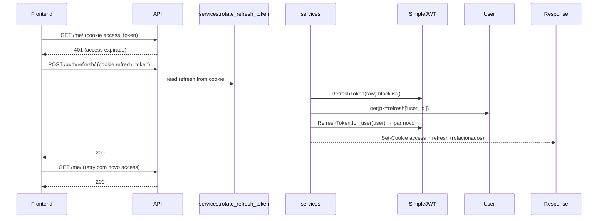
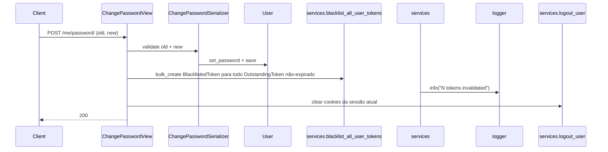
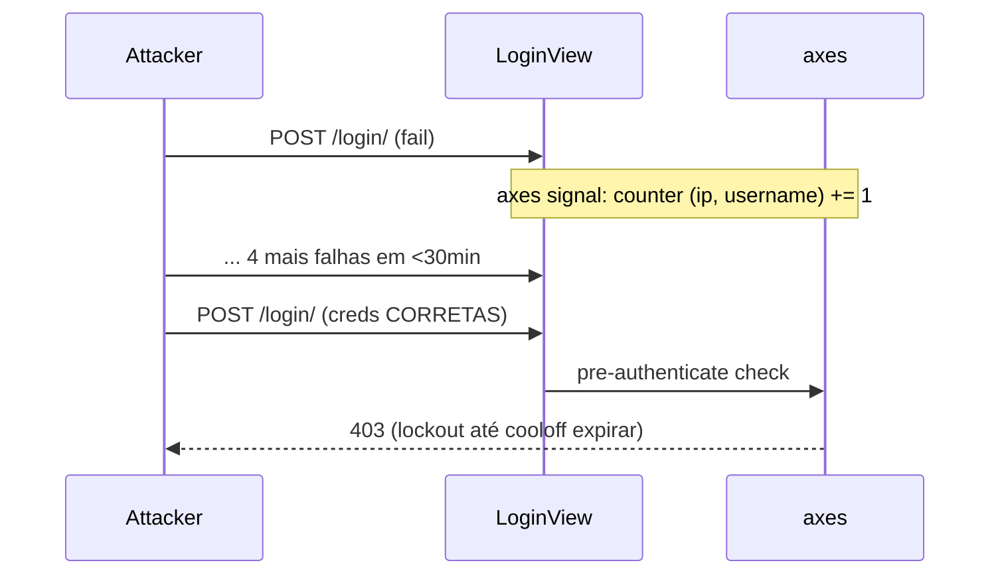
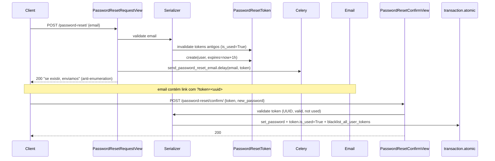

# Design — Módulo users + auth (retroativo)

> Retroativo · v1 · 2026-06-09 · Em produção
> Realiza: [RF-005](../../requirements/RF/RF-005-users-auth.md)
> Epic: [EP-01](../../backlog/epics/EP-01-fundacao-plataforma.md) + [EP-06](../../backlog/epics/EP-06-administracao-sistema.md)

---

## 0. Responsabilidade

`apps.users` é o **app-folha de identidade e autorização** do Interpop. Concentra: (a) modelo `User` UUID custom com role `dev/admin/editor/user`, (b) fluxo JWT em cookie httpOnly com rotação silenciosa, (c) hierarquia de permissões DRF canônicas, (d) password reset por token UUID com expiração de 1h, (e) blacklist de todas as sessões em troca/reset de senha (padrão NYT/GitHub/Substack), (f) brute-force defense por `django-axes` (5 falhas/30min por IP+username). É consumido por **todos** os outros apps via `settings.AUTH_USER_MODEL` e via `apps.users.permissions.*`.

---

## 1. Stack

- **Externas**: `djangorestframework-simplejwt` (RefreshToken + blacklist + rotation), `django-axes` (brute-force lockout), `python-decouple` (env), Argon2 hasher (default em `base.py:106`).
- **Depende de**: nada interno — é a base de auth.
- **É consumido por**: `articles`, `comments`, `moderation`, `newsletter`, `audit`, `search`.

---

## 2. Data model

### `User` — `apps/users/models.py:12-107`

`AbstractBaseUser + PermissionsMixin` (não `AbstractUser` clássico — herança mínima para evitar `username` clássico do Django e ter controle total dos campos):

| Campo                       | Tipo                                   | Notas                                                                                                                               |
| --------------------------- | -------------------------------------- | ----------------------------------------------------------------------------------------------------------------------------------- |
| `id`                        | `UUIDField` PK (`default=uuid.uuid4`)  | UUID em vez de BIGINT — exigido pelo cursor HMAC da busca (ADR-035) e por LGPD (não-enumerável).                                    |
| `email`                     | `EmailField` unique, indexed           | `USERNAME_FIELD = 'email'` — login por email, não username. Validado case-insensitive (`iexact`) no serializer.                     |
| `username`                  | `CharField(150)` unique, indexed       | Handle público (`[A-Za-z0-9_.-]+`, regex em `serializers.py:12`). Em `REQUIRED_FIELDS`. Unicidade `iexact` mas case **preservado**. |
| `first_name`, `last_name`   | `CharField(150)`                       | Required. `full_name` derivado em property.                                                                                         |
| `role`                      | `CharField(10)` choices, indexed       | `dev/admin/editor/user`. Default = `user`.                                                                                          |
| `bio`, `avatar`             | `TextField`, `ImageField`              | Profile editável via `MeView PATCH`.                                                                                                |
| `is_active`                 | `BooleanField(default=True)`           | Standard Django.                                                                                                                    |
| `is_staff`                  | `BooleanField(default=False)`          | Standard. Acesso ao `/admin/` Django nativo.                                                                                        |
| `is_banned`                 | `BooleanField(default=False)`, indexed | Banimento aplicacional (não-Django). Vetado em `LoginSerializer:71` + `IsNotBanned` permission.                                     |
| `date_joined`, `updated_at` | `DateTimeField` auto                   | `auto_now_add` e `auto_now`.                                                                                                        |
| `last_login`                | herdado de `AbstractBaseUser`          | Atualizado por `SIMPLE_JWT.UPDATE_LAST_LOGIN=True`.                                                                                 |

**Não** tem `email_verified`. Não há fluxo de confirmação de email — débito conhecido (§10 Open Q).

**Índice composto** (`models.py:43-45`): `(role, is_active, is_banned)` — serve queries de admin que listam "editores ativos não-banidos" e contagens de moderação.

### `PasswordResetToken` — `apps/users/models.py:110-136`

| Campo                      | Tipo                                             | Notas                                                                                                                                |
| -------------------------- | ------------------------------------------------ | ------------------------------------------------------------------------------------------------------------------------------------ |
| `id`                       | `UUIDField` PK                                   | Padrão.                                                                                                                              |
| `user`                     | FK `settings.AUTH_USER_MODEL` `CASCADE`          | `related_name='password_reset_tokens'`.                                                                                              |
| `token`                    | `UUIDField(unique=True, default=uuid4)`, indexed | Token público, enviado em URL no email. **Não** é signed JWT — é UUID v4 random (entropia 122 bits, suficiente para 1h de validade). |
| `created_at`, `expires_at` | `DateTimeField`                                  | `expires_at = created_at + 1h` (default no `save()`).                                                                                |
| `is_used`                  | `BooleanField`, indexed                          | One-shot. `validate_token` recusa após uso.                                                                                          |

Property `is_valid`: `not is_used and now < expires_at`.

**Não existe** `UserProfile` separado — campos sociais (bio, avatar) vivem no `User`. Decisão: 1 tabela é mais simples enquanto perfil é minimal (4 campos). Promover a tabela própria quando perfil incluir social links/preferências (>10 campos).

---

## 3. Hierarquia de roles e invariantes (REGRA DURA)

Fonte canônica: `CLAUDE.md §4` + `AGENTS.md`. Implementação: `models.py:60-107`.

| Role     | Imune a ban?                               | Pode banir               | Pode publicar artigo | Pode abrir BanRequest  |
| -------- | ------------------------------------------ | ------------------------ | -------------------- | ---------------------- |
| `dev`    | Sim (todos)                                | Sim (inclui admin)       | Sim                  | n/a (banimento direto) |
| `admin`  | Sim (admin-vs-admin); banível só por `dev` | Sim (exceto admin/dev)   | Sim                  | n/a (banimento direto) |
| `editor` | Não                                        | Não (só abre BanRequest) | Sim                  | Sim                    |
| `user`   | Não                                        | Não                      | Não                  | Não                    |

**Regras relacionais (não-binárias)** — `can_be_banned_by(actor)` em `models.py:83-100`:

- `actor` precisa estar autenticado.
- `actor != alvo` (ninguém bane a si mesmo).
- `actor.is_admin` (admin OU dev) — editor/user nunca bane diretamente.
- `alvo.role == DEV` → sempre False (dev imune a todos).
- `alvo.role == ADMIN` → True só se `actor.is_dev` (admin não bane admin).
- `alvo.role in (editor, user)` → True para qualquer admin/dev.

`can_be_unbanned_by` reusa a mesma regra — impede admin comum de **desfazer** ban que dev aplicou em outro admin (anularia a hierarquia pelo lado inverso).

**`is_admin` inclui dev** (`models.py:63-65`). Toda permission `IsAdminUser` aceita `dev` por construção — dev é admin++.

---

## 4. Public contract

### 4.1 Endpoints DRF — `apps/users/urls.py:15-26` (montado em `config/urls.py` como `/api/v1/auth/`)

| Método    | Path                                   | Permission              | Throttle               | Notas                                                                                                                        |
| --------- | -------------------------------------- | ----------------------- | ---------------------- | ---------------------------------------------------------------------------------------------------------------------------- |
| POST      | `/api/v1/auth/login/`                  | `AllowAny`              | `auth` scoped (10/min) | django-axes intercepta **antes** do view via signal de `authenticate()`. `views.py:30-44`.                                   |
| POST      | `/api/v1/auth/register/`               | `AllowAny`              | `auth` (10/min)        | Emite tokens imediatos (sem email verification). `views.py:56-71`.                                                           |
| POST      | `/api/v1/auth/logout/`                 | `IsAuthenticated`       | default user           | Blacklist refresh + limpa cookies. `views.py:47-53`.                                                                         |
| POST      | `/api/v1/auth/refresh/`                | `AllowAny`              | default                | Lê refresh do cookie, blacklista, emite par novo. **C1 do Improvement-system** fixado em `services.py:70-101`.               |
| GET/PATCH | `/api/v1/auth/me/`                     | `IsAuthenticated`       | default user           | GET retorna `UserPublicSerializer`; PATCH usa `UpdateProfileSerializer` (username/first/last/bio/avatar). `views.py:88-102`. |
| POST      | `/api/v1/auth/me/password/`            | `IsAuthenticated`       | default user           | `ChangePasswordSerializer` valida senha antiga; em seguida `blacklist_all_user_tokens` + `logout_user`. `views.py:105-117`.  |
| POST      | `/api/v1/auth/password-reset/`         | `AllowAny`              | `auth` (10/min)        | Sempre retorna 200 (evita email enumeration). Email vai por Celery (`tasks.send_password_reset_email`). `views.py:122-146`.  |
| POST      | `/api/v1/auth/password-reset/confirm/` | `AllowAny`              | default anon           | Token via body, não URL. `PasswordResetConfirmSerializer.save()` atomic + blacklist. `views.py:149-156`.                     |
| GET       | `/api/v1/auth/users/`                  | `IsPublisherOrReadOnly` | default user           | Admin + editor podem ler (editor precisa pra escolher alvo de BanRequest). `views.py:168-177`.                               |
| GET       | `/api/v1/auth/users/<uuid:pk>/`        | `IsPublisherOrReadOnly` | default user           | Mesma regra. `views.py:180-184`.                                                                                             |

**Não existe** endpoint `POST /users/<id>/promote/` — promoção de role é feita via Django admin ou `seed_team_users` management command. Backlog: expor API para dev only (§10).

### 4.2 Permissions canônicas — `apps/users/permissions.py`

| Classe                          | O que checa                                                               | Quando usar                                                                                                        |
| ------------------------------- | ------------------------------------------------------------------------- | ------------------------------------------------------------------------------------------------------------------ |
| `IsAdminUser` (`:4`)            | `is_authenticated and is_admin` (admin OU dev)                            | Endpoints exclusivos de admin (`AdminMetricsView`, mod actions diretas).                                           |
| `IsAdminOrReadOnly` (`:10`)     | SAFE_METHODS → True; write → `is_admin`                                   | Endpoints híbridos onde anon lê e só admin escreve. Pouco usado hoje.                                              |
| `IsPublisherOrReadOnly` (`:22`) | SAFE_METHODS → True; write → `can_publish` (dev/admin/editor)             | Artigos e listagem de usuários (read para editores).                                                               |
| `IsOwnerOrAdmin` (`:35`)        | object-level: SAFE → True; write → `obj.author_id == user.pk OR is_admin` | Edição de artigo próprio, comentário próprio.                                                                      |
| `IsNotBanned` (`:46`)           | `not (is_authenticated and is_banned)` — anon passa                       | **DEFAULT** em `REST_FRAMEWORK.DEFAULT_PERMISSION_CLASSES` (defense in depth além do bloqueio em LoginSerializer). |
| `IsEditorOrAdmin` (`:65`)       | herda `IsAuthenticated`; POST exige `can_publish` (admin/editor)          | `BanRequest` — admin vê todas, editor vê suas próprias e cria novas. C14 do reorganization-proposal.               |

**Não existe** `IsDev` separada — `is_admin` inclui dev e cobre todos os casos atuais. Promote-to-admin é feito fora da API (admin Django + management command).

### 4.3 Settings JWT — `config/settings/base.py:132-159`

```python
SIMPLE_JWT = {
    'ACCESS_TOKEN_LIFETIME':  timedelta(minutes=30),  # blast radius curto
    'REFRESH_TOKEN_LIFETIME': timedelta(days=30),     # UX invisível p/ leitor
    'ROTATE_REFRESH_TOKENS':       True,              # cada refresh emite par novo
    'BLACKLIST_AFTER_ROTATION':    True,              # anti-replay
    'UPDATE_LAST_LOGIN':           True,
    'ALGORITHM':                   'HS256',
    'SIGNING_KEY': config('JWT_SIGNING_KEY', default=config('SECRET_KEY')),  # S-02 débito
    'AUTH_COOKIE':           'access_token',
    'AUTH_COOKIE_REFRESH':   'refresh_token',
    'AUTH_COOKIE_SECURE':    True,    # False em dev (override em development.py)
    'AUTH_COOKIE_HTTP_ONLY': True,
    'AUTH_COOKIE_SAMESITE':  'Lax',
}
```

Refresh cookie path-restrito a `/api/v1/auth/refresh/` (`services.py:46`) — não vai em toda request, reduz superfície.

### 4.4 Settings django-axes — `base.py:202-207`

`AXES_FAILURE_LIMIT=5`, `AXES_COOLOFF_TIME=30min`, `AXES_LOCK_OUT_AT_FAILURE=True`, `AXES_RESET_ON_SUCCESS=True`, `AXES_LOCKOUT_PARAMETERS=['ip_address', 'username']` — lockout só dispara quando **ambos** combinam (mitiga DoS contra username conhecido por IPs aleatórios, mas vulnerável a botnet residencial — S-05 em CONCERNS).

---

## 5. Fluxos críticos

### 5.1 Login + cookie set

```mermaid
sequenceDiagram
    Client->>LoginView: POST /login/ {email, password}
    LoginView->>axes: signal pre-authenticate (count fails)
    alt 5+ fails/30min (IP+username)
        axes-->>Client: 403 lockout
    else
        LoginView->>LoginSerializer: validate
        LoginSerializer->>authenticate(): check creds
        LoginSerializer->>LoginSerializer: assert is_active, not is_banned
        LoginSerializer-->>LoginView: user
        LoginView->>services.issue_tokens_for_user: RefreshToken.for_user(user)
        services-->>Response: Set-Cookie access_token (30min, httpOnly, Secure, SameSite=Lax, path=/)
        services-->>Response: Set-Cookie refresh_token (30d, path=/api/v1/auth/refresh/)
        LoginView-->>Client: 200 UserPublicSerializer
    end
```

### 5.2 Rotação silenciosa em 401



Bug histórico (C1 do Improvement-system §11.1): versão anterior acessava `refresh.access_token.user` — atributo inexistente em `AccessToken`. `except Exception: pass` mascarava `AttributeError` e refresh retornava False silenciosamente. Sessão expirava em 30min reais em vez de 30 dias. Fix em `services.py:70-101` lê `refresh['user_id']` direto do claim + loga `exc_info` em vez de silenciar.

### 5.3 Mudança de senha invalida todas as sessões (S7)



Padrão NYT/GitHub/Substack: trocar senha derruba **todas** as sessões em outros devices. Sem isso, atacante com senha antiga continua logado mesmo após o usuário "trocar". Mesmo fluxo em `PasswordResetConfirmSerializer.save()` (`serializers.py:200-210`) — reset por email invalida sessões ativas (cobre cenário "suspeito de invasão").

### 5.4 Brute-force lockout



`ScopedRateThrottle 'auth': 10/min` no view (`views.py:32-33`) é **defesa adicional** — anon por IP. Insuficiente contra botnet distribuída (S-05).

### 5.5 Password reset



`@transaction.atomic` (ADR-012 / C3 do Improvement-system) — sem isso, crash entre `set_password` e `token.is_used=True` deixa token consumido com senha não trocada → usuário fica sem acesso.

---

## 6. Invariantes

- **I-01** — `email` único e armazenado em lowercase (`validate_email` no `RegisterSerializer:88`).
- **I-02** — `username` único `iexact`, case do input preservado.
- **I-03** — Login só com `is_active=True AND is_banned=False` (`LoginSerializer:69-72`).
- **I-04** — Senha mudada (change ou reset) ⇒ **todos** os `OutstandingToken` não-expirados são blacklistados (S7). Verificado em `services.blacklist_all_user_tokens`.
- **I-05** — Token JWT **nunca** sai no body de response — só em cookie `Set-Cookie` httpOnly. Auditar PRs futuros.
- **I-06** — `PasswordResetToken` é one-shot: `is_used=True` após uso, e qualquer request com `is_used` recusada em `validate_token`.
- **I-07** — Brute-force: 5 falhas em 30min na tupla `(ip, username)` ⇒ axes lockout 30min mesmo com credenciais corretas.
- **I-08** — Hierarquia `dev > admin > editor > user`: `can_be_banned_by` é a função canônica. Qualquer ban direto em código novo **deve** chamá-la — não duplicar lógica role-by-role.
- **I-09** — `IsNotBanned` em `DEFAULT_PERMISSION_CLASSES` é **defesa em profundidade**. View que customiza `permission_classes` **substitui** o default inteiro (DRF não faz merge). Toda view privada nova deve **repetir** `IsNotBanned` na própria classe. Erro de omissão é o caminho mais fácil para bypass (CONCERNS S-06 latente — conferir CONCERNS atualizado).

---

## 7. Conhecimento operacional

- **Criar dev/admin/editor para staff via shell**: `uv run python manage.py seed_team_users` (`apps/users/management/commands/seed_team_users.py`). Idempotente, lê `.env`. 7 findings de revisão adversarial registrados — leitura recomendada antes de usar em prod (observação `812 2026-05-29`).
- **Resetar contador axes local** (após testar lockout): `uv run python manage.py axes_reset` (ou `axes_reset_ip <IP>`).
- **Inspecionar JWT decodificado**: copiar valor do cookie `access_token` em DevTools → `jwt.io` (apenas claims, não valida signature). Útil para debugar `user_id`/`exp`.
- **Testar rotação local**: setar `ACCESS_TOKEN_LIFETIME=timedelta(seconds=10)` em `development.py`, fazer login, aguardar 11s, fazer request — interceptor axios chama refresh; verificar Set-Cookie novo no DevTools Network.
- **Verificar `last_login` pós-logout**: logout **não** zera `last_login` (intencional — campo é "último login", não "sessão ativa"). Para "está online agora" usar presença/heartbeat, não `last_login`.
- **Gerar `JWT_SIGNING_KEY` para prod**: `python -c "import secrets; print(secrets.token_urlsafe(64))"` → adicionar em `.env` da VPS. **Não** reusar `SECRET_KEY` (S-02).

---

## 8. Status e débitos (cross-ref CONCERNS)

| ID                  | Severidade      | Resumo                                                                                                       | Onde                                                                                                                                                                                           |
| ------------------- | --------------- | ------------------------------------------------------------------------------------------------------------ | ---------------------------------------------------------------------------------------------------------------------------------------------------------------------------------------------- |
| **S-02**            | Alta            | `JWT_SIGNING_KEY` faz fallback para `SECRET_KEY` sem hard-fail em prod. Vazamento de uma compromete a outra. | `base.py:150`. Mitigação: replicar padrão `SEARCH_CURSOR_HMAC_SECRET` (`production.py`, ADR-035, fix F2-B-03 commit `96cdad5`) — `raise ImproperlyConfigured` se igual a `SECRET_KEY` em prod. |
| **S-04**            | Crítica         | Sem 2FA para `dev/admin/editor`. Única barreira é senha + axes. Risco maior do projeto.                      | `grep -rn "totp\|2fa" backend/` → 0. Mitigação imediata: fechar `/admin/` por firewall/WireGuard até 2FA chegar.                                                                               |
| **S-05**            | Média           | axes lockout só por `(ip, username)` — botnet residencial bypassa.                                           | `base.py:206`. Defesa adicional via `ScopedRateThrottle 'auth: 10/min'` (`views.py:32`) também escala por IP.                                                                                  |
| **S-06**            | Média (latente) | `IsNotBanned` em DEFAULT vaza quando view declara `permission_classes` (DRF substitui, não merge).           | Auditar cada view privada nova. Toda view sensível deve **repetir** `IsNotBanned`.                                                                                                             |
| **S-08**            | Baixa           | Sem `request.session.cycle_key()` após login — session fixation latente se combinar com XSS (S-01).          | `views.py:30-44`. Adicionar `request.session.cycle_key()` em `LoginView.post`.                                                                                                                 |
| **info-disclosure** | Baixa           | `UserPublicSerializer` expõe `is_banned` publicamente (observação `860 2026-05-29`).                         | `serializers.py:38-42`. Decidir: remover do payload público OU manter intencionalmente.                                                                                                        |
| **D-01**            | Tech debt       | Sem endpoint API de promote/demote role — só Django admin + management command.                              | Backlog.                                                                                                                                                                                       |
| **histórico — C1**  | Resolvido       | Rotação silenciosa retornava False silenciosamente (sessão expirava em 30min em vez de 30d).                 | Fixed em `services.py:70-101`.                                                                                                                                                                 |
| **histórico — C3**  | Resolvido       | `PasswordResetConfirmSerializer.save()` não era atômico.                                                     | Fixed com `@transaction.atomic` em `serializers.py:200-210`.                                                                                                                                   |

**Referência operacional preservada**: [`docs/planning/session-auth-strategy.md`](../../planning/session-auth-strategy.md) (gitignored, 443 LOC) contém comparativo NYT/G1/BBC, decisão da TTL atual (30min + 30d uniforme), e roadmap para TTL diferenciada por role + step-up auth + multi-device session list. Este DESIGN intencionalmente **não duplica** o conteúdo — apenas referencia.

---

## 9. Cross-references

- **Realiza**: [RF-005](../../requirements/RF/RF-005-users-auth.md)
- **Epic**: [EP-01](../../backlog/epics/EP-01-fundacao-plataforma.md) (fundação) + [EP-06](../../backlog/epics/EP-06-administracao-sistema.md) (admin)
- **Consumido por**: TODOS os apps (`articles`, `comments`, `moderation`, `newsletter`, `audit`, `search`)
- **ADRs**: ADR-008 (DPO/LGPD), ADR-010 (prefixo `/api/v1/`), ADR-012 (atomicidade em mutações multi-tabela), ADR-035 (HMAC env-driven com hard-fail — padrão a replicar em S-02)
- **CLAUDE.md §4** — hierarquia `dev > admin > editor > user`
- **CONCERNS.md** — S-02, S-04, S-05, S-06, S-08; matriz de estabilidade linha `users` (estável)
- **Referência operacional não-versionada**: [`docs/planning/session-auth-strategy.md`](../../planning/session-auth-strategy.md)

---

## 10. Open questions (próximas decisões)

1. **2FA — quando e qual stack?** TOTP via `django-otp` é mainstream e barato. CONCERNS S-04 é o risco mais sério aberto. Decisão pendente: WebAuthn agora ou TOTP primeiro?
2. **Email verification flow** — não existe. Cadastro emite tokens imediatos. Risco: cadastro com email alheio (spam, takeover via reset). Backlog: quando?
3. **Social login (OAuth Google)** — sem ADR. Demanda de produto para reduzir fricção. `django-allauth` é o caminho-default. Bloqueado por: definir se identidade primária continua sendo email/senha (com Google só como conveniência) ou se Google substitui senha.
4. **Session invalidation em mudança de email** — `MeView PATCH` não invalida sessões hoje. Atacante que troca email do alvo continua usando sessões antigas. Aplicar mesmo padrão S7?
5. **Force logout de banido** — `is_banned=True` impede **login novo**, mas sessões ativas continuam até access expirar (30min) e refresh ser bloqueado. Aceitável? Ou chamar `blacklist_all_user_tokens` no ban?
6. **DELETE account (LGPD)** — não existe endpoint. Hoje só admin via Django admin. Backlog longo: anonimização vs hard-delete, comentários/artigos órfãos.
7. **Endpoint API de promote/demote role** — hoje só management command + admin Django. Expor `POST /users/<id>/role/` dev-only?
8. **TTL diferenciada por role** — sessão-auth-strategy propõe `reader=60-90d / editor=14d / admin=4-8h`. Quando promover do quick-win uniforme atual?

---

_Spec retroativo criado em 2026-06-09 (Skills aplicadas: `tlc-spec-driven`, `backend-architect`, `auth-implementation-patterns`, `backend-security-coder`, `architecture-decision-records`). Fonte de verdade: código em `backend/apps/users/`. Próxima revisão: ao implementar S-02 (hard-fail JWT_SIGNING_KEY) ou ao adotar 2FA (S-04)._
